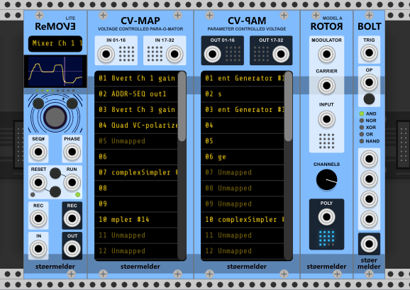

# stoermelder PackOne

The PackOne plugin pack gives you a some modules.

## Building

Follow the build instructions for [VCV Rack](https://vcvrack.com/manual/Building.html#building-rack-plugins).

## License

Copyright © 2019 Benjamin Dill

Licensed under the [Gnu Public License, version 3](https://www.gnu.org/licenses/gpl-3.0.en.html).

The panel graphics in the `res` and `res-src` directories are licensed under CC BY-NC-ND 4.0. You may not create modified adaptations of these graphics.