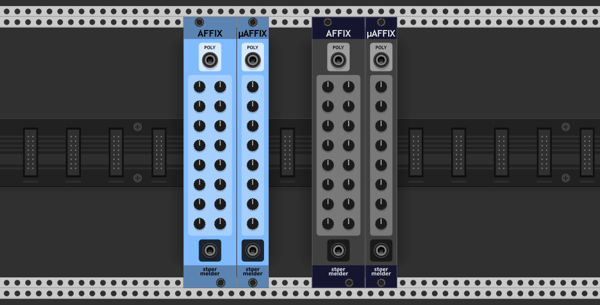
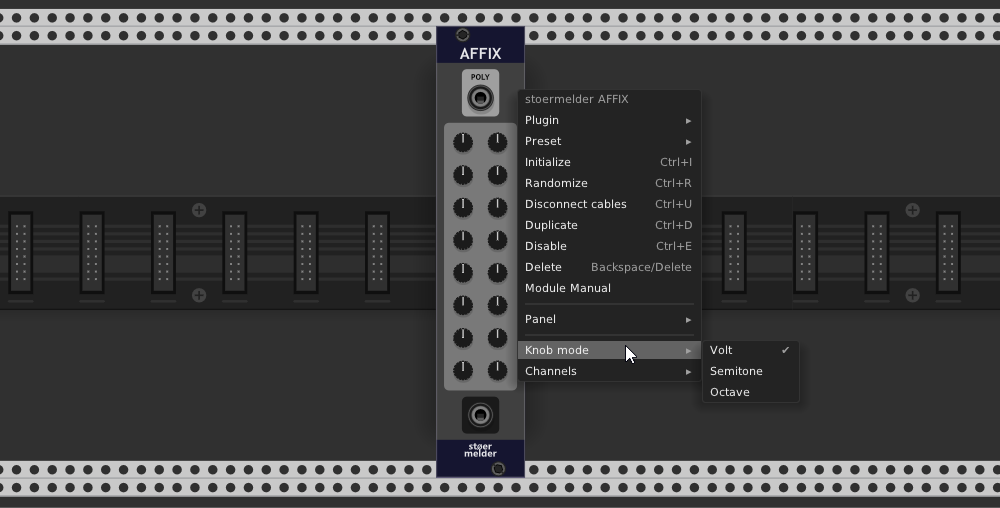
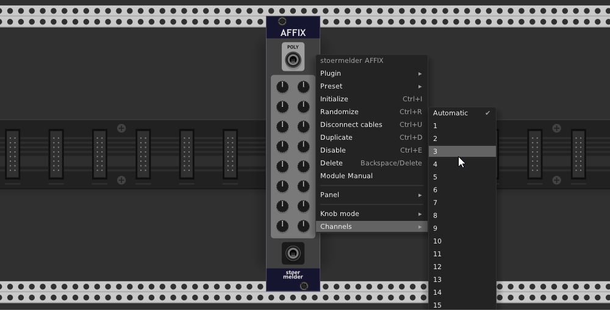

# stoermelder AFFIX and µAFFIX

AFFIX and µAFFIX are utility modules for polyphonic cables: They allow you to add an voltage offset to each of the 16 and 8 channels, respectively, by adjusting a knob.

To make the modules more useful the knobs offer three different modes available on the context menu: "Volt" allows the knobs to be set to an exact voltage, "Semitones" snaps the offset in semitone steps according to the 1V/Oct-standard (1/12V per step) and "Octave" snaps the offset in 1V increments.

The modules can be used to adjust the number of active channels within a polyphonic cable or even without an incoming signal at all: Just set the number of channels on the context menu. When set to "Auto" they output the same number of channels as received on the input port.

AFFIX and µAFFIX were added in v1.6.0 of PackOne.