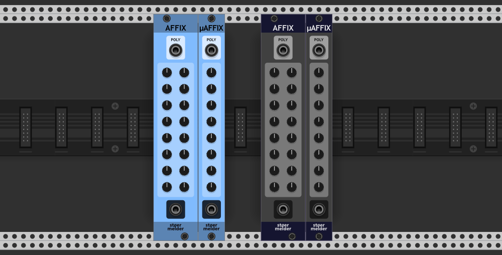
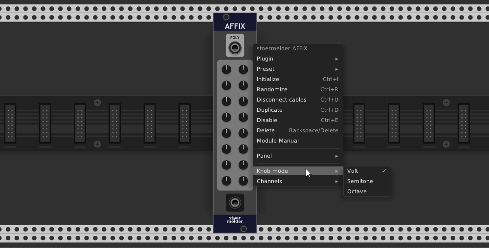
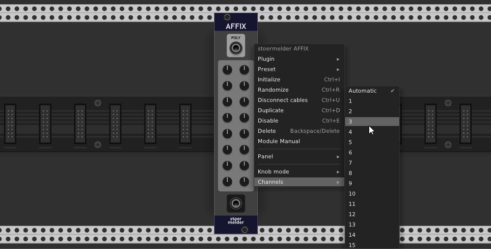

# stoermelder AFFIX and µAFFIX

AFFIX and µAFFIX are utility modules for polyphonic cables. They allow you to add a voltage offset to each of the 16 (AFFIX) and 8 (µAFFIX) channels by adjusting a knob.

The knobs offer three modes via the context menu:
- **Volt**: Set the knobs to an exact voltage.
- **Semitones**: Snap the offset in semitone steps (1/12V per step, per the 1V/Oct standard).
- **Octave**: Snap the offset in 1V increments.

The modules can adjust the number of active channels in polyphonic cables or output voltage even without an input signal. To do this, set the number of channels in the context menu. In _Auto_ mode, the output matches the number of channels received on the input port.

## Changelog

- v1.6.0
    - Initial release of AFFIX and µAFFIX
- v2.0.0
    - Fixed knob reset on double-click in Semitone/Octave-mode (#387)
    - Fixed wrong output voltage in Semitone/Octave-mode after loading (#403)
    - Don't use Rack's parameter smoothing in Semitone/Octave-mode (broken since Rack 2.3.0)