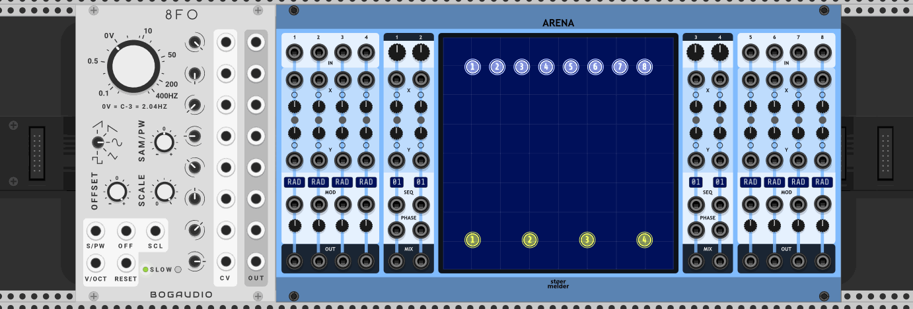
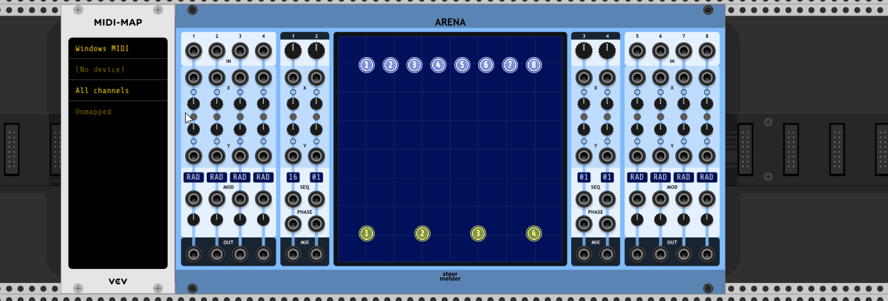

# stoermelder ARENA

ARENA is a two-dimensional mixer with 8 inputs with 8 assigned outputs, 4 mixed outputs with 16 motion sequences each and various modulation options. In the center of the module is a big colorful screen that visualizes the positions of the inputs and outputs in two-dimensional space and their modulated parameters.

The module produces no signal on its own.

## IN-ports and OUT-ports

The module has 8 input-ports with assigned controls for "Amount" and "Radius" and are routed their output-ports respectively. The signal sent to the OUT-port is calculated in this way: The amount is used to scale the input linearly between 0-100%. The radius defines the range of influence of the input-signal according to the euclidian distance between each of the MIX-objects in 2d-space considering the x/y coordinates of the objects. These weighted distances are summed in respect of one of the following OUT-modes:

- Scale: Each MIX-port brings in at most $\frac{1}{n}$ * 100% of the input-signal if $n$ MIX-ports are active, so the output can reach 100% at most.
- Limit: Each MIX-port brings in at most 100% of the input-signal and the output is limited at 100% of the input.
- Clip -5..5V / 0..10V: Each MIX-port brings in at most 100% of the input-signal, the sum can be >100% but the output is hard limited on -5..5V or 0..10V.
- Fold -5..5V / 0..10V: Each MIX-port brings in at most 100% of the input-signal, the sum can be >100% but the output is wave-folded on -5..5V or 0..10V.

Each channel has several settings that can be changed by the context-menu of the small text-display or directly on the white circle in the center-screen.

For visualization a line is drawn between a white (input) and yellow (mix) circle on the screen if the input is in range according to the radius. The brightness of the outer circle and the connecting line visuals the current amount-value of the input.

## X and Y-ports

The position in 2d-space of each input (and mix-output) can be changed by mouse on the center-screen. Of course this is a module in virtual modular so there are CV-inputs with assigned attenuverters for modulating x and y-positions. The voltage range can be set to -5..5V or 0..10V and please notice that attenuverters must be opened to use any input voltage.

## MOD-ports

For further modulation of the input-signals each channel has a MOD-input that can be used for different modulation targets shown in the channels text-display:

- RAD / radius (Default): The radius of an input determines the range within 2d-space in which the signal is sent to its OUT-port and to the MIX-ports.
- AMT / amount: The amount determines how much of the input signal is entering the signal-path.
- O-X, O-Y / offset x-pos, offset y-pos: The offsets for x/y-coordinates can be used in addition to the X/Y-ports to offset one of the CV-signals. 
- WLK / Random walk: The position of the input in 2d-space is randomly modified.

Each MOD-port can be configured to accept a voltage range of -5..5V or 0..10V.

## MIX-ports

## SEQ-ports and PHASE-ports

Each of the 4 mixed outputs can be motion sequenced with up to 16 different motion paths. To enter the edit mode click on the number-display of the mix-channel. In edit mode the number-display is lit in red and the center screen shows "SEQ-EDIT" in the bottom corner. The start point of the motion is set by a left mouse click, the motion is recorded by mouse movement with held down left mouse button. To exit edit-mode click again on the number-display.

Additionally there are some predefined motion paths that can be scaled in x/y-directions and can be parameterized if available, like circles, saws or spirals. A random path can also be generated. 

There are some edit options available to modify a recorded path or one of the presets: flip horizontally or flip vertically and rotate. Also a path can be copied and pasted to another sequencing slot.

The SEQ-input allows you to select a sequence by CV. There are several modes available:

- Trigger forward (Default): When a trigger is received the module advances to the next sequence-slot.
- Trigger reverse:  When a trigger is received the module advances to the previous sequence-slot.
- Trigger random 1-16, 1-8 or 1-4: When a trigger is received the module chooses a random sequence-slot within the selected range.
- 0..10V: The range is splitted evenly by 16. 0-0.625V selects sequence-slot 1, 0.625-1.25V sequence-slot 2 and so on.
- C4-D#5: Keyboard mode, C4 triggers sequence-slot 1, D#5 triggers sequence-slot 16.

Each input labeled PHASE can be set to accept -5..5V or 0..10V and allows controlling the position of the mix-output on the currently selected motion path: The input-voltage is mapped to the length of the motion-sequence. Using an LFO's unipolar saw output or a clock with phase output like [ZZC's Clock-module](https://zzc-cv.github.io/en/clock-manipulation/clock) the motion can synced to sequencers and you get looping behavior, an LFO with triangle-output gives you a ping pong-motion.

## X/Y-mapping

The colored circles on the center-screen representing inputs and mix-outputs cannot be mapped to MIDI-controls with modules like MIDI-MAP. Instead ARENA has small "mapping-circles" next to the CV-inputs for X and Y positions that can be mapped like normal parameters.

This module was added in v1.3 of PackOne.
