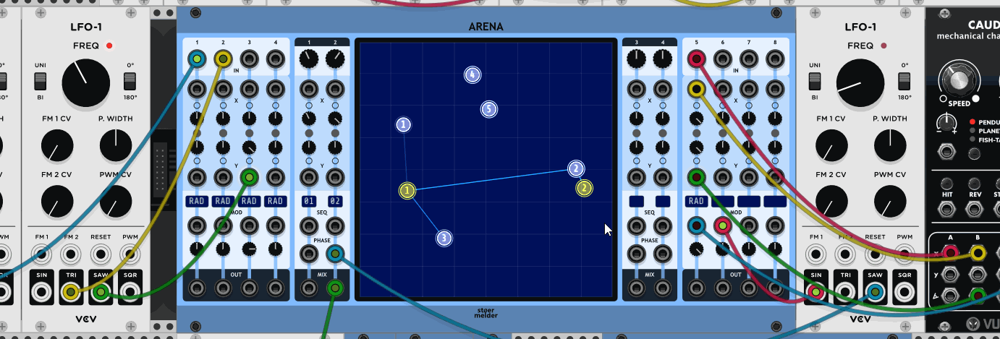
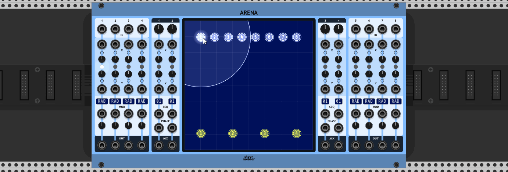
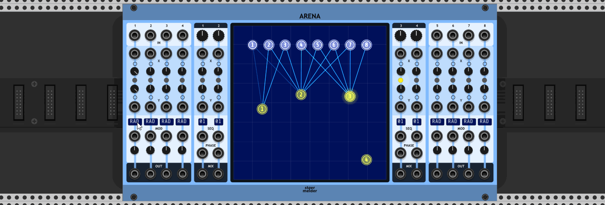
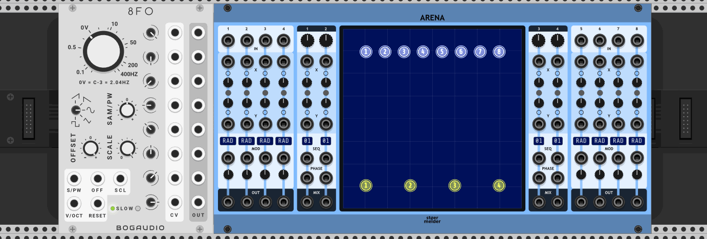
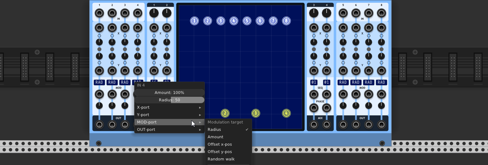
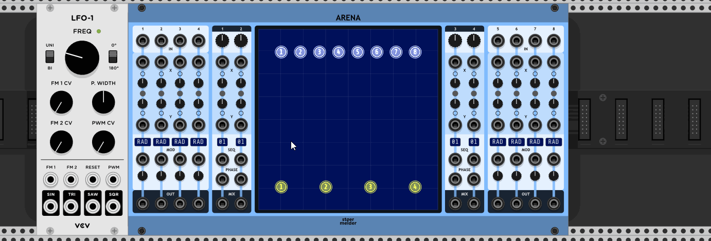
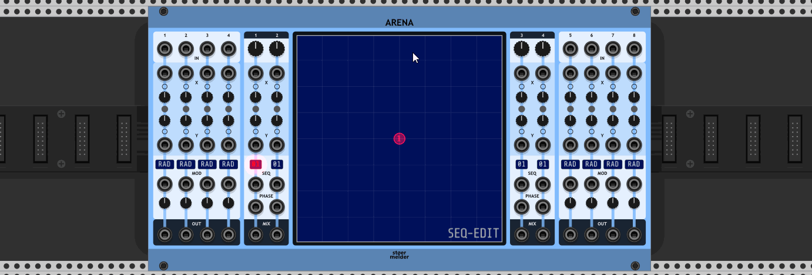
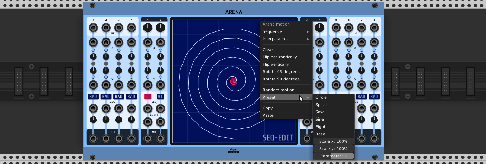
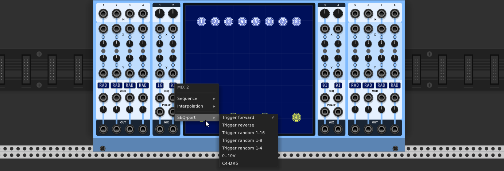
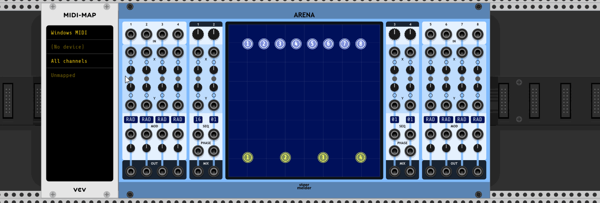

# stoermelder ARENA

- [IN-ports and OUT-ports](#in-ports-and-out-ports)
- [X and Y-ports](#x-and-y-ports)
- [MOD-ports](#mod-ports)
- [MIX-ports](#mix-ports)
- [SEQ-ports and PHASE-ports](#seq-ports-and-phase-ports)
- [Configuration](#configuration)
- [X/Y-mapping](#xy-mapping)
- [Changelog](#changelog)

### Overview

ARENA is a two-dimensional mixer with 8 inputs with 8 assigned outputs, 4 mixed outputs with 16 motion sequences each and various modulation options. In the center of the module is a big colorful screen that visualizes the positions of the inputs and outputs in two-dimensional space and their modulated parameters.

The module produces no signal on its own.

### _IN_-ports and _OUT_ ports

The module has 8 input-ports with assigned controls for _Amount_ and _Radius_ and are routed their output-ports respectively. The signal sent to the _OUT_-port is calculated in this way: The amount is used to scale the input linearly between 0-100%. The radius defines the range of influence of the input-signal according to the Euclidean distance between each of the _MIX_-objects in 2D space considering the x/y coordinates of the objects. These weighted distances are summed in respect of one of the following _OUT_-modes:

- **Scale** - Each _MIX_-port brings in at most $\frac{1}{n}$ * 100% of the input-signal if $n$ _MIX_-ports are active, so the output can reach 100% at most.

- **Limit** - Each _MIX_-port brings in at most 100% of the input-signal and the output is limited at 100% of the input.

- **Clip -5..5V / 0..10V** - Each _MIX_-port brings in at most 100% of the input-signal, the sum can be >100% but the output is hard limited on -5..5V or 0..10V.

- **Fold -5..5V / 0..10V** - Each _MIX_-port brings in at most 100% of the input-signal, the sum can be >100% but the output is wave-folded on -5..5V or 0..10V.

Each channel has several settings that can be changed by the context-menu of the small text-display or directly on the white circle in the center-screen.

For visualization a line is drawn between a white (input) and yellow (mix) circle on the screen if the input is in range according to the radius. The brightness of the outer circle and the connecting line visuals the current amount-value of the input.

### _X_ and _Y_ ports

The position in 2D space of each input (and mix-output) can be changed by mouse on the center screen. Of course this is a module in virtual modular so there are CV inputs with assigned attenuverters for modulating x and y positions. The voltage range can be set to -5..5V or 0..10V, and note that attenuverters must be opened to use any input voltage.

### _MOD_ ports

For further modulation of the input signals, each channel has a _MOD_ input that can be used for different modulation targets shown in the channel's text display:

- **RAD / radius (Default)** - The radius of an input determines the range within 2D space in which the signal is sent to its _OUT_ port and to the _MIX_ ports.

- **AMT / amount** - The amount determines how much of the input signal is entering the signal path.

- **O-X, O-Y / offset x-pos, offset y-pos** - The offsets for x/y coordinates can be used in addition to the _X_/_Y_ ports to offset one of the CV signals.

- **WLK / Random walk** - The position of the input in 2D space is randomly modified.

### _MIX_-ports

ARENA has 4 mix channels that output the combined signals of all connected input channels based on their distance from the mix output position. Each mix channel can be controlled, sequenced, and positioned independently in the 2D space.

Each mix channel has the following controls:

- **Volume** - Adjusts the volume level of the mix channel from 0 to 200%. The output will be scaled according to this setting.

- **X/Y position** - Position the mix output in the 2D space on the center screen. This determines which input channels will be mixed based on their distance and radius. You can move the mix position by clicking and dragging the yellow circle on the screen, or adjust the small white circles next to the CV inputs for fine control.

- **X/Y CV inputs** - Modulate the X and Y position of the mix output with control voltages. The attenuverter knobs next to these inputs control how much the incoming CV affects the position. Set the attenuverter fully left to disable CV control or fully right to enable it.

The mix output combines the signals from all input channels that fall within their radius at the current mix position. The combined signal is sent to the corresponding _MIX_ output port. You can then process or record these mixed signals elsewhere in your patch.

### _SEQ_ ports and _PHASE_ ports

Each of the 4 mixed outputs can be motion sequenced with up to 16 different motion paths. To enter edit mode, click on the number display of the mix channel. In edit mode, the number display is lit in red and the center screen shows "SEQ-EDIT" in the bottom corner. The start point of the motion is set by a left mouse click, and the motion is recorded by mouse movement with the left mouse button held down. To exit edit mode, click again on the number display.

Additionally, there are some predefined motion paths that can be scaled in x/y directions and can be parameterized if available, like circles, saws, or spirals. A random path can also be generated.

There are some edit options available to modify a recorded path or one of the presets: flip horizontally or flip vertically, and rotate. A path can also be copied and pasted to another sequencing slot.

The _SEQ_ input allows you to select a sequence by CV. There are several modes available:

- **Trigger forward** (Default) - When a trigger is received, the module advances to the next sequence slot.

- **Trigger reverse** - When a trigger is received, the module advances to the previous sequence slot.

- **Trigger random 1-16, 1-8, or 1-4** - When a trigger is received, the module chooses a random sequence slot within the selected range.

- **0..10V** - The range is split evenly by 16. 0-0.625V selects sequence slot 1, 0.625-1.25V selects sequence slot 2, and so on.

- **C4-D#5** - Keyboard mode: C4 triggers sequence slot 1, D#5 triggers sequence slot 16.

Each input labeled _PHASE_ can be set to accept -5..5V or 0..10V and allows you to control the position of the mix output on the currently selected motion path. The input voltage is mapped to the length of the motion sequence. Using an LFO's unipolar saw output or a clock with phase output like [ZZC's Clock module](https://zzc-cv.github.io/en/clock-manipulation/clock), the motion can be synced to sequencers, giving you looping behavior. An LFO with triangle output gives you a ping-pong motion.

### Channel Settings

Right-click on the small text display next to each input or mix channel to access configuration options for that channel:

For IN-channels:
- **Amount** - Adjusts how much of the input signal enters the mixing process (0-100%).
- **Radius** - Sets the range of influence of this input in 2D space.
- **X/Y Voltage mode** - Switch between -5..5V (bipolar) and 0..10V (unipolar) for the X and Y CV inputs.
- **Modulation target** - Select what the MOD input modulates: Radius (default), Amount, Offset X, Offset Y, or Random walk.
- **Output mode** - Choose how the input signal is processed: Scale, Limit, Clip, or Fold (see IN-ports section for details).

For MIX-channels:
- **X/Y Voltage mode** - Switch between -5..5V (bipolar) and 0..10V (unipolar) for the X and Y CV inputs of this mix channel.

### Module Configuration

Right-click on the main module panel (away from channels) to access these options:

- **Number of _IN_ ports** - Dynamically set the number of active input channels from 1 to 8. This allows you to use fewer channels if needed, reducing CPU usage.
- **Number of _MIX_ ports** - Dynamically set the number of active mix output channels from 1 to 4. Useful if you only need a few mixed outputs.

### X/Y-mapping

The colored circles on the center screen representing inputs and mix outputs cannot be mapped to MIDI controls with modules like MIDI-MAP. Instead, ARENA has small "mapping circles" next to the CV inputs for X and Y positions that can be mapped like normal parameters.

## Changelog

- v1.3.0
    - Initial release of ARENA
- v1.4.0
    - Added missing bipolar-mode for X/Y-inputs of the mix-channels
- v1.7.0
    - Fixed wrong calculation of output levels (#147, #113)
- v1.8.0
    - Fixed noise on OUT-ports (#190)
- v2.0.0
    - Fixed broken behavior of "Radius" sliders of "In"-ports
    - Fixed broken patch-restore of "Radius" sliders (#331)
    - Fixed behavior of attenuvertors for X/Y/MOD-inputs (#394)
    - Fixed coarse parameter updates on screen interaction because of display refresh rate (#210)