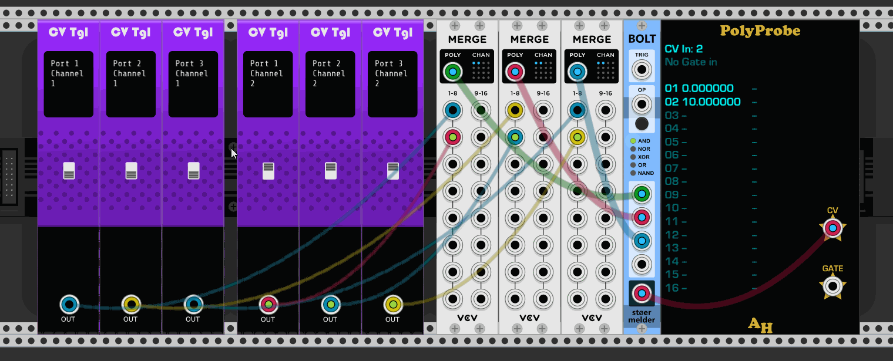

# stoermelder BOLT

BOLT is module for applying different boolean functions on up to four input signals. "Another module for boolean functions" you say? Yes, because it has two special twists: First, it is polyphonic. The module processes up to 16 channels on the four input ports and applies the selected boolean function on its inputs. Second, it can be modulated by CV which boolean function is evaluated. Also, it has rarly available functions [NAND](https://en.wikipedia.org/wiki/Sheffer_stroke) and [NOR](https://en.wikipedia.org/wiki/Logical_NOR).

### Input TRIG

When TRIG is connected the module acts as a sample and hold module. Only when a trigger is received the boolean function is applied and the output updated. The TRIG-port is polyphonic and normalized: When only one channel is connected a trigger is used for all 16 channels, with more channels connected each can have its own trigger. When no cable is connected to TRIG the module updates the output port instantly.

### Input OP

This port modulates the boolean function. It is monophonic. On the context menu can be configured how this port is used:

- 0..10V: The range is splitted evenly by 5. 0-2V selects the first function, 2-4V the second and so on.
- C4-E4: Keyboard mode, C4 selectes function 1, E4 selects function 5.
- Trigger: When a trigger is received the module advances to the next function, like using the button.

### Input ports

Input is considered low below 1.0V and high from 1.0V and up. Input channels are polyphonic, but not normalized. Only actually connected channels will be considered during evaluation of the boolean function.

### Output mode

The module allows three different output modes:

- Gate: The output is high (10V) when the boolean function returns true, otherwise low (0V).
- Trigger on high: The module outputs a trigger whenever the boolean function changes from false to true.
- Trigger on change: The module outputs a trigger whenever the boolean function changes.