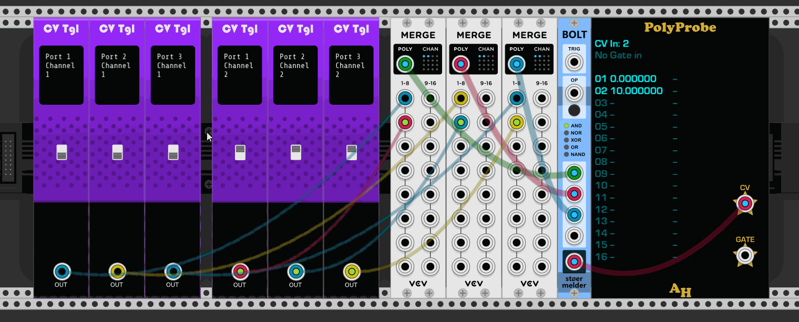
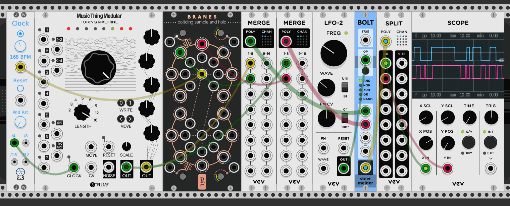

# stoermelder BOLT

BOLT is a module that applies various boolean functions to up to four input signals. "Another module for boolean functions," you might ask? It offers two special twists:

- **Polyphony** – The module processes up to 16 channels on each of the four input ports and applies the selected boolean function to those inputs.

- **CV‑controlled function selection** – The boolean function that is evaluated can be modulated by a CV input.

It also includes rarely available functions such as [NAND](https://en.wikipedia.org/wiki/Sheffer_stroke) and [NOR](https://en.wikipedia.org/wiki/Logical_NOR).

This module integrates several boolean‑logic modules into a single compact housing and combines them with a sequential switch or a signal router.

### Input _TRIG_

When the _TRIG_ input is connected, the module behaves as a sample‑and‑hold. The boolean function is applied and the output updated only when a trigger is received. The _TRIG_ port is polyphonic and normalized: if only one channel is connected, a single trigger is used for all 16 channels; if multiple channels are connected, each can have its own trigger. When no cable is connected to TRIG, the module updates the output instantly.

### Input _OP_

The _OP_ port modulates the boolean function. It is monophonic. In the context menu you can configure how this port is used:

- **0–10V** – The range is split evenly into five segments: 0–2 V selects function 1, 2–4 V selects function 2, and so on.

- **C4–E4** – Keyboard mode: C4 selects function 1, E4 selects function 5.

- **Trigger** – When a trigger is received, the module advances to the next function, as if the button were pressed.

### Input ports

Input is considered low below 1.0V and high from 1.0V and above. Input channels are polyphonic but not normalized; only the channels that are actually connected are considered during evaluation of the boolean function.

### Output mode

The module offers three output modes:

- **Gate** – The output is high (10V) when the boolean function returns true, otherwise low (0V).

- **Trigger on high** – The module outputs a trigger whenever the boolean function changes from false to true.

- **Trigger on change** – The module outputs a trigger whenever the boolean function changes.

## Changelog

- v1.0.2
    - Initial release