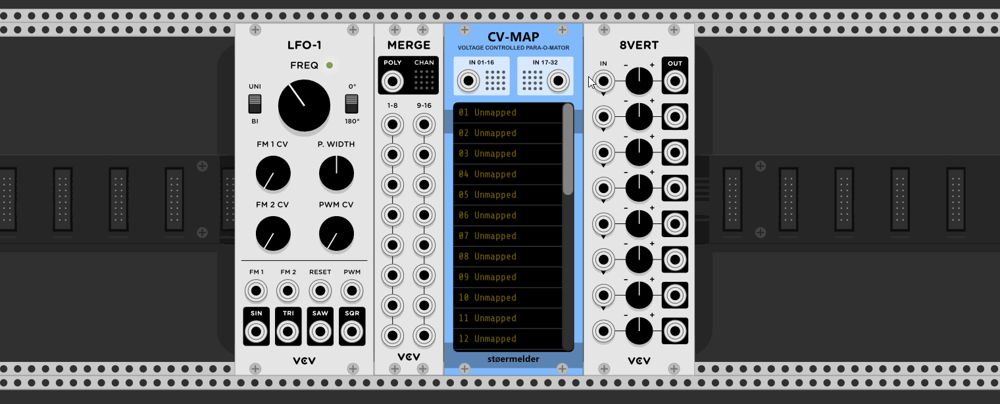
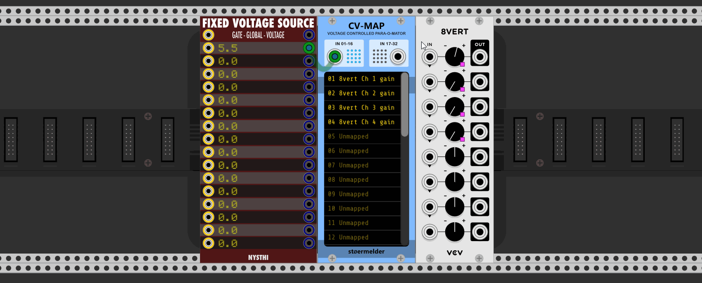

# stoermelder CV-MAP

The module CV-MAP is inspired by Rack v1's MIDI-MAP module: It allow you to modulate any parameter of any module by CV even when there is no CV input on the module itself! 

It has been said that is a bit againt the idea of "virtual modular" and it is some kind of bad design when CV-controlling things that weren't intended to by thier creators. Still, CV-MAP provides automation for your virtual knobs, switches and faders in Rack.

New in v1.0.2: You can disable text scrolling if it distracts you.

Some videos about CV-MAP:

- [Omri Cohen](https://omricohencomposer.bandcamp.com/) showed how to use this module in one of his recent [live streams](https://youtu.be/RSvWeBZzYEA?t=2522).
- A really epic [tutorial video](https://www.youtube.com/watch?v=Dd0EESJhPZA) from [Omri Cohen](https://omricohencomposer.bandcamp.com/).
- Extensive use of little brother µMAP in [this video](https://www.youtube.com/watch?v=_bVb3LewdVw) from VCV Rack Ideas.

### Mapping of parameters

You can bind up to 32 mapping slots onto parameters of any module in your patch. You do this by activating a mapping with a mouse click. As long the mapping-mode is active the slot shows "Mapping...". Then click on the knob of the module you like to automate. The mapping slot binds to the knob by showing its name, also a small pink mapping indicator is shown near the parameter. The mapping mode automatically moves to the next empty slot and can be deactivated by clicking anywhere in the rack except a parameter.

New in v1.0.2: In the context menu of each mapping slot you find a option "Locate and indicate" which centers the module on screen and blinks the pink mapping indicator for a short time. Useful when you get lost in what maps what.

### Inputs

To save some panel space the module uses two polyphonic input ports for receiving 32 voltages. In most cases you add an VCV Merge-module to combine the signals and then send it to CV-MAP. By default the input ports expect voltage between 0 and 10V but they can be switched to bipolar mode (-5 to 5V) in the context menu.

### Unlocking parameters

By default mapped parameters can't be changed manually as the incoming voltage constantly sets the value of the parameter. To loosen this limitation a bit you have an option to "unlock" parameters through the context menu: In "Unlock"-mode you can manually change parameters as long as thier input voltage stays constant. However, when the input voltage changes the parameter will be set to the new value. The input voltage still has a sort of higher priority.

