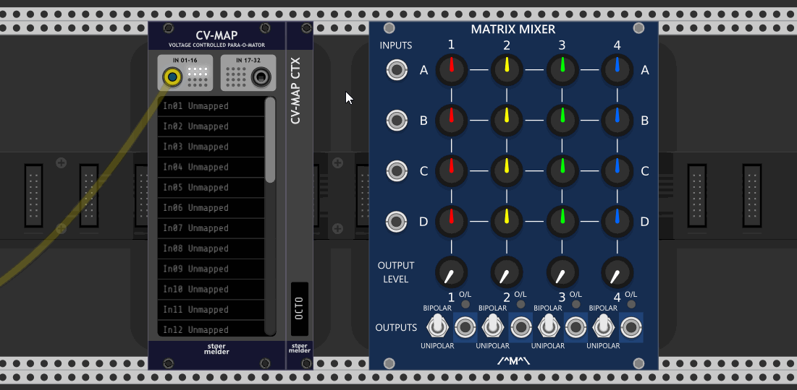

# stoermelder CV-MAP and CTX-expander

The module CV-MAP is inspired by Rack v1's MIDI-MAP module: It allows you to modulate any parameter of any module by CV even if there is no CV input on the module itself.

Some videos about CV-MAP:

- [Omri Cohen](https://omricohencomposer.bandcamp.com/) showed how to use this module in one of his [live streams](https://youtu.be/RSvWeBZzYEA?t=2522).
- A really epic [tutorial video](https://www.youtube.com/watch?v=Dd0EESJhPZA) from [Omri Cohen](https://omricohencomposer.bandcamp.com/).
- Extensive use of little brother µMAP in [this video](https://www.youtube.com/watch?v=_bVb3LewdVw) from [Artem Leonov](https://artemleonov.bandcamp.com/) of VCV Rack Ideas.

It has been said that such functionality is somehow against the idea of "virtual modular" and it is some kind of bad design if CV-controlling things that were not intended to by their creators. Still, CV-MAP provides automation for your virtual knobs, switches and faders in Rack.

You can disable text scrolling if it distracts you by context menu option (since v1.0.2).

## Mapping parameters

You can bind up to 32 mapping slots onto parameters of any module in your patch. You do this by activating a mapping slot with a mouse click. As long the mapping-mode is active the slot shows "Mapping...". Then click on the knob of the module you like to automate. The mapping slot binds to the knob by showing its name, also a small pink mapping indicator is shown next to the parameter. The mapping mode automatically moves to the next empty slot and can be deactivated by clicking anywhere in Rack except a parameter.

In the context menu of each mapping slot you find a option "Locate and indicate" which centers the module on screen and blinks the pink mapping indicator for a short time (since v1.0.2). It is useful when you get lost in what maps what.

## Inputs

For saving some panel space the module uses two polyphonic input ports for receiving up to 32 voltages. In most cases you add an VCV Merge-module to combine the signals and send it to CV-MAP then. By default the input ports expect voltages between 0 and 10V but they can be switched to bipolar mode (-5 to 5V) in the context menu.

Before v1.9 of CV-MAP input channels 1-32 were "hard-wired" to mapping slots 1-32, respectively. Since v1.9 input channels can be freely assigned to each mapping slot by context menu, while slot 1 uses channel 1, slot 2 channel 2 and so on, by default. This is especially useful for using the same input channel on multiple parameters or fast change of modulation sources.

For making the channel assignment more intuitive each input channel can be labeled with some custom text: These labels are managed by context menus on the two input ports. This is even more useful with the [CTX-expander](CVMap.md#ctx-expander).

## Unlocking parameters

By default mapped parameters can't be changed manually as the incoming voltage constantly sets the value of the parameter. To loosen this limitation you have an option to "unlock" parameters through the context menu: In "Unlock"-mode you can manually change parameters as long as their input voltage stays constant. However, when the input voltage changes the parameter will be set to the new value. The input voltage overrules manual changes.

## Slew-limiting and input-scaling

Added in v1.9: Each mapping slot has its own setting for slew-limiting of the input CV which applies an exponential filter. Larger values for _Slew_ give an overall steady movement of the mapped parameter on fast input changes.

Added in v1.9: Each mapping slot has also two sliders (_Low_ and _High_) for scaling incoming CV values which allows you to adjust the range of the CV control and how the mapped parameter is affected. By setting the two sliders accordingly almost any linear transformation is possible, even inverting a CV control. For convenience some presets are provided and the current scaling transformation is shown on the context menu.

## Additional features

- Mapping many parameters can result in quite high CPU usage. If automation at audio rate is not needed you can disable "Audio rate processing" on the context menu: This way only on every 32th audio sample the mapped parameter is updated and the CPU usage drops to about a 32th (since v1.4).

- If you find the pink mapping indicators distracting you can disable them on the context menu (since v1.5).

- Accidental changes of the mapping slots can be prevented by the "Lock mapping slots" context menu option which locks access to the widget of the mapping slots (since v1.5.0).

- A blinking mapping indicator will indicate the bound parameter of the mapping-slot which is currently selected (since v1.7). 

- Scrolling Rack's current view by mouse is interrupted by CV-MAP's list widget while hovered. As this behavior can be annoying all scrolling events are ignored if _Lock mapping slots_ is enabled (since v1.7).

- After a parameter has been mapped the parameter's context menu is extended with some addtional menu items allowing quick channel reassignment and centering it's mapping CV-MAP module on the center of the screen (since v1.9.0). There are even further options with the [CTX-expander](CVMap.md#ctx-expander).

CV-MAP was added in v1.0 of PackOne.

# CTX-expander

CTX is a companion module for CV-MAP: The expander allows you to name each instance of CV-MAP in your patch. This name can be addressed in every parameters' context menu for mapping or re-mapping parameters to input channels of the two input ports.

CTX for CV-MAP must be placed on the right side of CV-MAP. The display can hold up to 8 characters for naming CV-MAP.

### A tutorial and showcase of **CV-MAP CTX** made by VCV Rack Ideas

CTX for CV-MAP was added in v1.9 of PackOne.