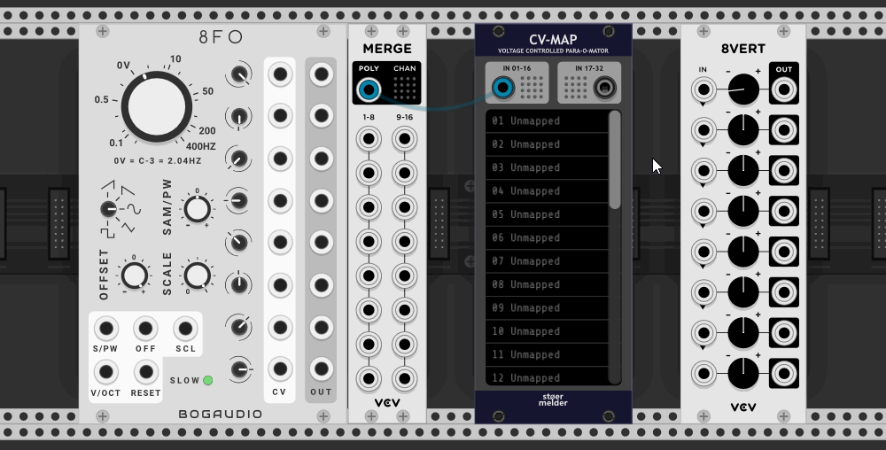

# stoermelder CV-MAP

The module CV-MAP is inspired by Rack v1's MIDI-MAP module: It allows you to modulate any parameter of any module by CV even if there is no CV input on the module itself!

It has been said that such functionality is a bit against the idea of "virtual modular" and it is some kind of bad design if CV-controlling things that weren't intended to by their creators. Still, CV-MAP provides automation for your virtual knobs, switches and faders in Rack.

You can disable text scrolling if it distracts you (since v1.0.2).

Some videos about CV-MAP:

- [Omri Cohen](https://omricohencomposer.bandcamp.com/) showed how to use this module in one of his [live streams](https://youtu.be/RSvWeBZzYEA?t=2522).
- A really epic [tutorial video](https://www.youtube.com/watch?v=Dd0EESJhPZA) from [Omri Cohen](https://omricohencomposer.bandcamp.com/).
- Extensive use of little brother µMAP in [this video](https://www.youtube.com/watch?v=_bVb3LewdVw) from [Artem Leonov](https://artemleonov.bandcamp.com/) of VCV Rack Ideas.

### Mapping of parameters

You can bind up to 32 mapping slots onto parameters of any module in your patch. You do this by activating a mapping slot with a mouse click. As long the mapping-mode is active the slot shows "Mapping...". Then click on the knob of the module you like to automate. The mapping slot binds to the knob by showing its name, also a small pink mapping indicator is shown next to the parameter. The mapping mode automatically moves to the next empty slot and can be deactivated by clicking anywhere in Rack except a parameter.

In the context menu of each mapping slot you find a option "Locate and indicate" which centers the module on screen and blinks the pink mapping indicator for a short time (since v1.0.2). It is useful when you get lost in what maps what.

### Inputs

For saving some panel space the module uses two polyphonic input ports for receiving up to 32 voltages. In most cases you add an VCV Merge-module to combine the signals and send it to CV-MAP then. By default the input ports expect voltages between 0 and 10V but they can be switched to bipolar mode (-5 to 5V) in the context menu.

### Unlocking parameters

By default mapped parameters can't be changed manually as the incoming voltage constantly sets the value of the parameter. To loosen this limitation you have an option to "unlock" parameters through the context menu: In "Unlock"-mode you can manually change parameters as long as their input voltage stays constant. However, when the input voltage changes the parameter will be set to the new value. The input voltage overrules manual changes.

### Additional features

Mapping many parameters can result in quite high CPU usage. If automation at audio rate is not needed you can disable "Audio rate processing" on the context menu: This way only on every 32th audio sample the mapped parameter is updated and the CPU usage drops to about a 32th (since v1.4.0).

If you find the pink mapping indicators distracting you can disable them on the context menu (since v1.5.0).

Accidental changes of the mapping slots can be prevented by the "Lock mapping slots" context menu option which prevents any changes on the 32 mapping slots (since v1.5.0).

CV-MAP was added in v1.0.0 of PackOne.