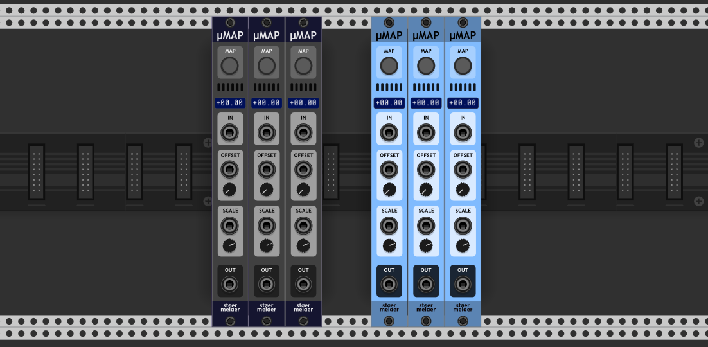

# stoermelder µMAP

µMAP is a single slot of [CV-MAP](./CVMap.md) with attenuation and output port. Please refer to the manual of [CV-MAP](./CVMap.md) how to this module works.

### OFFSET

Using the trimpod the input signal can be offseted in the range 0% to 100%. Connecting a cable to the offset-port disables the trimpod. It expects voltage 0-10V.

### SCALE

The input signal can be scaled using the trimpod from -200% to 200% while its default value is 100%. Connecting a cable to the scale-port disables the trimpod. It expects voltage -10V to +10V which is mapped to scaling -200% to 200%.

### OUT

In addition to [CV-MAP](./CVMap.md)'s capabilities µMAP has an OUT-port for outputting CV of the currently selected value of the mapped parameter (which is similar to [CV-PAM](./CVPam.md)'s function). This ports follows the voltage range selected for the INPUT-port and can be inverted by option on the context-menu (since v1.2.0).

µMAP was added in v1.0.2 of PackOne.