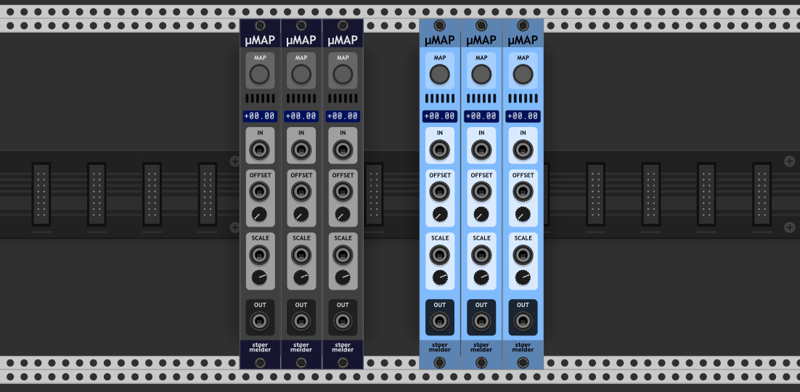
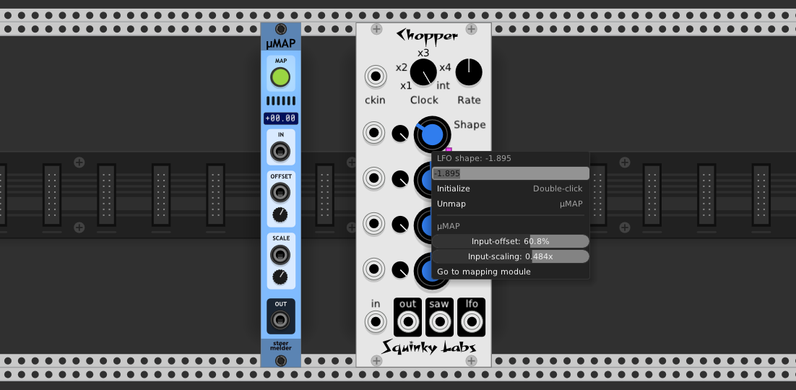

# stoermelder µMAP

µMAP is a single slot of [CV‑MAP](./CVMap.md) with attenuation and an output port. Please refer to the [CV‑MAP](./CVMap.md) manual to see how this module works.

### _OFFSET_

Using the trimpot, the input signal can be offset in the range 0% to 100%. Connecting a cable to the offset port disables the trimpot. It expects a voltage range of 0..10V.

### _SCALE_

The input signal can be scaled using the trimpot from –200% to 200%; its default value is 100%. Connecting a cable to the **SCALE**-port disables the trimpot. It expects voltages from –10V to +10V, which are mapped to scaling values from –200% to 200%.

### _OUT_

µMAP has an _OUT_ port that outputs the CV of the currently selected mapped parameter value, similar to the function of [CV‑PAM](./CVPam.md). This port follows the voltage range selected for the **INPUT**-port and can be inverted by option on the context-menu (since v1.2.0).

### Tips

- After a parameter has been mapped, its context menu is extended with additional items allowing quick adjustments and centering the µMAP module on the screen (since v1.9.0).

- By default, parameter changes are not reported back to the plugin host when µMAP is used in a plugin version of VCV Rack. In v2.2.0, a context menu option was added to enable this behavior, which may increase CPU usage.

## Changelog

- v1.0.2
    - Initial release
- v1.0.3
    - Fixed bug causing "damaged" module panels (array out of bounds)
- v1.3.0
    - Added context-menu options on mapped parameters of the target module
- v1.8.0
    - Added input voltage display
- v2.1.0
    - Improved mapping logic to allow more parameters to be mapped