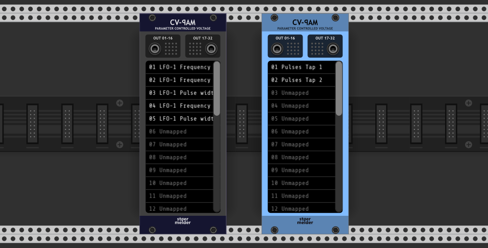
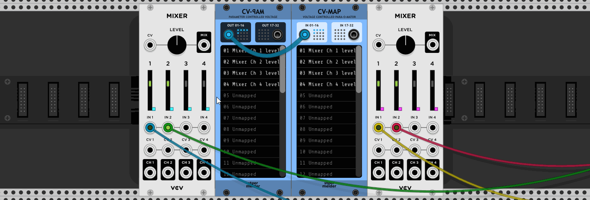

# stoermelder CV-PAM

CV-PAM is like a brother of [CV-MAP](./CVMap.md). While [CV-MAP](./CVMap.md) takes some CV and automates any knob, switch or slider, CV-PAM does kind of the opposite: You can attach one of its 32 slots to a parameter of any module and it generates CV-output from its movements. Clearly the use-cases for this module aren't that various as for [CV-MAP](./CVMap.md).

Using CV-PAM in combination with CP-MAP you can synchronize parameter changes of multiple instances of the same module (or different modules if you like). For an all-in-one solution for synchronizing parameters you can also use [MIRROR](./Mirror.md) (since v1.6.0).

You can disable text scrolling if it distracts you (since v1.0.2).

## Additional features

- Mapping many parameters can result in quite high CPU usage. If automation at audio rate is not needed you can disable "Audio rate processing" on the context menu: This way only on every 32th audio sample the mapped parameter is updated and the CPU usage drops to about a 32th (since v1.4.0).

- If you find the pink mapping indicators distracting you can disable them on the context menu (since v1.5.0).

- Accidental changes of the mapping slots can be prevented by the "Lock mapping slots" context menu option which locks access to the widget of the mapping slots (since v1.5.0).

- A blinking mapping indicator will indicate the bound parameter of the mapping-slot which is currently selected (since v1.7.0). 

- Scrolling Rack's current view by mouse is interrupted by CV-PAM's list widget while hovered. As this behavior can be annoying all scrolling events are ignored if _Lock mapping slots_ is enabled (since v1.7.0).

CV-PAM was added in v1.0.0 of PackOne.