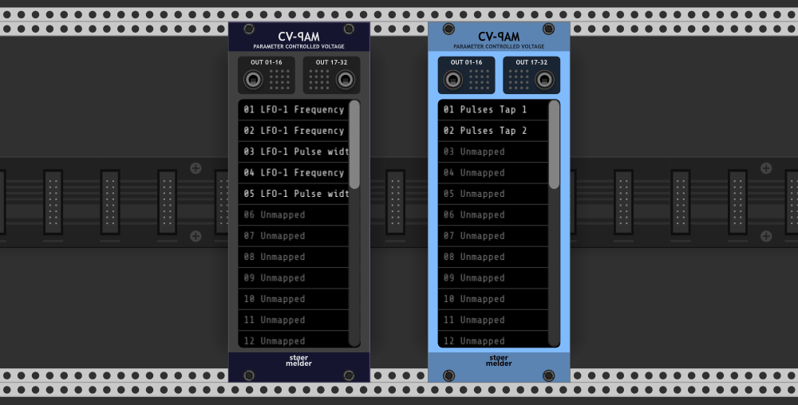
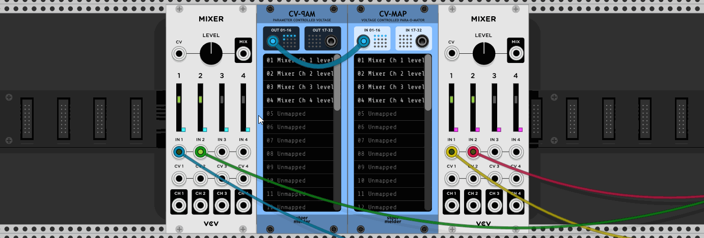

# stoermelder CV‑PAM

CV‑PAM is the counterpart of [CV‑MAP](./CVMap.md). While CV‑MAP takes CV input and automates any knob, switch or slider, CV‑PAM does the opposite: you attach one of its 32 slots to a parameter of any module and it generates CV output from the parameter’s movements. The use‑cases for CV‑PAM are therefore not as varied as those for [CV-MAP](./CVMap.md).

Using CV‑PAM in combination with CV‑MAP lets you synchronize parameter changes across multiple instances of the same module (or different modules). For an all‑in‑one solution you can also use [MIRROR](./Mirror.md) (since v1.6.0).

### Additional features

- Text scrolling of the mapping slots can be disabled  (since v1.0.2).

- **CPU usage** – Mapping many parameters can increase CPU usage. If audio‑rate automation is not required, disable _Audio rate processing_ from the context menu. This updates the mapped parameter only every 32nd audio sample, reducing CPU usage to roughly 1/32 (since v1.4.0).

- **Pink mapping indicators** – If the pink indicators are distracting, disable them from the context menu (since v1.5.0).

- **Lock mapping slots** – Prevent accidental changes by enabling the _Lock mapping slots_ option, which locks the mapping‑slot widgets (since v1.5.0).

- **Blinking indicator** – A blinking indicator shows the bound parameter of the currently selected mapping slot (since v1.7.0).

- **Scrolling interference** – Hovering over CV‑PAM’s list widget interrupts Rack view mouse scrolling. Enabling *Lock mapping slots* suppresses all mouse scrolling events while hovered (since v1.7.0).

## Changelog

- v1.0.0
    - Added text scrolling for longer module and parameter names
- v1.0.2
    - Added context menu options (locate & blink indicator on LED display, disable text scrolling, link online manual)
- v1.4.0
    - Added option to disable audio rate processing for lower CPU usage
    - Added option for hiding parameter indicator squares
- v1.7.0
    - Don't capture mouse scrolling if mapping slots are locked
    - Blink mapping indicator of currently selected mapping slot
- v1.8.0
    - Fixed wrong channel count of the polyphonic output ports