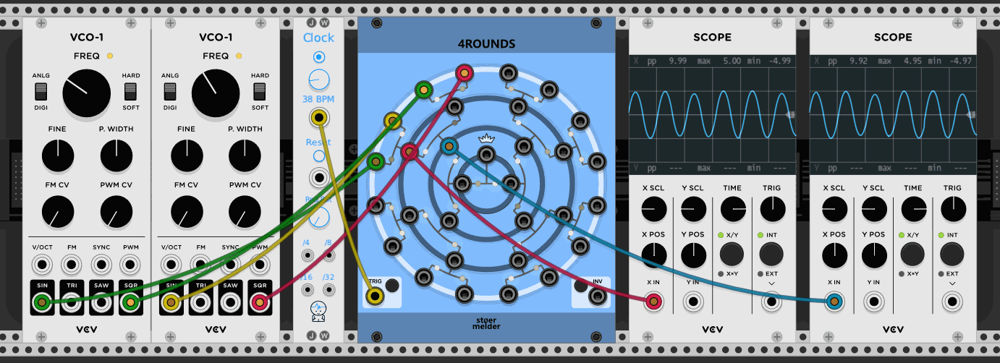

# stoermelder 4ROUNDS

4ROUNDS processes up to 16 input signals (bright circle) and generates up to 15 output signals (represented by dark circles) with randomly selected or mixed inputs. This is done by hosting some sort of contest or tournament between signals and choosing a random winner of several "1-on-1 matches". There are four rounds of 1-on-1 matches needed to find a winner out of 16 inputs hence the name 4ROUNDS. Every pairing of each match is drawn on the panel for easy visual understanding.

### Section _TRIG_

A new contest begins whenever a trigger is received. Winners of each 1-on-1 match are randomly selected until only one signal remains as the overall winner.

### Section _INV_

The _INV_ function inverts the module's state. Losers of all 1-on-1 matches become winners, and winners become losers.

### Modes

The module provides currently three different operation modes selectable on the context menu:

- In **CV / Audio** mode, the winning signal from each match is directly routed to its corresponding output. Active signals are shown by LEDs lit in green and an inverted state is shown by LEDs lit in red.
- In **Sample & Hold** mode, a single sample of each input is captured upon receiving a trigger on TRIG. Green and red LEDs are used the same way as in "CV / audio" mode.
- In **Quantum** mode, outputs are not binary (winners/losers) but a weighted mix of all input signals. The output reflects every possible state between inputs. The LEDs are lit in white signaling the weighting.

## Changelog

This module was introduced in v1.2 of PackOne.