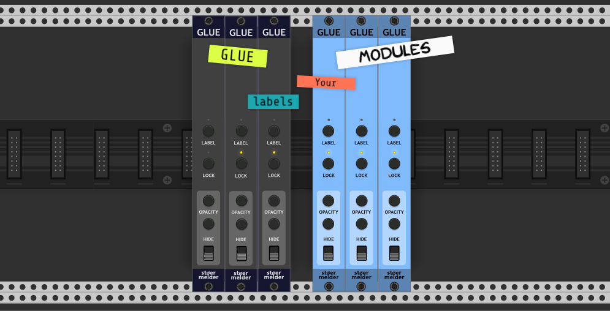
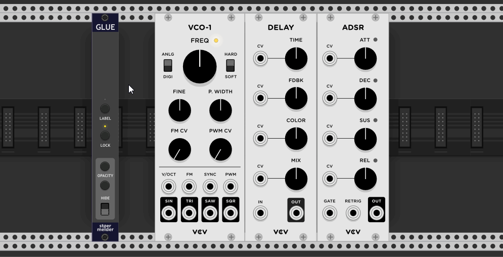
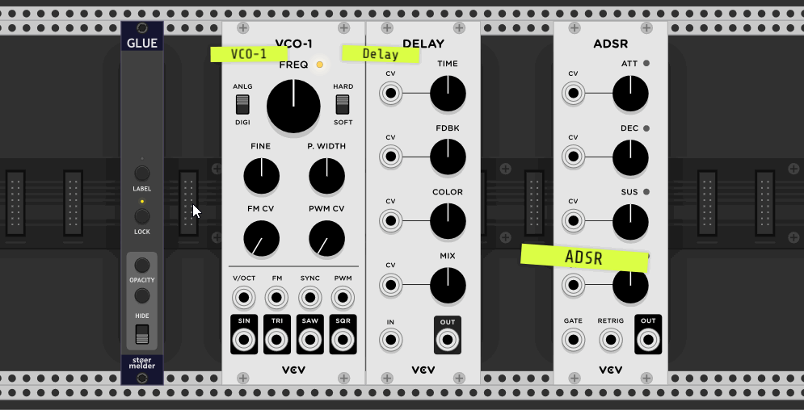
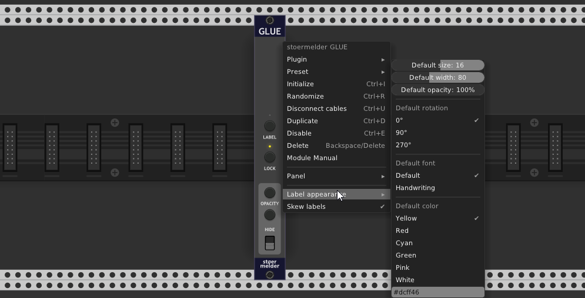
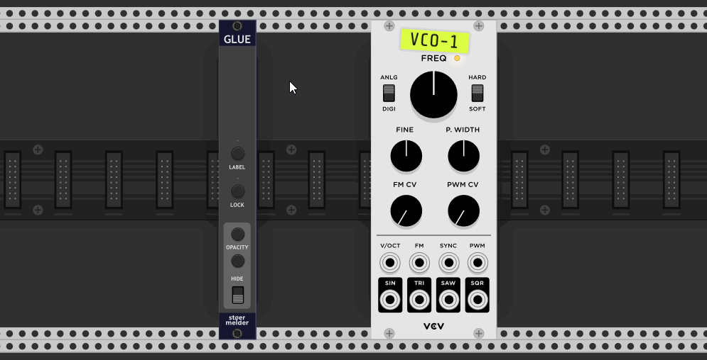
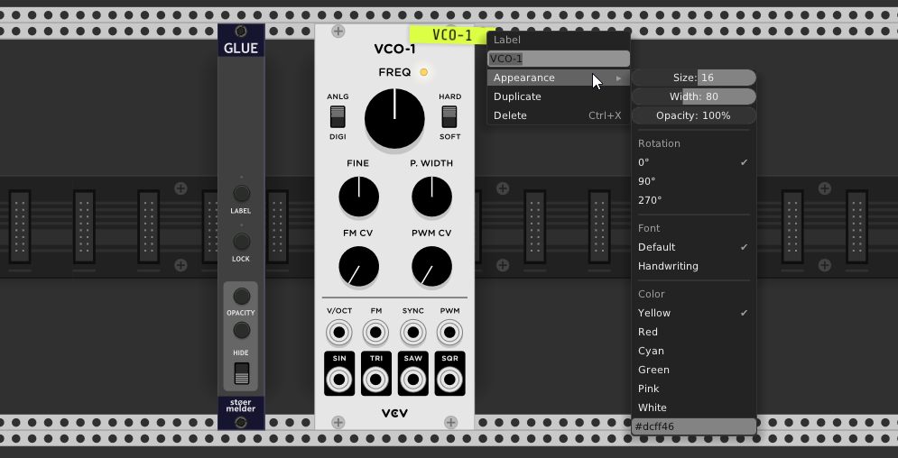

# stoermelder GLUE

GLUE is an utility module that provides the ability to put small text labels on modules in VCV Rack.

## Usage

Labels can be placed after "arming" the labeling-mode with the button *LABEL* (the LED is lit while active) and clicking on any module within your patch. Every label is attached to a specific module and will of course keep its place when moving the module around. After a new label has been placed GLUE "unlocks" itself automatically: In *locked mode* (LED is lit in yellow) all labels are "transparent" for any action and cannot be edited. In *unlocked mode* (LED off) labels can be moved within the boundaries of their modules and can be edited using the context menu.

While in *unlocked mode* you can use the hotkeys CTRL+G to place a label at the current position of the mouse pointer and CTRL+X to remove a label while hovering over it.

Since v1.9.0 there is a context menu option to consolidate the labels: If the current patch contains multiple GLUE-modules all except the current one will be removed and the labels are merged into one GLUE-module. This operation can be undo if needed.

## Opacity controls

There are global controls for opacity available which affect all labels of a GLUE instance: *HIDE* hides all labels temporarily, this switch can also be MIDI-mapped. Two buttons on *OPACITY* increase or decrease the opacity of all labels by 5%.

## Default appearance and skew

While each label keeps its own settings for appearance the module provides default settings which will be applied on every new label. These settings are:
* **Size**
* **Width**
* **Opacity**
* **Rotation**: 0, 90 or 270 degrees
* **Font**: Default (typewriter) and Handwriting
* **Font-color**: Preset-colors or your own color hexstring (#ffffff) for font-drawing (since v1.7.0)
* **Color**: Preset-colors or your own color hexstring (#ffffff)

By default every label gets a small random skew on placement to make it natural looking. If you prefer a clean aligned look skewing can be disabled by context menu option.

## Label appearance

Obviously every label has its own text content which is set with to the module's name by default. All graphical settings which are provided by default from the module can be changed per label afterwards (while *unlocked*).  
The context menu option "Duplicate" arms the labeling mode. Click on any module and create a new label with the same appearance as the duplicated one.

## Tips

* Labels get deleted when a module is removed from Rack.
* When undo-ing a delete operation of a module all labels will also reappear.
* Duplicating a label won't duplicate the skew.
* Duplicating an instance of GLUE won't duplicate any labels.
* While a label is strictly attached to a module it can be placed 50% off in any direction.
* Labels are drawn above all module components but below cables.
* GLUE supports labels within a stoermelder STRIP-file (since v1.7.0). Please note that GLUE must be included in the strip.

## Changelog

- v1.6.0
    - Initial release of GLUE
- v1.6.1
    - Fixed invalid initialization on new instances
- v1.6.3
    - Fixed crash on loading patches with empty labels
- v1.7.0
    - Implemented support for labels within STRIP, please be aware to include GLUE within your strip-file (#115)
    - Added options for changing text coloring (#136)
- v1.9.0
    - Added option to consolidate all GLUE modules into the current one
- v2.0.0
    - Changed "Add label" hotkey from Ctrl+A to Ctrl+G (#305)