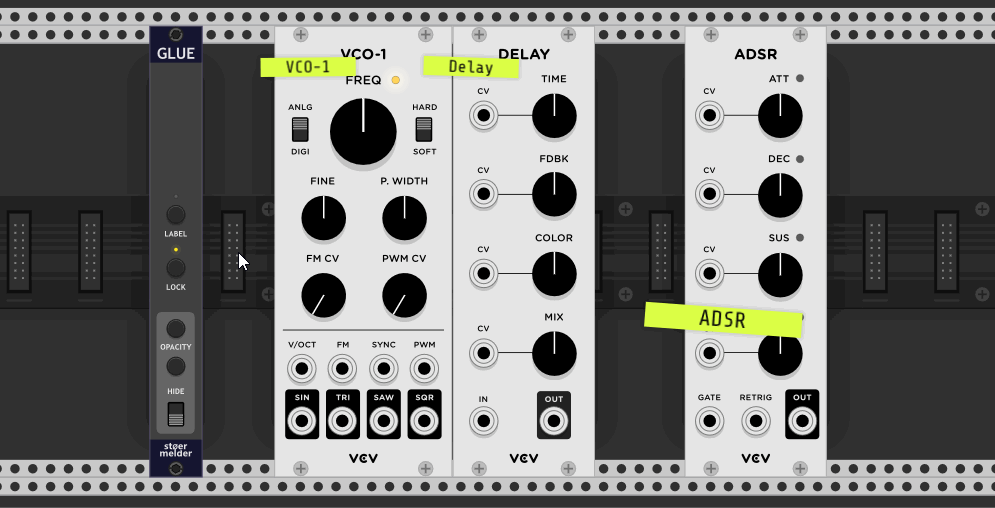

# stoermelder GLUE

GLUE is a utility module that provides the ability to put small text labels on modules in VCV Rack.

### Usage

Labels can be placed after arming the labeling mode by pressing the _LABEL_ button (the LED lights while active) and clicking on any module in your patch. Every label is attached to a specific module and will remain in place when the module is moved.

After a new label is placed, GLUE automatically unlocks itself: In *locked mode* (LED lit in yellow) all labels are transparent to actions and cannot be edited. In *unlocked mode* (LED off) labels can be moved within the boundaries of their modules and edited via the context menu.

While in *unlocked mode*, you can use the hotkeys CTRL+G to place a label at the current mouse position and CTRL+X to remove a label while hovering over it.

Since v1.9.0, a context menu option consolidates labels: If the current patch contains multiple GLUE modules, all except the current one are removed and their labels are merged into a single GLUE module. This operation can be undone if needed.

### Opacity controls

There are global opacity controls that affect all labels of a GLUE instance: _HIDE_ temporarily hides all labels and can be MIDI‑mapped. Two buttons on _OPACITY_ increase or decrease the opacity of all labels by 5%.

### Default appearance and skew

While each label keeps its own settings for appearance, the module provides default settings that are applied to every new label. These settings are:

- **Size**
- **Width**
- **Opacity**
- **Rotation** - 0°, 90°, or 270°
- **Font** - Default (typewriter) or Handwriting)
- **Font color** - preset colors or custom hex string, e.g. #ffffff (since v1.7.0)
- **Color** - preset colors or custom hex string (#ffffff)

By default, each label receives a small random skew upon placement to create a natural look. If you prefer a clean, aligned appearance, skewing can be disabled via the context menu.

### Label appearance

Each label has its own text content, which defaults to the module's name. All graphical settings provided by the module can be changed per label afterward (while *unlocked*). The context menu option _Duplicate_ arms the labeling mode. Click on any module to create a new label with the same appearance as the duplicated one.

### Tips

- Labels get deleted when a module is removed from Rack.
- When undoing a delete operation of a module, all labels will also reappear.

- Duplicating a label won't duplicate the skew.

- Duplicating an instance of GLUE won't duplicate any labels.

- While a label is strictly attached to a module it can be placed 50 % off in any direction.

- Labels are drawn above all module components but below cables.

- GLUE supports labels within a stoermelder STRIP-file (since v1.7.0). Please ensure GLUE is included in your strip.

## Changelog

- v1.6.0
    - Initial release of GLUE
- v1.6.1
    - Fixed invalid initialization on new instances
- v1.6.3
    - Fixed crash on loading patches with empty labels
- v1.7.0
    - Implemented support for labels within STRIP, please ensure GLUE is included in your strip-file (#115)
    - Added options for changing text coloring (#136)
- v1.9.0
    - Added option to consolidate all GLUE modules into the current one
- v2.0.0
    - Changed "Add label" hotkey from Ctrl+A to Ctrl+G (#305)
    - Added hotkey Ctrl+Shift+G for "Lock"
    - Added HSL color picker