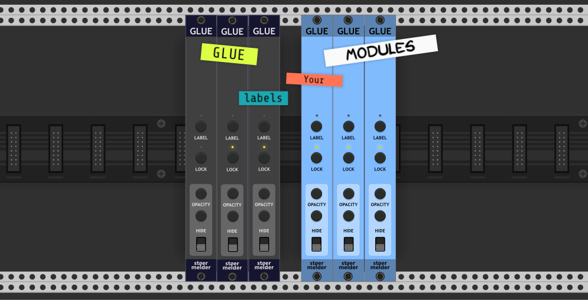
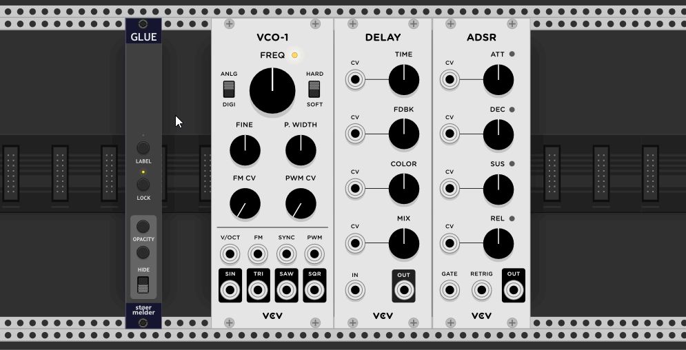
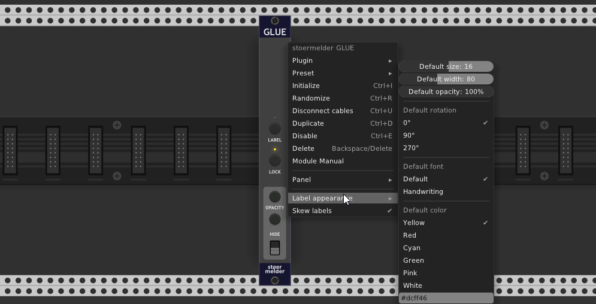
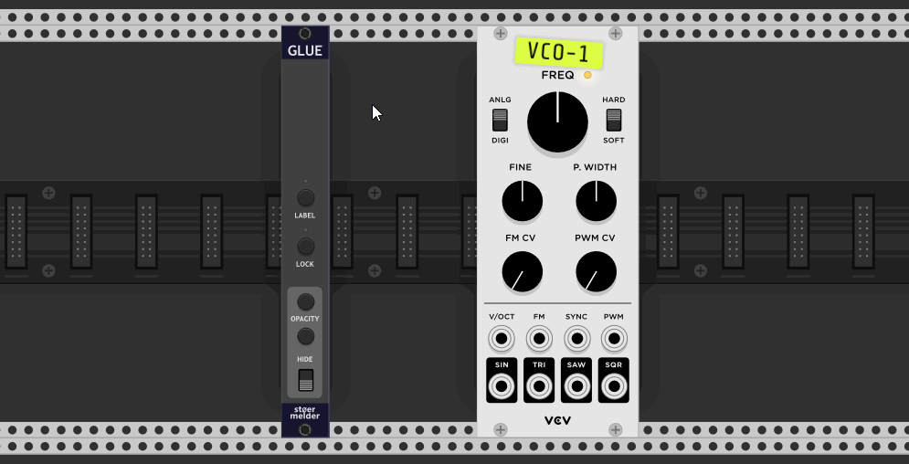
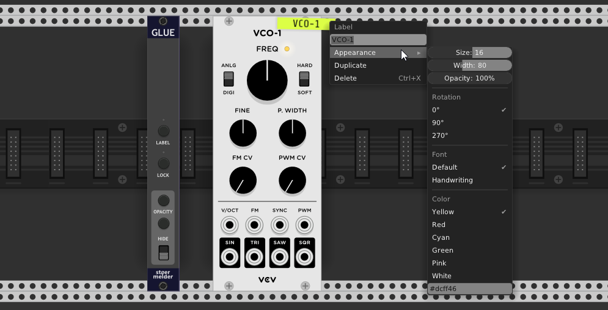

# stoermelder GLUE

- [Basic Usage](#basic-usage)
- [Module Controls](#module-controls)
- [Default Appearance](#default-appearance)
- [Label Customization](#label-customization)
- [Tips](#tips)
- [Changelog](#changelog)

### Overview

GLUE is a utility module that provides the ability to put small text labels on modules in VCV Rack. Labels can be used to annotate modules, mark important settings, or add notes to your patches.

### Basic Usage

Labels can be placed after arming the labeling mode by pressing the _LABEL_ button (the LED lights while active) and clicking on any module in your patch. Every label is attached to a specific module and will remain in place when the module is moved.

After a new label is placed, GLUE automatically unlocks itself: In *locked mode* (LED lit in yellow) all labels are transparent to actions and cannot be edited. In *unlocked mode* (LED off) labels can be moved within the boundaries of their modules and edited via the context menu.

While in *unlocked mode*, you can use the hotkey Ctrl+G to place a label at the current mouse position and Ctrl+X to remove a label while hovering over it.

### Module Controls

GLUE has several buttons for controlling labeling and label visibility:

- **LABEL button** (top) - Arms the labeling mode for placing new labels. Press while the LED is lit to place labels. The white LED indicates labeling mode is active.
- **LOCK button** (middle) - Toggles between locked and unlocked modes. The yellow LED indicates locked mode (labels cannot be edited).
- **OPACITY + button** - Increases the overall opacity of all labels by 5%.
- **OPACITY − button** - Decreases the overall opacity of all labels by 5%.
- **HIDE button** - Temporarily hides all labels. This switch can be mapped to MIDI for remote control.

### Default Appearance

While each label keeps its own settings for appearance, the module provides default settings that are applied to every new label. These settings can be configured in the module's context menu under "Label appearance":

- **Size** - Font size for new labels (8-24 pixels, default 16)
- **Width** - Text box width for new labels (20-180 pixels, default 80)
- **Opacity** - Transparency level for new labels (20%-100%, default 100%)
- **Rotation** - Default text rotation: 0°, 90°, or 270°
- **Color** - Label background color (Yellow, Red, Cyan, Green, Pink, White, or custom hex color)
- **Font** - Text font: Default (typewriter) or Handwriting
- **Font color** - Text color: Black, White, or custom hex color (since v1.7.0)

By default, each label receives a small random skew upon placement to create a natural look. If you prefer a clean, aligned appearance, skewing can be disabled via the context menu.

### Label Customization

Each label has its own text content, which defaults to the module's name. All graphical settings provided by the module can be changed per label afterward (while *unlocked*). The context menu option _Duplicate_ arms the labeling mode. Click on any module to create a new label with the same appearance as the duplicated one.

### Consolidating Multiple GLUE Modules

Since v1.9.0, GLUE can consolidate multiple instances of itself in a patch. If your patch contains multiple GLUE modules, you can right-click on any GLUE module and select _Consolidate GLUE_ to merge all labels from other GLUE instances into the current one. All other GLUE modules will be removed. This operation can be undone if needed.

### Tips

- Labels are deleted when a module is removed from Rack. When undoing a delete operation of a module, all labels will also reappear.

- Duplicating a label won't duplicate its random skew effect.

- Duplicating an instance of GLUE won't duplicate any of its labels.

- While a label is strictly attached to a module, it can be positioned up to 50% outside the module's boundaries in any direction.

- Labels are drawn above all module components but below cables.

- GLUE supports labels within stoermelder STRIP-files (since v1.7.0). Ensure GLUE is included in your strip-file for labels to persist.

## Changelog

- v1.6.0
    - Initial release of GLUE
- v1.6.1
    - Fixed invalid initialization on new instances
- v1.6.3
    - Fixed crash on loading patches with empty labels
- v1.7.0
    - Implemented support for labels within STRIP, please ensure GLUE is included in your strip-file (#115)
    - Added options for changing text coloring (#136)
- v1.9.0
    - Added option to consolidate all GLUE modules into the current one
- v2.0.0
    - Changed "Add label" hotkey from Ctrl+A to Ctrl+G (#305)
    - Added hotkey Ctrl+Shift+G for "Lock"
    - Added HSL color picker