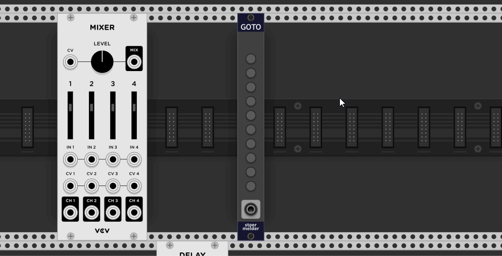

# stoermelder GOTO

GOTO is a utility module that moves the current viewport of VCV Rack to interesting locations in your patch. Up to ten jump points can be recalled using key combinations SHIFT+1, SHIFT+2, … or via CV.

Every jump point of GOTO is bound to a specific module or a selection of modules in your patch. Binding is activated by long‑pressing one of the red‑lit buttons and then selecting a module with the mouse. Alternatively, a selection can be set via the context‑menu option of the jump‑point buttons.
Already used jump points are lit in yellow and can be cleared by long‑pressing the button again. The current zoom level is also saved and recalled when a jump point is activated.

There are several settings available in the context menu:

- **Smooth transition**: By default the viewport jumps directly to the bound module. Enabling this option moves the viewport smoothly to the new position, which may increase graphical processing load.

- **Ignore zoom level**: By default GOTO recalls the zoom level at binding time. Enabling this option keeps the current zoom level unchanged.

- **Jump position**: This option determines whether the bound module is centered on the screen or moved to the top‑left corner.

### _INPUT_-port

It is possible to trigger a view-port change by CV which is especially useful with one of the MIDI-modules, like MIDI-CV, MIDI-GATE or MIDI-CC. As long as a cable is connected to the port the hotkeys SHIFT+1..0 are deactivated. There are two modes available: 

- **Polyphonic trigger**: The first ten channels of a polyphonic cable are used to trigger jump points 1–10.

- **C5–A5**: The input port is treated as monophonic, and voltages from C5 to A5 (1.00 V–1.83 V) trigger jump points 1–10. The module reacts to every change in input voltage.

## Changelog

- v1.6.0
    - Initial release
- v1.7.0
    - Added support for number pad keys (#134)
- v2.0.0
    - Added "top left" as a modules reference point for jump destination
    - Removed setting "Center module" as the disabled state did not work correctly
    - Fixed crash on patch-loading inside Rack VST (#342)
    - Fixed broken zoom behavior when jumping by buttons on the panel
- v2.2.0
    - Extended jump-points for multiple modules/selections