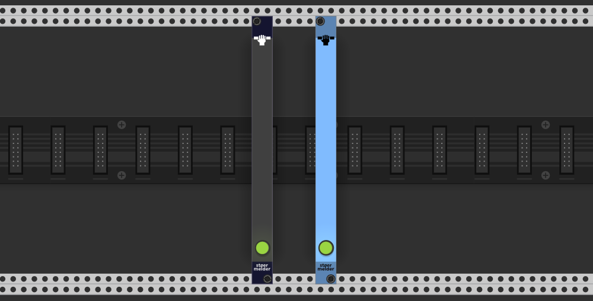
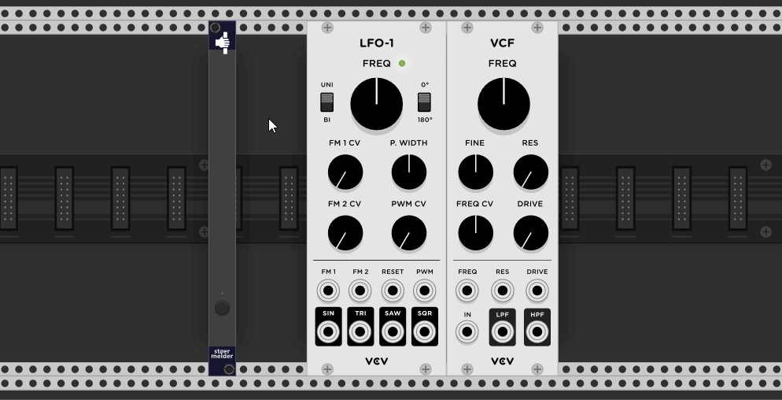

# stoermelder GRIP

GRIP is a small utility module which helps you to keep knobs, faders, switchs or buttons locked at a specific value. It avoids accidental parameter changes and prevents randomization using the context menu option.

A parameter can be locked by activating "mapping mode" (white light) using the single button on the panel and a click on the parameter afterwards, a red mapping square will appear next to it. Mutiple parameters can be locked by repeating this procedure and a list of all locked parameters is shown in the context menu of the module.  
One instance of GRIP can lock up to 32 parameters.

GRIP supports locking parameters within a stoermelder STRIP-file (added in v1.7.0). Please note that GRIP must be included in the strip.

GRIP was added in v1.6.0 of PackOne.