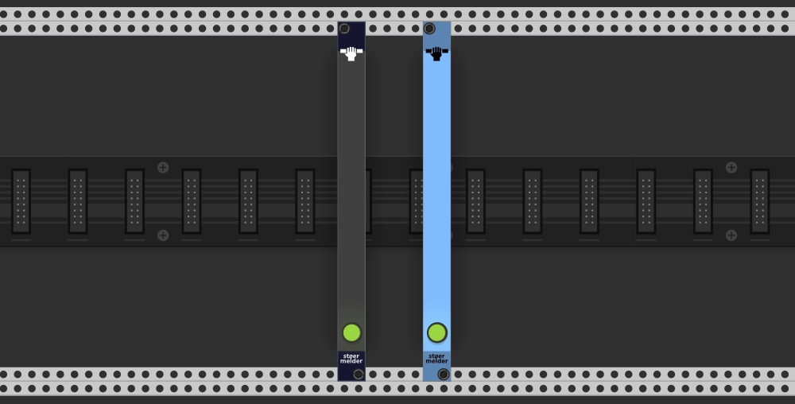
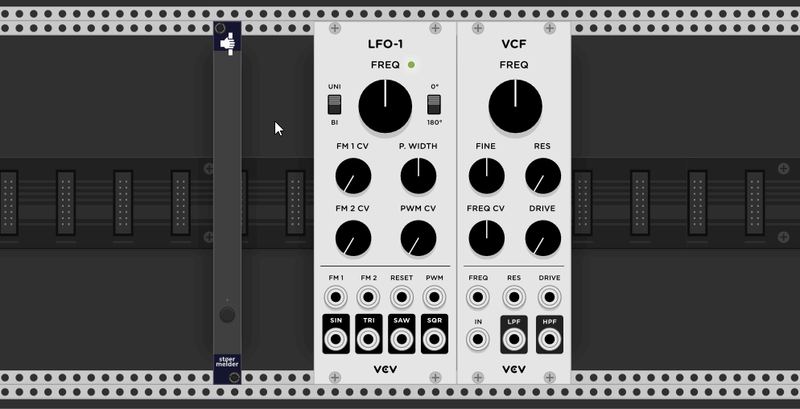

# stoermelder GRIP

GRIP is a small utility module that helps you keep knobs, faders, switches, or buttons locked at a specific value. It prevents accidental parameter changes and randomisation via the context‑menu option.

To lock a parameter, activate *mapping mode* (the white light) by pressing the single button on the panel, then click the parameter. A red mapping square will appear next to it.
Multiple parameters can be locked by repeating this procedure; a list of all locked parameters is shown in the module’s context menu.
One instance of GRIP can lock up to 32 parameters.

GRIP supports locking parameters within a stoermelder STRIP file (added in v1.7.0). Note that GRIP must be included in the strip.

GRIP was introduced in v1.6 of PackOne.