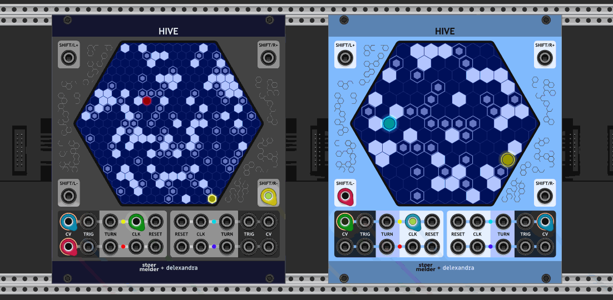

# stoermelder HIVE

HIVE is a random ratcheting sequencer with 4 independent outputs which run on a common 2-dimensional hexagonal grid. HIVE is an oddball and a close relative of [MAZE](./Maze.md): Almost everything works the same way except for the playheads running on a grid consisting of hexagonal cells.

HIVE was kindly contributed to PackOne by [Delexander](https://github.com/anlexmatos) and this is what he says about the sequencer:  
(from https://community.vcvrack.com/t/stoermelders-idea-und-development-thread/10515/236)

> [...]  
> Some general thoughts on HIVE, for anyone curious:
> 
> I’ve been intrigued by hexagonal grids for about as long as I can remember, largely driven by experiences with strategy games played on hexagonally-gridded game boards: Battle for Wesnoth, Settlers of Catan, Civilization 5, and more recently abstract games from Nick Bentley like Bug 1, Circle of Life 1, and Blooms 1.
> 
> In scenarios like those involving strategic positioning and movement, the 6 degrees of hexagonal space create a significant impact in the structure, flow, feel, and apparent complexity of the game. Also, in my completely subjective opinion, hexagonal grids and the games played upon them have a striking visual appeal.
> 
> I was also driven by an interest in the interface between the visual appearance of a grid and the pitch/amplitude and rhythm information derived from it, as seen in MAZE. Using MAZE to make music involves beginning perhaps with a musical idea, translating that into intent visually upon MAZE’s grid, hearing a (likely unexpected) result, and finally the resultant sound feeds backward psychologically and informs our perception of the visual appearance of the grid, or at least that’s how it seems to me.
> 
> When a sequencer is also a visualizer, and sequences are programmed visually, and the sequencer has a bit of a mind of its own via randomization and probability, there seems to be a rich cyclic interaction between the aural and visual components of perception.
> 
> Playing with MAZE and then having the idea for HIVE provided me with a unique opportunity to explore that interest in hexagonal grids. I implemented it while wondering how that same sort of transformation from square to hexagonal in the strategy-space of a game might translate to some sort of an analogous transformation in the music-space of a sequencer, via MAZE’s laws of physics.  
> [...]

A lush example how HIVE and MAZE can work together:

HIVE was added in v1.8.0 of PackOne.