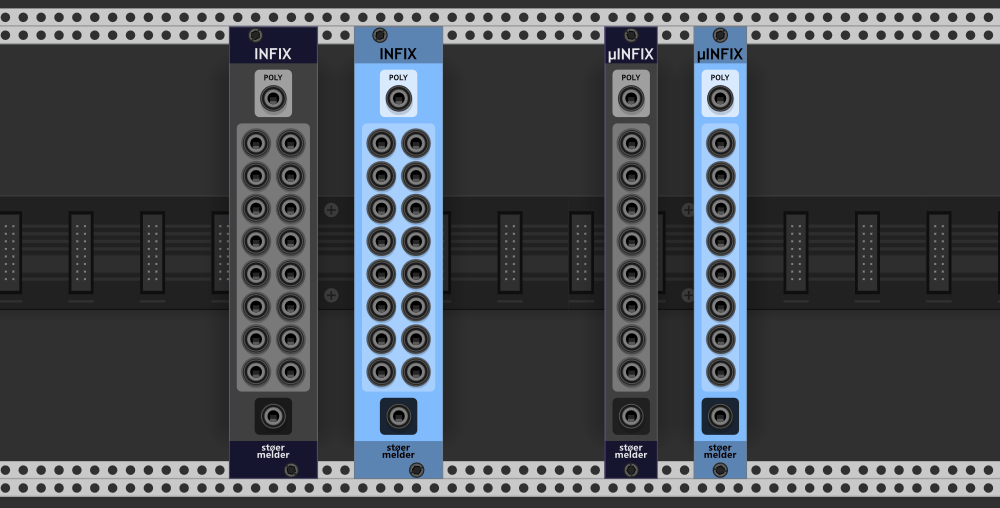
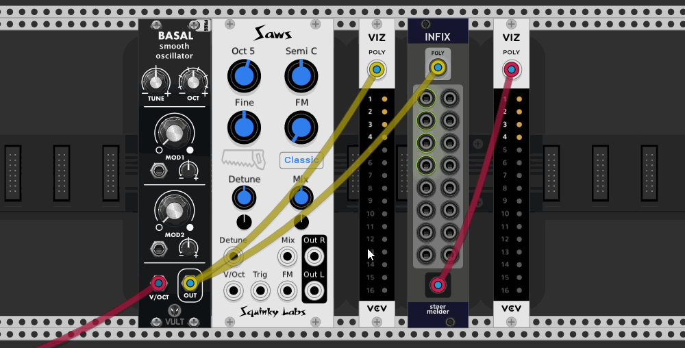

# stoermelder INFIX and µINFIX

INFIX is a utility module for inserting or replacing individual channels within a polyphonic signal. By default, the _POLY_ input is passed unchanged to the _POLY_ output. When a cable is connected to any of the monophonic input ports (1-16), the corresponding channel on the _POLY_ output is either replaced (if the channel is already in use by the _POLY_ input) or added (if the channel is unused).

## Changelog

- v1.0.3
    - Initial release
- v1.3.0
    - Added µINFIX, an 8-port variant of INFIX
- v1.4.0
    - Added LEDs for used channels on polyphonic cables