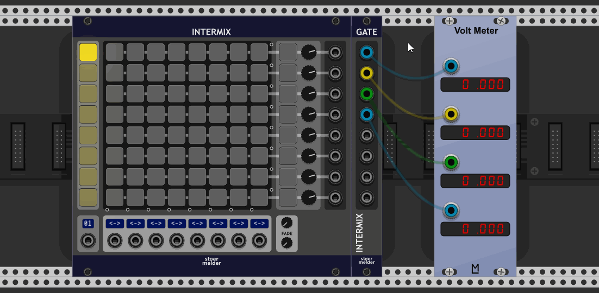
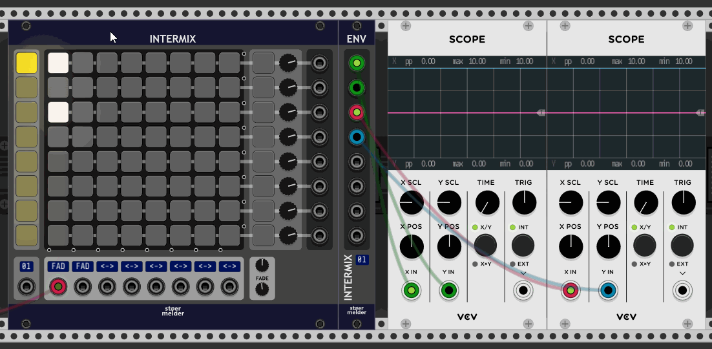
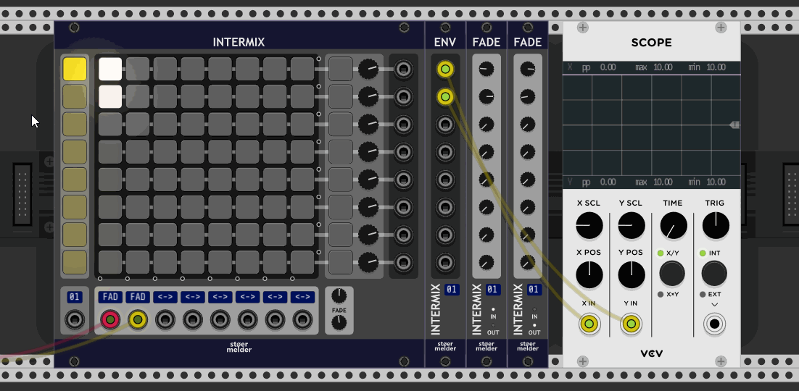

# stoermelder INTERMIX

INTERMIX is a precision-adder matrix with 8 inputs and 8 outputs.

- Support for 8 different scenes
- Various input-modes, e.g. constant voltages
- Supports fading between scenes with adjustable time for fade-in and fade-out
- Optional visualization of input-voltage on the switch-pads
- Compatible with MIDI-mapping
- Very low CPU-usage
- Polyphony support (added in v1.8.0)

## Tips

- The context menu option "Scene lock" prevents accidental changes made on the scenes, scene-buttons and output-buttons are still active (added in v1.10.0).

INTERMIX was added in v1.4 of PackOne.

## GATE-expander

The expander INTERMIX-GATE must be placed on the right-side of INTERMIX (or one of its expanders) and outputs 10V whenever at least one pad is active of the row.

INTERMIX-GATE was added in v1.10 of PackOne.

## ENV-expander

The expander INTERMIX-ENV must be placed on the right-side of INTERMIX (or one of its expanders) and outputs envelopes for a specific input column, in case _FADE_ is activated. In other cases it outputs gate-signals whenever the pad is active.

INTERMIX-ENV was added in v1.10 of PackOne.

## FADE-expander

The expander INTERMIX-FADE must be placed on the right-side of INTERMIX (or one of its expanders) and allows custom fade values for each pad of a selected input column. It can be used to set the values for fade-in and fade-out the same time or fade-in only or fade-out only. When the expander is detached or configured for another input column the default values from the main-module reapply.

INTERMIX-FADE was added in v1.10 of PackOne.