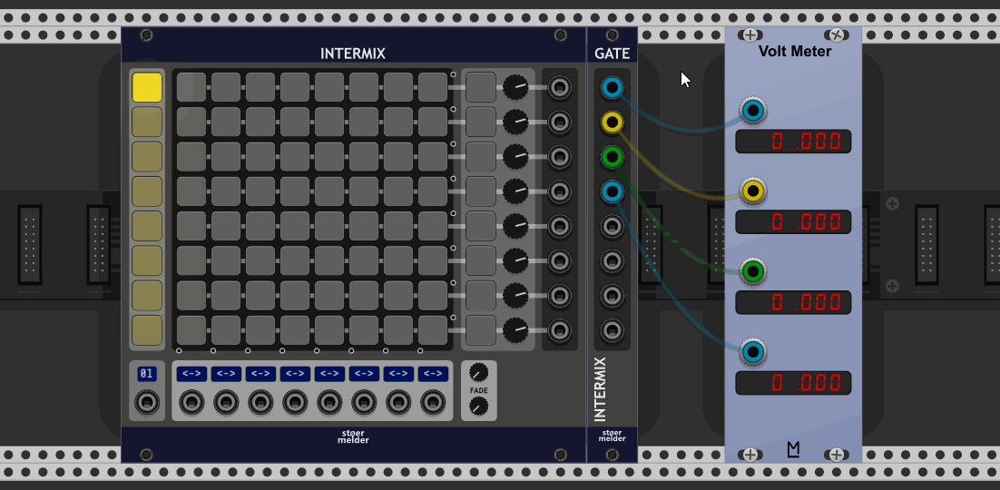
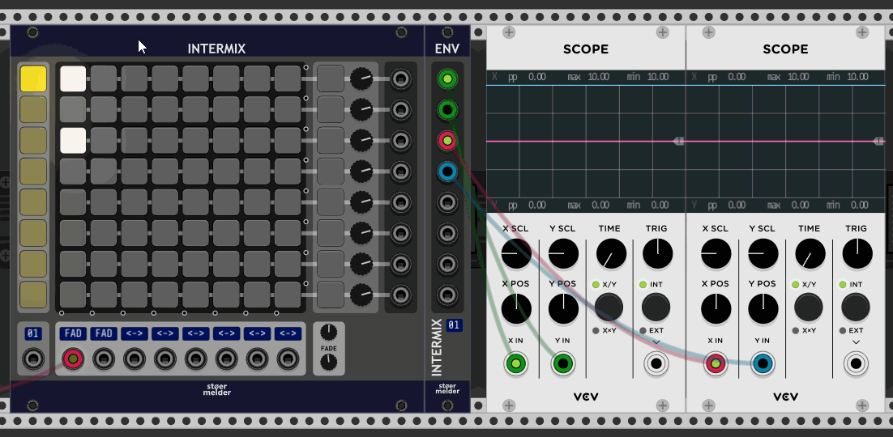
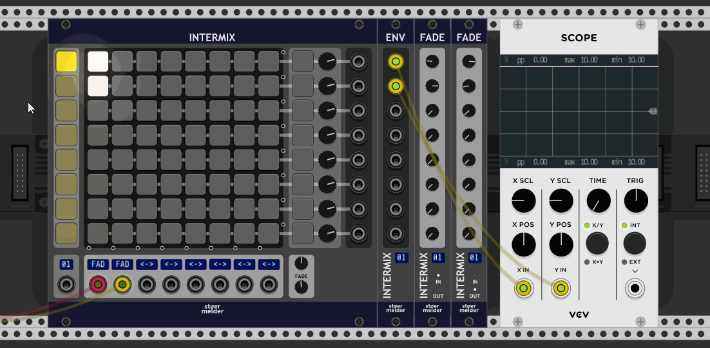

# stoermelder INTERMIX

INTERMIX is a precision‑adder matrix featuring 8 inputs and 8 outputs.

- Support for 8 distinct scenes
- Multiple input modes, such as constant voltages
- Fade smoothly between scenes with adjustable fade‑in and fade‑out times
- Optional visualization of input voltage on the switch pads
- Full compatibility with MIDI mapping
- Very low CPU usage
- Polyphony support (added in v1.8.0)

### Tips

- The context‑menu option "Scene lock" prevents accidental changes to scenes, while scene‑buttons and output‑buttons remain active (added in v1.10.0).

### GATE-expander

The INTERMIX‑GATE expander must be placed on the right side of INTERMIX (or one of its expanders) and outputs 10V whenever at least one pad in the row is active.

### ENV-expander

The INTERMIX‑ENV expander should be mounted on the right side of INTERMIX (or one of its expanders). It outputs envelopes for a specific input column when _FADE_ is enabled; otherwise it outputs gate signals whenever the pad is active.

### FADE-expander

The INTERMIX‑FADE expander should be placed on the right side of INTERMIX (or one of its expanders). It allows custom fade values for each pad of a selected input column, enabling simultaneous fade‑in and fade‑out, fade‑in only, or fade‑out only. When the expander is detached or reconfigured for a different input column, the default values from the main module are restored.

## Changelog

- v1.4.0
    - Initial release
- v1.5.0
    - Added matrix‑mapping parameters for rows and columns to support MIDI mapping
    - Added option to exclude attenuverters from scenes
    - Added ability to copy scenes
    - Added ability to reset scenes
    - Added option to disable the SCENE port
    - Added option to change the number of active scenes
    - Fixed broken fading when either fade‑in or fade‑out is set to zero
- v1.8.0
    - Added support for polyphony (#199)
- v1.10.0
    - Added context menu option "Scene lock" to prevent accidental changes
    - Added expander INTERMIX-FADE
    - Added expander INTERMIX-ENV
    - Added expander INTERMIX-GATE