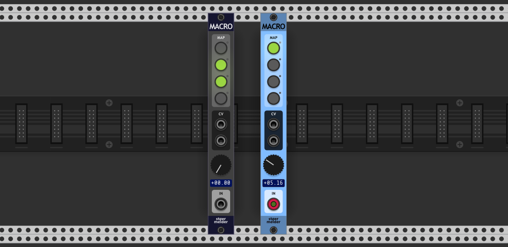
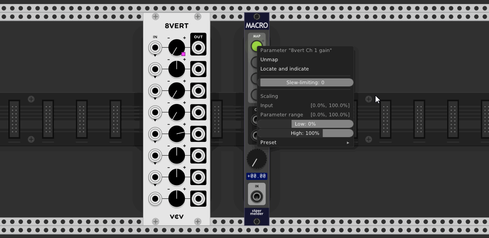

# stoermelder MACRO

MACRO is an utility module for controlling four different parameters at once. It has also two CV output ports controlled the same way and it provides built-in slew-limiting and scaling options, adjustable for every parameter and every port.

## Mapping parameters

You can bind up to four parameters of any module in your patch. You do this by activating a mapping button by click. While mapping is active the led it lit in red and turns green after you click onto a knob or fader of the module you like to control, also a small pink mapping indicator is shown next to the parameter.

## Slew-limiting and scaling

Each mapping slot and each CV output port has its own settings for slew-limiting and scaling the input value. The current scaling projection is shown on the context menu.

## IN-port

The IN-port is optional and MACRO can be used without anything connected. In this case the value is taken from the big knob's current position. If voltage is applied to IN the knob acts as an attenuator, also the voltage range can be switch from unipolar (0..10V) to bipolar (-5..5V) on the context menu.

## Additional features

Mapping parameters can result in quite high CPU usage. As controlling parameters at audio rate is not needed in most of the cases you can switch four different performance settings using _Precision_ option on the context menu.

MACRO was added in v1.8.0 of PackOne.