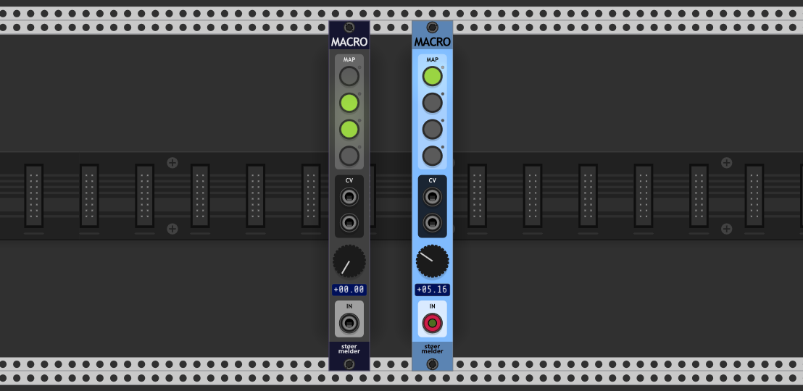
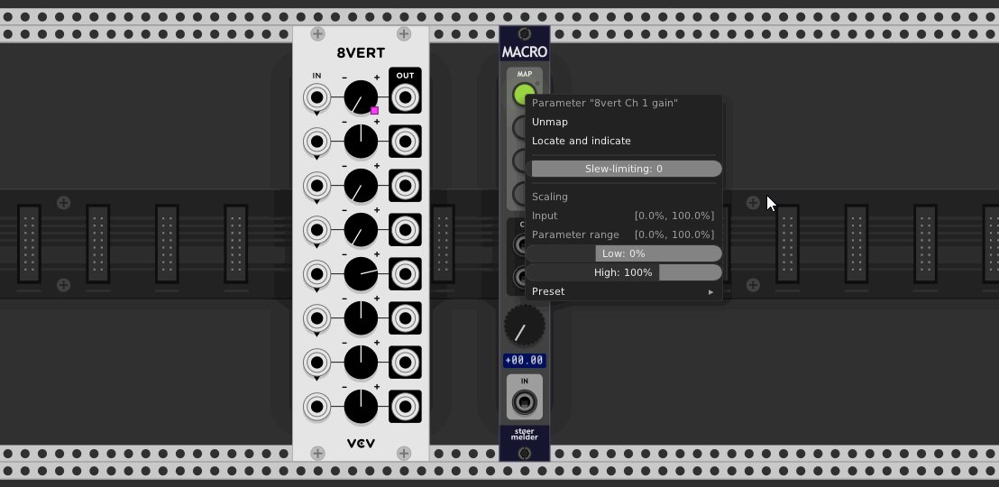

# stoermelder MACRO

MACRO is a utility module designed to control up to **four parameters** simultaneously. It includes **two CV output ports**, each configurable independently. Built-in slew-limiting and scaling options allow fine-tuned adjustments for every parameter and output.

### Mapping parameters

MACRO allows you to map up to four parameters from any module in your patch. To start mapping:

- Click a mapping button (LED turns red).
- Click a knob or fader on the target module.
- The LED turns green, and a pink indicator appears next to the mapped parameter.

### Slew-limiting

Each mapping slot includes an exponential filter to smooth input changes:
- Low slew values → smoother adjustments.
- High slew values → faster, steadier parameter/CV output movement.

### Scaling

Each slot and CV output features Low/High sliders to:
- Adjust the input range.
- Apply linear transformations (e.g., inversion).
- Presets are available, and the current scaling formula is displayed in the context menu.

### _IN_-port

The usage of the _IN_-port is optional. If the port is unconnect, the input value is taken from the big knob's current position. If voltage is applied to _IN_, the knob acts as an attenuator and the voltage range can be switched from unipolar (0..10V) to bipolar (-5..5V) on the context menu.

### Additional features

- Mapping parameters can consume significant CPU resources. To optimize: Adjust four precision settings via the context menu (audio-rate control is rarely needed).

- By default, MACRO does not report parameter changes to the host (VCV Rack plugin). v2.2.0+: Enable reporting via the context menu (this may increase CPU usage).

## Changelog

MACRO was introduced in v1.8 of PackOne.