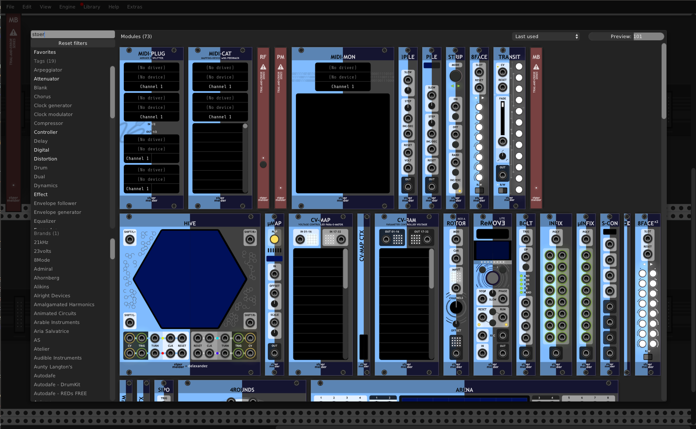

# stoermelder MB

MB is a module for experimental replacement for Rack's module browser, formerly available in stoermelder's PackTau. It brings back the browser from Rack v0.6x and has a modified browser from Rack v1.x with adjustable preview size, favorites, extended filtering options and more.

### Introduction by Omri Cohen

MB was added in v1.8 of PackOne.