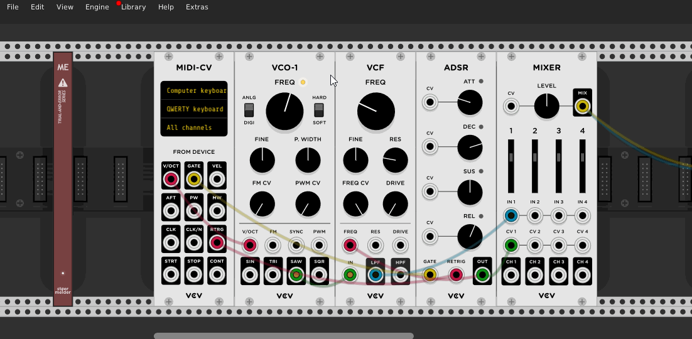

# stoermelder ME

ME (_mouse enhancements_) is an experimental utility module which provides a screen overlay on parameter changes made by mouse.

## Overlay settings

The screen overlay is used by different stoermelder modules (like [MIDI-CAT](MidiCat.md) and [SAIL](Sail.md)) and ME allows some graphical settings for the overlay which are applied globally.

ME was added in v1.9 of PackOne.