# stoermelder MIDI-CAT and expanders MEM and CTX

MIDI-CAT is a module for MIDI-mapping and an evolution of [VCV's MIDI-MAP](https://vcvrack.com/manual/Core.html#midi-map) with several additional features:

- It can be configured for an MIDI output-port to send **controller feedback**, all your controls get initalized on patch-loading if your controller supports it!
- It has two different **pickup-modes** for controllers without input or automatic adjustment, so your parameters won't change until your controls reach their current positions.
- It allows mapping of **MIDI note messages**, providing momentary-mode, momentary-mode with velocity and toggle-mode.
- You can switch the module to "Locate and indicate" mode, which will help you to retrace your midi controls to the mapped module and parameter.
- CPU usage has been optimized.
- And much much more...

Besides these new features the module brings the goodies known from stoermelder's other mapping modules like...

- ...text scrolling for long parameter names,
- ..."Locate and indicate" on slot's context menu for finding mapped parameters and
- ...unlocked parameters for changes by mouse or by preset loading or using a by preset-manager like stoermelder's [8FACE](./EightFace.md).

## Mapping parameters

A typical workflow for mapping your MIDI-controller will look like this:

- Connect your MIDI controller and select it on the top display of MIDI-CAT. If your controller can receive MIDI messages you can select the output port of the controller in the display in the middle.
- Activate the first mapping slot by clicking on it.
- Click on a parameter of any module in your patch. The slot will bind this parameter.
- Touch a control or key on your MIDI device. The slot will bind the MIDI CC or note message.
- Repeat this process until all the desired parameters have been mapped.

Since v1.7.0 a blinking mapping indicator will indicate the bound parameter the mapping-slot which is currently selected. 

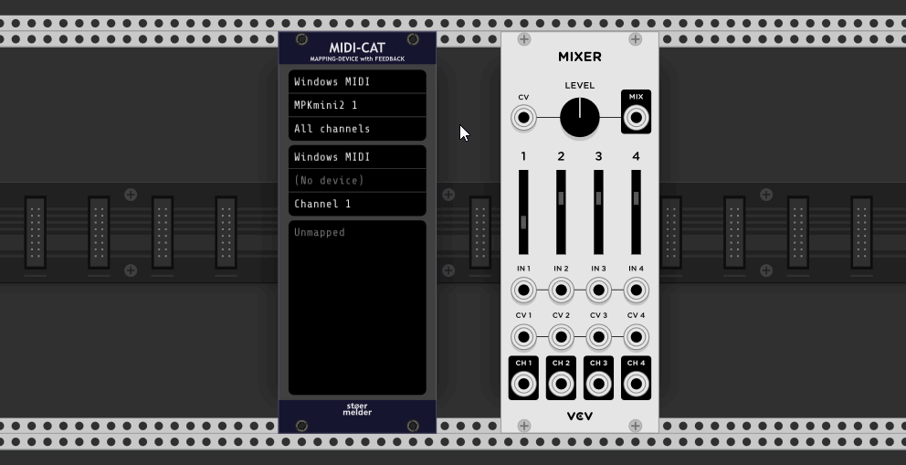

If you like to know more on MIDI-mapping in VCV Rack please refer to one of the existing tutorials like [this one](https://www.youtube.com/watch?v=Dd0EESJhPZA) from [Omri Cohen](https://omricohencomposer.bandcamp.com/).

In v1.7.0 new mapping options have been added to MIDI-CAT to achieve even faster mappings without the need for touching every single parameter of a module:

- **Map module (left)**  
  Place MIDI-CAT directly on the left side of the module you like to map. Use the option _Map module (left)_ on the context menu to fill the mapping slots with all parameters of the module. Please note that there are two different variants available: _Clear first_ clears all mappings slots before the slots of MIDI-CAT are filled, _Keep MIDI assignments_ will not clear the assigned MIDI controls but all bindings to parameters. The latter option is useful if you want to reuse the controls of your MIDI device and re-map them onto a different module.  
  Mapping can be also enabled by Ctrl/Cmd+Shift+E (_Clear first_) or Shift+E (_Keep MIDI assignments_).

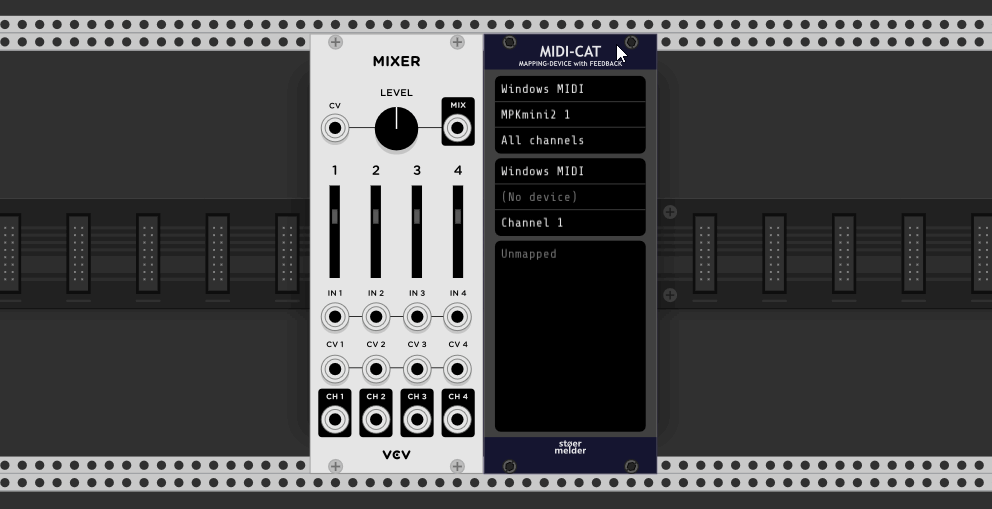

- **Map module (select)**  
  This option changes your cursor into a crosshair which needs to be pointed onto any module within your patch by clicking on the panel. The variants _Clear first_ and _Keep MIDI assignments_ work the same way as for _Map module (left)_.  
  Mapping can be also enabled by Ctrl/Cmd+Shift+D (_Clear first_) or Shift+D (_Keep MIDI assignments_).

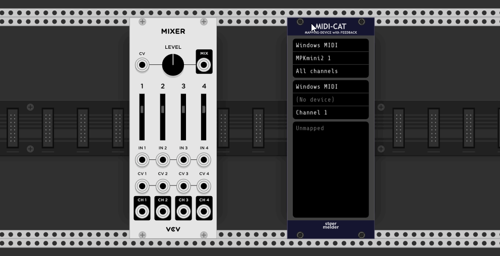

## "Soft-takeover" or "Pickup" for CCs

MIDI-CAT supports a technique sometimes called "soft-takeover" or "pickup": If the control on your MIDI device has a position different to the mapped parameter's position all incoming MIDI messages are ignored until the parameter's position has been "picked up". This method must be enabled for each mapping-slot in the context menu: 

- **Direct**: Every received MIDI CC message is directly applied to the mapped parameter (default).

- **Pickup (snap)**: MIDI CC messages are ignored until the control reaches the current value of the parameter. After that the MIDI control is "snaped" unto the parameter and will only unsnap if the parameter is changed from within Rack, e.g. manually by mouse or preset-loading.

- **Pickup (jump)**: Same as snap-mode, but the control will loose the parameter when jumping to another value. This mode can be used if your MIDI controller supports switching templates and you don't want your parameters to change when loading a different template.

- **Toggle**: Every MIDI _continuous control_ message toggles the parameter between its minimum and maximum value (usually 0 and 1 for switches) (added in v1.9.0).

- **Toggle + Value**: Every MIDI _continuous control_ message toggles the parameter between its minimum and the control's value (added in v1.9.0).

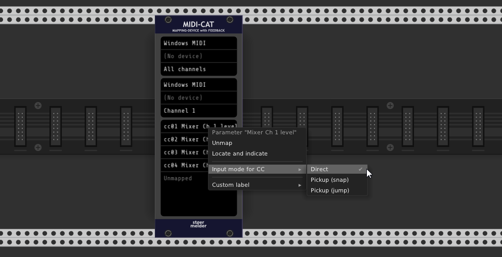

## Note-mapping

MIDI-CAT supports mapping of MIDI note-messages instead of MIDI CC. There are different modes availbale as note-messages work differently to continuous controls:

- **Momentary**: Default setting, when a MIDI note is received the parameter will be set to its maximum value (an MIDI velocity of 127 is assumed).

- **Momentary + Velocity**: same as "Momentary", but the MIDI velocity of the note is mapped to the range of the parameter.

- **Toggle**: Every MIDI _note on_ message toggles the parameter between its minimum and maximum value (usually 0 and 1 for switches).

- **Toggle + Velocity**: Every MIDI "note on" message toggles the parameter between its minimum and the note's velocity value (added in v1.8.0).

Some controllers with push-buttons don't handle "note off" messages the way the message is intended, hence a mapping-slot can be switched with the option _Send "note on, vel 0" on note off_ to send a "note on" message with "velocity 0" as MIDI feedback instead (since v1.7.0).

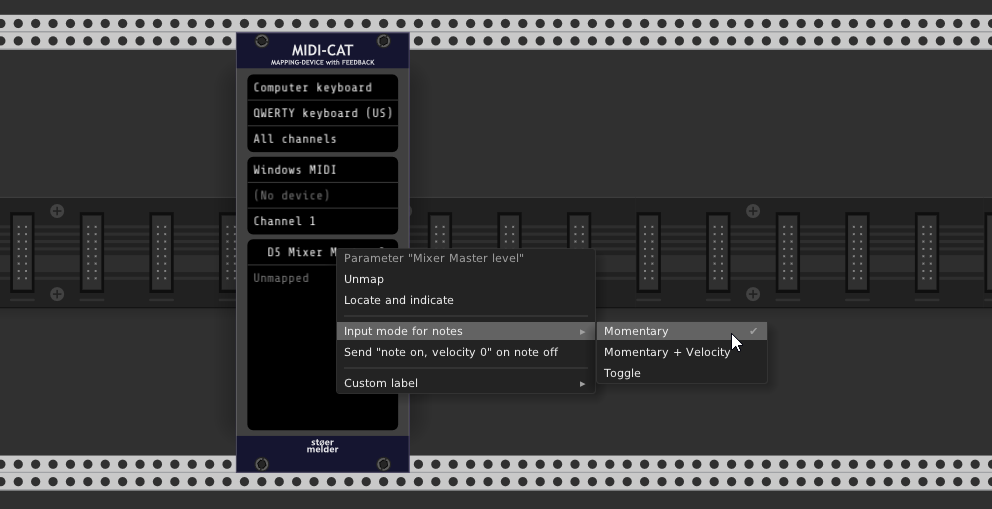

## Slew-limiting and input-scaling

Added in v1.8.0: Each mapping slot has its own setting for slew-limiting of the input value which applies an exponential filter. Small values for _Slew_ are smoothing incoming MIDI values which are quite "steppy" as MIDI supports only values 0-127 for CC and note velocity. Larger values for _Slew_ give an overall steady movement of the mapped parameter on fast controller changes.  

As slew-limiting can be a CPU-intensive operation when used on many parameters MIDI-CAT has an option to set the update frequency and thus its precision. This option can be found on the context menu and allows updating parameters on every audio sample which will cause the highest CPU usage but is rarely needed. Lower update frequencies also lower the CPU usage accordingly.

Added in v1.8.0: Each mapping slot has also two sliders (_Low_ and _High_) for scaling incoming MIDI values which allows you to adjust the range of the MIDI control and how the mapped parameter is affected. By setting the two sliders accordingly (MIDI values are ranging from 0 to 127) almost any linear transformation is possible, even inverting a MIDI control. For convenience some presets are provided and the current scaling transformation is shown on the context menu.

Please note that slew-limiting and input-scaling also works fine with note-mapping.

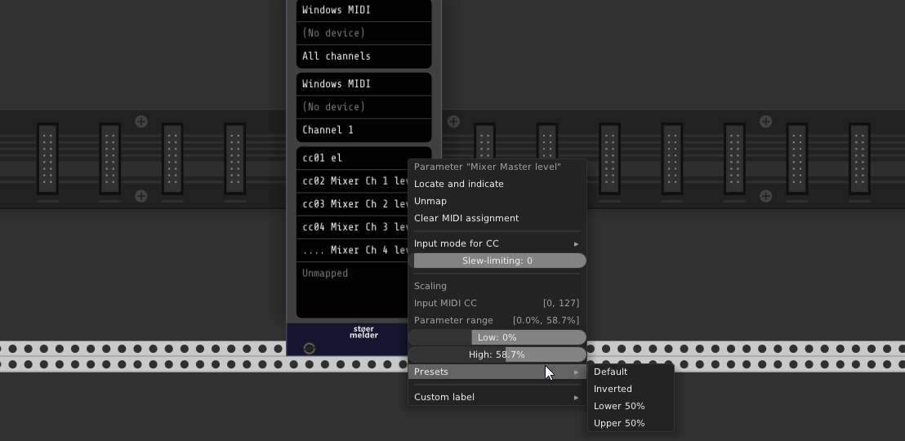

## 14-bit CC

MIDI 14-bit CC pairs are supported since v1.9.0: _continuous control_ messages 0-31 are combined pairwise with 32-63 for increasing the resolution of the value range from 0-127 to 0-16383. Of course the MIDI controller must support 14-bit CC as both messages must be always sent sequentially to make it work. 14-bit support can be enabled in each mapping slot assigned to MIDI CC 0-32.

The increased value resolution is displayed on the context menu and all available options like scaling and slew work can be used like regular CCs.

## MIDI-feedback

Any parameter change can be sent back to an MIDI output with the same CC or note. "Feedback" is useful for initialization of the controls on the MIDI device if it is supported, especially after loading a patch. [Slew-limiting](#slew-limiting-and-input-scaling) it not applied on MIDI feedback.

The option _Re-send MIDI feedback_ on MIDI-CAT's context menu allows you to manually send the values of all mapped parameters back to your MIDI device (since v1.7.0). This option can be useful if you switch your MIDI device while running Rack or the device behaves strangely and needs to be initalized again.

For some MIDI controllers which don't support different simultaneous "layers" but different presets which can be switched (e.g. Behringer X-Touch Mini) there is an additional submenu option _Periodically_ (since v1.8.0): When enabled MIDI-CAT sends MIDI feedback twice a second for all mapped controls regardless of parameter has been changed.

## Additional features

- The module allows you to import presets from VCV MIDI-MAP for a quick migration.

- The module can be switched to "Locate and indicate"-mode: Received MIDI messages have no effect to the mapped parameters, instead the module is centered on the screen and the parameter mapping indicator flashes for a short period of time. When finished verifying all MIDI controls switch back to "Operating"-mode for normal module operation of MIDI-CAT.

- The text shown in every mapping slot can be replaced by a custom text label in the context menu (since v1.4.0).

- If you find the yellow mapping indicators distracting you can disable them on MIDI-CAT's context menu (since v1.5.0).

- Accidental changes of the mapping slots can be prevented by the option _Lock mapping slots_ in the context menu which locks access to the widget of the mapping slots (since v1.5.0).

- Scrolling Rack's current view by mouse is interrupted by MIDI-CAT's list widget while hovered. As this behavior can be annoying all scrolling events are ignored if _Lock mapping slots_ is enabled (since v1.7.0).

- An active mapping process can be aborted by hitting the ESC-key while hovering the mouse over MIDI-CAT (since v1.7.0).

- An active mapping slot can be skipped by hitting the SPACE-key while hovering the mouse over MIDI-CAT (since v1.8.0).

- Settings of a mapping slot are copied from the previous slot: If you set up the first mapping slot and map further mapping slots afterwards, these settings are copied over. Useful for settings like "Pickup" or "14-bit CC".

- After a parameter has been mapped the parameter's context menu is extended with some addtional menu items allowing quick MIDI learning and centering it's mapping MIDI-CAT module on the center of the screen (since v1.8.0). There are even further options with the [CTX-expander](MidiCat.md#ctx-expander).

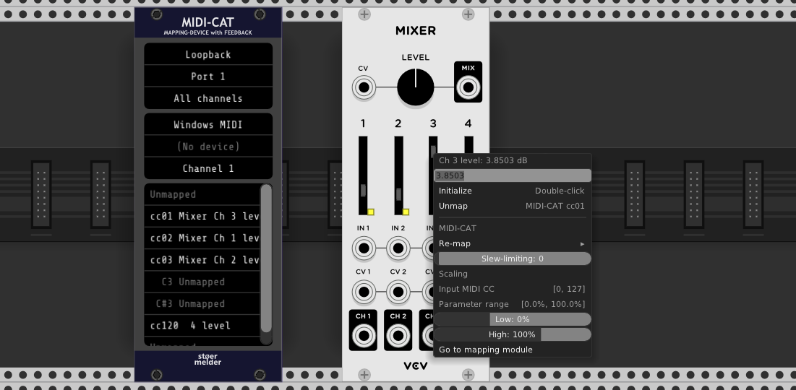

- MIDI-CAT uses an overlay window displaying parameter changes on the bottom of the screen (since v1.9.0). This overlay is enabled by default and can be disabled in the context menu. Some adjustments for the appearance of the overlay can be made with the [stoermelder ME](./Me.md) module.

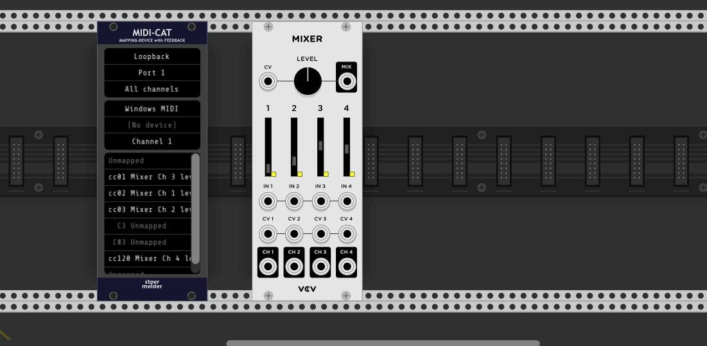

MIDI-CAT was added in v1.1 of PackOne. 

# MEM-expander

MEM is a companion module for MIDI-CAT: The expander allows you store an unlimited number of module-specific mappings which can be recalled for the same type of module without doing any mapping manually.  
A typical workflow will look like this:

- Place MEM on the right side of MIDI-CAT.
- Create a mapping using your MIDI device of any module in MIDI-CAT.
- You find a new option _Store mapping_ in the _MEM-expander_-section of MIDI-CAT's context menu. The submenu shows all module-types which are currently mapped in MIDI-CAT. If you mapped only one module in MIDI-CAT there will be only one item.
- The module-mapping is listed under _Available mappings_ in the context menu after storing. The number on the display of MEM will also increase by 1.
- If you like you can repeat this process: Clear the mapping-slots of MIDI-CAT and repeat for another module-type.

Stored module-mappings can be recalled by context menu option _Apply mapping_ or hotkey Shift+V while hovering MIDI-CAT or using the button on the panel of MEM. The cursor changes to a crosshair and the MIDI-mapping is loaded into MIDI-CAT after you click on a panel of module in your patch and MEM contains a mapping for this module-type.

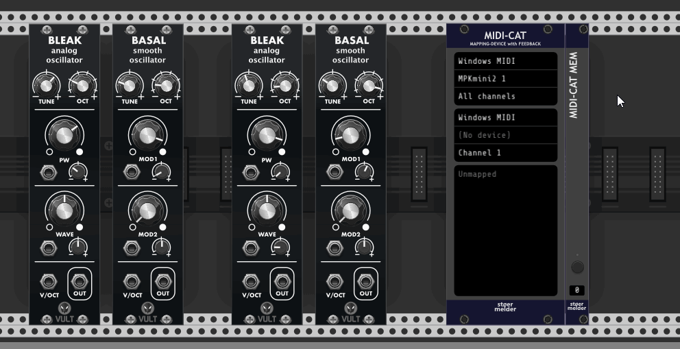

MEM should be considered as a sort of "memory-unit" for MIDI-CAT: The module-specific mappings are saved inside the MEM-module and can be exported using Rack's preset functionality on the context menu. This means you can reuse the same mappings in different instances of MIDI-CAT or multiple patches, independently of any current mapping of MIDI-CAT.

MEM is not designed to map and recall mappings for different types of modules the same time. If you desire to recall a specific mapping-setup into MIDI-CAT you can use stoermelder [8FACE](./EightFace.md) which applies a complete setup by loading a preset of MIDI-CAT. For this purpose an option _Ignore MIDI devices on presets_ has been added (since v1.8.0) which skips any MIDI device settings when loading a preset into MIDI-CAT, only settings for all mapping slots will be recalled.

Added in v1.8.0: MEM has two buttons labeled _Prev_ and _Next_ which scan your patch from top-left to bottom-right and apply a stored mapping to the next/previous module of the current mapped module. Modules without a mapping available in MEM will be skipped while scanning obviously. This function is especially useful when triggering _Next_ and _Prev_ with a MIDI controller which allows you to control your patch without touching the mouse or keyboard and without static mapping, for example.

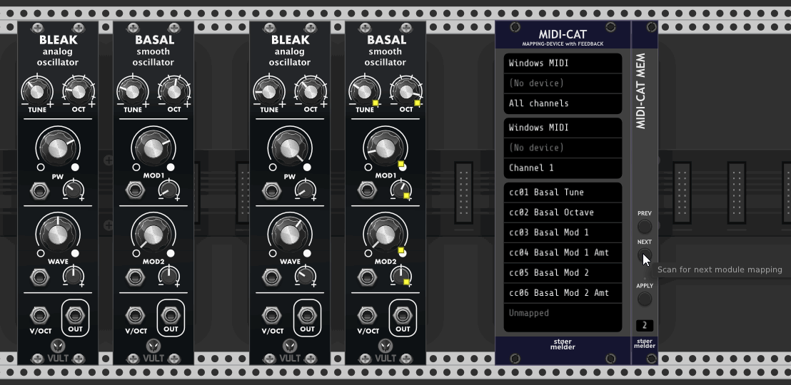

## Tips for MEM

- MEM can store only one mapping of any specific module-type. If you store a mapping for a module which has a mapping already it will be replaced.

- You can remove any mapping using the the context menu _Delete_.

- All push buttons on MEM can be mapped using any mapping module if you like to activate _Apply mapping_ by MIDI or some other command.

MEM for MIDI-CAT was added in v1.7 of PackOne.

# CTX-expander

CTX is a second companion module for MIDI-CAT: The expander allows you to name each instance of MIDI-CAT in your patch. This name can be addressed in every parameters' context menu for activating MIDI mapping or re-mapping parameters to an existing MIDI control or note mapping in another mapping slot of MIDI-CAT.

CTX for MIDI-CAT must be placed on the right side of MIDI-CAT and can be used the same time as the MEM-expander. The display can hold up to 8 characters for naming MIDI-CAT.

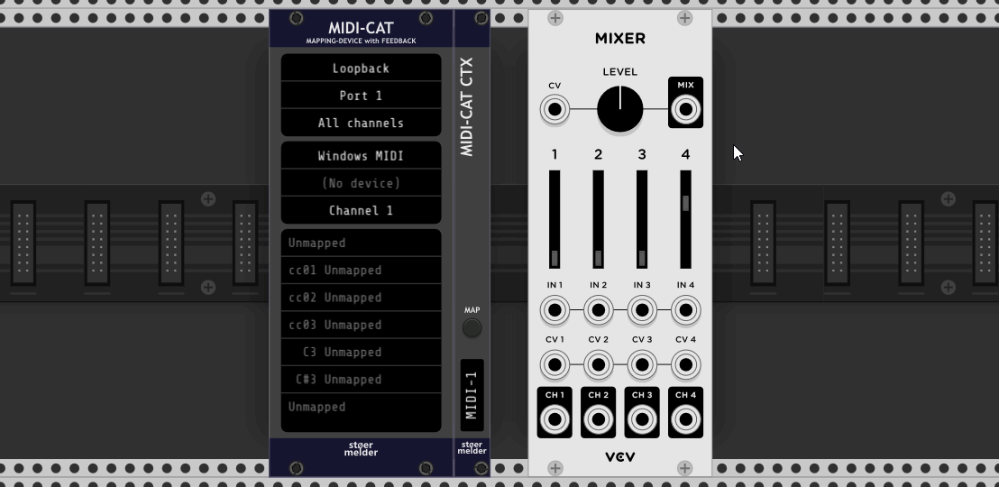

Additionally MIDI-CAT CTX provides a button for activating mapping on the first empty mapping slot in MIDI-CAT. This button can also mapped to a MIDI controller which allows start MIDI mapping by a MIDI message.

CTX for MIDI-CAT was added in v1.9 of PackOne.