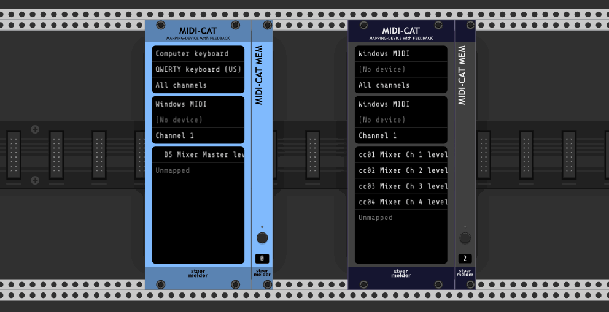

# stoermelder MIDI-CAT

MIDI-CAT is a module for MIDI-mapping and it is an evolution of [VCV's MIDI-MAP](https://vcvrack.com/manual/Core.html#midi-map) with several additional features:

- It can be configured for an MIDI output-port to send controller feedback, all your controls get initalized on patch-loading if your controller supports it!
- It has two different pickup-modes for controllers without input or automatic adjustment, so your parameters won't change until your controls reach their current positions.
- It allows mapping of MIDI note messages, providing momentary-mode, momentary-mode with velocity and toggle-mode.
- You can switch the module to "Locate and indicate" mode, which will help you to retrace your midi controls to the mapped module and parameter.
- CPU usage has been optimized.

Besides these new features the module brings the goodies known from stoermelder's other mapping modules like...

- ...text scrolling for long parameter names,
- ..."Locate and indicate" on slot's context menu for finding mapped parameters and
- ...unlocked parameters for changes by mouse or by preset loading or using a by preset-manager like stoermelder's [8FACE](./EightFace.md).

Any parameter change is sent to midi output with the same CC or note as mapped. Each mapping-slot has an additional context menu: 

- Input modes for CC-mapping:
    - Direct: Every received MIDI CC message is directly applied to the mapped parameter (default).
    - Pickup (snap): MIDI CC messages are ignored until the control reaches the current value of the parameter. After that the MIDI control is "snaped" unto the parameter and will only unsnap if the parameter is changed from within Rack, e.g. by mouse or preset-loading.
    - Pickup (jump): Same as snap-mode, but the control will loose the parameter when jumping to another value. This mode can be used if your MIDI controller supports switching templates and you don't want your parameters to change when loading a different template.
- Input modes for note-mapping:
    - Momentary: Default setting, when a MIDI note is received the parameter will be set to its maximum value (an MIDI velocity of 127 is assumed).
    - Momentary + Velocity: same as "Momentary", but the MIDI velocity of the note is mapped to the range of the parameter.
    - Toggle: Every MIDI "note on" message toggles the parameter between its minimum and maximum value (usually 0 and 1 for switches).

The module allows you to import presets from VCV MIDI-MAP for a quick migration. Also, the module can be switched to "Locate and indicate"-mode: Received MIDI messages have no effect to the mapped parameters, instead the module is centered on the screen and the parameter mapping indicator flashes for a short period of time. When finished verifying all MIDI controls switch back to "Operating"-mode for normal module operation of MIDI-CAT.

MIDI-CAT was added in v1.1.0 of PackOne.
