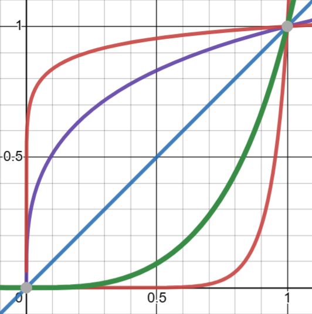

# stoermelder MIDI-KIT

MIDI-KIT is scripting module for altering, filtering, delaying or generating MIDI messages. It provides a simple scripting engine which interprets a very basic subset of JavaScript.

## How it works

The module uses internally a very basic implementation of a JavaScript engine (Elk 3) for interpreting your custom scripts. It is certainly not the fastest way for running JavaScript from C/C++ but MIDI messages are relatively rare events (in contrast to audio/dsp-processing).

The module is purely event-driven: It is only active if a MIDI message arrives on the selected MIDI device. The programming interface provides an ability for creating new MIDI messages, one arriving message can result in up to 16 MIDI outgoing messages. Incoming MIDI messages are not automatically passed through to the MIDI out, instead   
The module has four CV inputs and four parameters. These can be used within the script for adding some dynamic script configuration of modulation if needed.

MIDI-KIT can be used as an MIDI insert using the built-in MIDI Loopback driver of VCV Rack: incoming MIDI messages can be processed before reaching the actual MIDI module (like MIDI-CC or MIDI-CV or MIDI-MAP or MIDI-CAT). Outgoing MIDI messages can be processed the same way.

## Examples

### Basic pass-through
The script passes all incoming MIDI messages to the default MIDI output port.
```
let processMidi = function(midiPort, msg) {
   midiOut.send(msg);
};
```

### Simple MIDI filter
The script drops all incoming MIDI messages except for MIDI channel 2. Messages without a channel field (like MIDI clock) will also be dropped.
```
let processMidi = function(midiPort, msg) {
   if (midi.getChannel(msg) === 2) {
      midiOut.send(msg);
   }
};
```

### MIDI channel routing for CC messages
The script routes incoming CC messages on MIDI channel 2 to MIDI channel 3. All other messages are passed-through unchanged.
```
let processMidi = function(midiPort, msg) {
   if (midi.isCc(msg) && midi.getChannel(msg) === 2) {
      midi.setChannel(msg, 3);
   }
   midiOut.send(msg);
};
```

### Dynamic MIDI channel routing for CC messages by knob (1)
The script routes incoming CC messages on MIDI channel 2 to a MIDI channel set by parameter 1 on the panel. All other messages are passed-through unchanged.
```
param.enable(1);

let processMidi = function(midiPort, msg) {
   if (midi.isCc(msg) && midi.getChannel(msg) === 2) {
      let ch = number.ceil(param.getValue(1) * 16);
      midi.setChannel(msg, ch);
   }
   midiOut.send(msg);
};
```

### Dynamic MIDI channel routing for CC messages by knob (2)
The script handles MIDI messages like the previous example, but MIDI-KIT provides additional programming interface for user interface configuration: `param.getName` configures the text "MIDI Channel" for the tooltip of the first panel parameter, the display value is scaled to the integer range 1..16 by `param.getValueFormat`.
```
param.enable(1);

param.getName = function(port) {
    if (port === 1) return "MIDI Channel";
    return "";
};

param.getValueFormat = function(port) {
    if (port === 1) return number.toString(number.ceil(param.getValue(1) * 16));
    return number.toString(param.getValue(i));
};

let processMidi = function(midiPort, msg) {
   if (midi.isCc(msg) && midi.getChannel(msg) === 2) {
      let ch = number.ceil(param.getValue(1) * 16);
      midi.setChannel(msg, ch);
   }
   midiOut.send(msg);
};
```


### Send NRPN message
```
let processMidi = function(midiPort, msg) {
   if (midi.isNoteOn(msg)) {
      let nrpn1 = midi.createNRPN();
      midi.setNRPN(nrpn1, 1, 12345, 13456);
      midiOut.send(nrpn1);
   }
};
```

### Send SysEx message
```
let processMidi = function(midiPort, msg) {
   if (midi.isNoteOn(msg)) {
      let sysex = midi.create();
      midi.setSysEx(sysex, "ab33010001");
      midiOut.send(sysex);
   }
};
```

## Language reference

MIDI-KIT uses [Elk](https://github.com/cesanta/elk) for interpreting JavaScript. Elk is completely bare, it does not even have a standard library.

### Supported features

- Operations: all standard JS operations except:
   - `!=`, `==`. Use strict comparison `!==`, `===`
   - No computed member access `a[b]`
   - No exponentiation operation `a ** b`
- Typeof: `typeof('a') === 'string'`
- For loop: `for (...;...;...)  ...`
- Conditional: `if (...) ... else ...`
- Ternary operator `a ? b : c`
- Simple types: `let a, b, c = 12.3, d = 'a', e = null, f = true, g = false;`
- Functions: `let f = function(x, y) { return x + y; };`
- Objects: `let obj = {f: function(x) { return x * 2}}; obj.f(3);`
- Every statement must end with a semicolon `;`
- Strings are binary data chunks, not Unicode strings: `'Київ'.length === 8`

### Not supported features

- No `var`, no `const`. Use `let` (strict mode only)
- No `do`, `switch`, `while`. Use `for`
- No `=>` functions. Use `let f = function(...) {...};`
- No arrays, closures, prototypes, `this`, `new`, `delete`
- No standard library: no `Date`, `Regexp`, `Function`, `String`, `Number`

Be aware that there is no implicit casting, especially for casting numbers to strings. For this purpose the function `number.toString` has been added.

## Programming reference

### Global functions

- `processMidi(midiPort, msg)`: Main entry point of the script. This function is called by the module on each incoming MIDI message `msg`, received from MIDI input port `midiPort` (always *1* for this version).
- `log(str)`: Prints string `str` on the display of the module.
- `overlay(str1, [str2], [str3])`: Displays string `str1` in an Rack overlay widget.

### input

- `input.enable(port)`: Enables input with index `port` (1..4).
- `input.getName(port)`: Callback function used by the module to display a tooltip text for the input. The default implementation can be replaced to display some additional information for the input.
- `input.getVoltage(port, [channel])`: Reads the current voltage on the input port `port` (1..4) of polyphonic `channel` (1..16).
- `input.isHigh(port, [channel])`: Returns true if the voltage on input port `port` (1..4) of polyphonic `channel` (1..16) is above 0.7V.
- `input.isLow(port, [channel])`: Returns true if the voltage on input port `port` (1..4) of polyphonic `channel` (1..16) is below 0.7V.

### trig

- `trig.getTicks(trigPort)`: Returns the number of triggers on trigger input port `trigPort` (only *1* is supported in this version, on polyphonic channel 1) since loading the script. 
- `trig.isHigh(trigPort, [channel = 1])`: Returns true if the voltage on trigger input port `trigPort` (only *1* is supported in this version) of polyphonic `channel` (1..16) is above 0.7V.
- `trig.isLow(trigPort, [channel = 1])`: Returns true if the voltage on trigger input port `trigPort` (only *1* is supported in this version) of polyphonic `channel` (1..16) is below 0.7V.
- `trig.setGate(trigPort, [channel = 1], duration)`: Sends a gate on trigger output port `trigPort` (only *1* is supported in this version) with length of `duration` ms on polyphonic `channel` (1..16).
- `trig.setHigh(trigPort, [channel = 1])`: Sets the trigger output port `trigPort` (only *1* is supported in this version) to 10V on polyphonic `channel` (1..16).
- `trig.setLow(trigPort, [channel = 1])`: Sets the trigger output port `trigPort` (only *1* is supported in this version) to 0V on polyphonic `channel` (1..16).
- `trig.setTrigger(trigPort, [channel = 1])`: Sends a trigger on trigger output port `trigPort` (only *1* is supported in this version) on polyphonic `channel` (1..16).

### param

- `param.enable(arg)`: Enables parameter with index `arg` (1..4).
- `param.getName(arg)`: Callback function used by the module to display a tooltip text for the parameter. The default implementation can be replaced to display some additional information for the parameter.
- `param.getValueFormat(arg)`: This function is used by the module to display a formated value on the tooltip for the parameter. The default implementation can be replaced.
- `param.getValue(arg)`: Reads the value of the parameter with index `arg` (1..4). The return value is interval [0, 1].

### number

- `number.abs(x)`: Computes the absolut value of `x`.
- `number.ceil(x)`: Computes the largest integer value not less than `x`.
- `number.crossfade(a, b, p)`: Linearly interpolates between `a` and `b`, from `p = 0` to `p = 1`.
- `number.floor(arg)`: Computes the largest integer value not greater than `arg`.
- `number.max(arg1, arg2)`: Returns the greater of two arguments.
- `number.min(arg1, arg2)`: Returns the smaller of two arguments.
- `number.random()`: Returns a random number of interval [0, 1).
- `number.rescale(x, xMin, xMax, yMin, yMax, [a])`: Rescales `x` from the range `[xMin, xMax]` to `[yMin, yMax]`, while `p` defines the curvature according to this formula for the interval [0, 1] with `a = 0` being linear scaling:
  $$ f(x) \frac{\ \exp\left(\left(\ln\left(x\left(e-1\right)+1\right)\right)^{\left(2^{a}\right)}\right)-1}{e-1} $$
  Resulting in curves for `a = -4, -2, 0, 2, 4`:  
  
- `number.toString(arg)`: Converts `arg` to a string representation.

### midi

- `midi.create()`: Creates an empty MIDI message.
- `midi.createNRPN()`: Creates an empty NRPN MIDI message (actually 4 MIDI messages).
- `midi.getChannel(msg)`: Returns the MIDI channel (1..16) of `msg`.
- `midi.getLength(msg)`: Returns the length of the MIDI message `msg`, for all common messages this will return *3*.
- `midi.getNote(msg)`: Returns the MIDI note number (0..127) of `msg` (byte 2 of the MIDI message).
- `midi.getSysExData(msg)`: Returns the data of a MIDI SysEx message `msg` as hexstring.
- `midi.getPitchWheel(msg)`: Returns the MIDI pitch wheel (0..16383) value of `msg`.
- `midi.getValue(msg)`. Returns the MIDI value field (0..127) of `msg` (byte 3 of the MIDI message).
- `midi.isCc(msg)`: Returns true if `msg` is a MIDI CC message.
- `midi.isChanPressure(msg)`: Returns true if `msg` is a MIDI channel pressure message.
- `midi.isClock(msg)`: Returns true if `msg` is a MIDI clock message.
- `midi.isContinue(msg)`: Returns true if `msg` is a MIDI continue message.
- `midi.isNoteOff(msg)`: Returns true if `msg` is a MIDI note off message.
- `midi.isNoteOn(msg)`: Returns true if `msg` is a MIDI note on message.
- `midi.isPitchWheel(msg)`: Returns true if `msg` is a MIDI pitch wheel message.
- `midi.isProgramChange(msg)`: Returns true if `msg` is a MIDI program change message.
- `midi.isStart(msg)`: Returns true if `msg` is a MIDI start message.
- `midi.isStop(msg)`: Returns true if `msg` is a MIDI stop message.
- `midi.isSysEx(msg)`: Returns true if `msg` is a MIDI SysEx message.
- `midi.setCc(msg, channel, cc, value)`: Sets `msg` as a MIDI CC message with the specified MIDI channel `channel` (1..16), CC number `cc` (0..127) and `value` (0..127).
- `midi.setCc14bit(msg1, msg2, channel, cc, value)`: Sets `msg1` and `msg2` as a 14-bit MIDI CC message pair, with the MIDI channel `channel` (1..16), CC number `cc` (0..127) and `value` (0..16383).
- `midi.setChannel(msg, channel)`: Sets the MIDI channel `channel` (1..16) for `msg`.
- `midi.setChanPressure(msg, channel, value)`: Sets `msg` as a MIDI channel pressure message, with MIDI channel `channel` (1..16) and pressure `value` (0..127).
- `midi.setKeyPressure(msg, channel, note, value)`: Sets `msg` as MIDI key pressure/aftertouch message, with the MIDI channel `channel` (1..16), MIDI note number `note` (0..127) and pressure `value` (0..127).
- `midi.setNote(msg, note)`: Sets the MIDI note number (0..127) for `msg` (byte 2 of the MIDI message).
- `midi.setNoteOff(msg, channel, note)`: Sets `msg` as MIDI note off message, with MIDI channel `channel` (1..16) and MIDI note number `note` (0..127). Please be aware, some MIDI devices need a MIDI note on message with velocity *0* instead of a MIDI note off message.
- `midi.setNoteOn(msg, channel, note, velocity)`: Sets `msg` as MIDI note on message, with MIDI channel `channel` (1..16), MIDI note number `note` (0..127) and `velocity` (0..127).
- `midi.setNRPN(nrpn, channel, number, value)`: Sets the NRPN number and NRPN value of `nrpn`.
- `midi.setPitchWheel(msg, channel, value)`: Sets `msg` as a MIDI pitch wheel message, with the specified MIDI channel (1..16) and pitch wheel value (0..16383).
- `midi.setProgramChange(msg, channel, prg)`: Sets `msg` as a MIDI program change message, with the MIDI channel `channel` (1..16) and program number `prg` (0..127).
- `midi.setSysEx(msg, str)`: Sets `msg` as a MIDI SysEx message with string `str` representing a hexstring of data (e.g. "ab0fad050fdd", whitespaces are ignored).
- `midi.setValue(msg, value)`: Sets the MIDI value field (0..127) for `msg` (byte 3 of the MIDI message).

### midiOut

Some functions provide a parameter `midiPort` for selecting the output port. Currently MIDI-KIT has only one output port (with index *1*) and additional ports will be added in the future by expanders.

- `midiOut.send([midiPort], msg)`: Sends `msg` on MIDI port `midiPort` (default port = *1*). If `midiPort` is omitted the default MIDI output port is used.
- `midiOut.sendAfterMs([midiPort], msg, ms)`: Sends `msg` delayed on MIDI port `midiPort` (default port = *1*). The delay `ms` is specified in milliseconds. If `midiPort` is omitted the default MIDI output port is used.
- `midiOut.sendAfterTrigger([midiPort], msg, [trigPort], ticks)`: Sends `msg` delayed on MIDI port `midiPort` (default output = *1*). The delay is specified in `ticks` of triggers on CV trigger input `trigPort`. If `midiPort` is omitted the default MIDI output port is used. If `trigPort` is omitted the default trigger port is selected.

## Future feature ideas

- Support for TTY ([Tipsy](https://github.com/baconpaul/tipsy-encoder))
- Expander-modules
- Another engine for supporting a different language

## Changelog

- v2.x.x
   - Initial release of MIDI-KIT