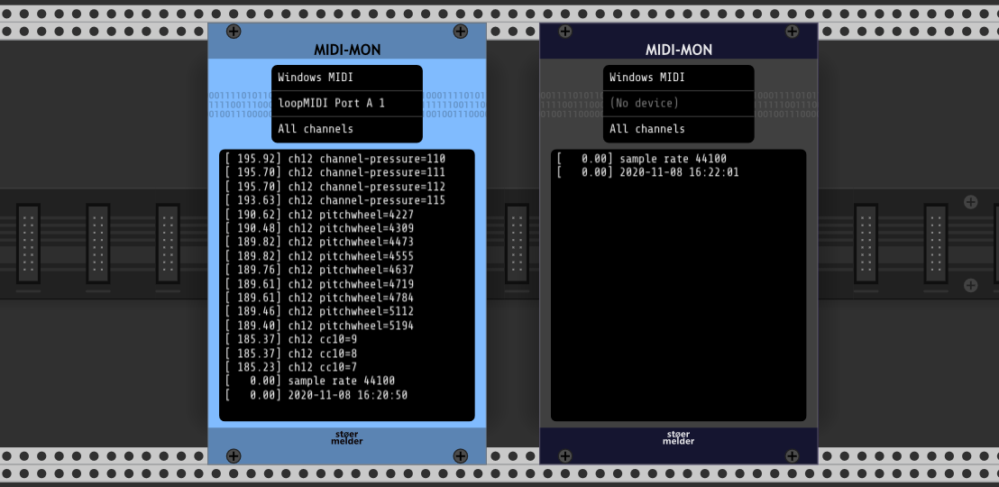

# stoermelder MIDI-MON

MIDI-MON is an utility module for monitoring MIDI messages. Also export as text-file is possible.

## Changelog

- v1.8.0
    - Initial release of MIDI-MON
- v1.9.0
    - Added support for more message types (program change, song select, song pointer)
    - Added context menu option for clearing the log
- v2.0.0
    - Added support for SysEx messages