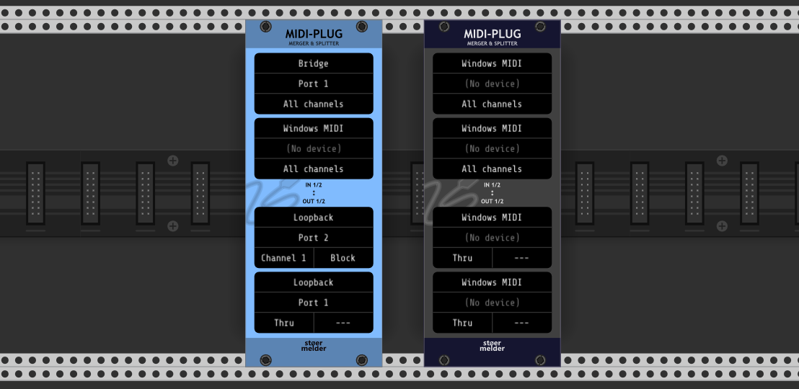
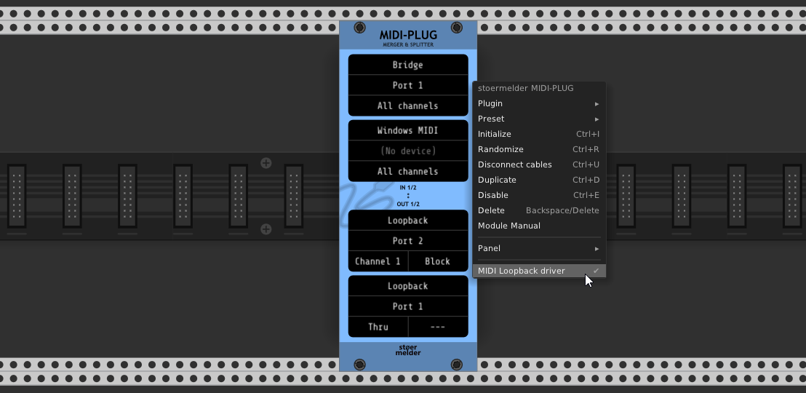

# stoermelder MIDI-PLUG

MIDI-MON is an utility module for MIDI-routing: It allows merging messages of different MIDI ports, filtering MIDI messages by channel and duplicating messages to two different output ports. 

Each of the two output ports can be configured in two different operating modes:

- "Thru" sends every MIDI message untouched to the MIDI device.

- The selection of a specific MIDI channel makes three sub-modes available:

  - "Replace" replaces the MIDI channel of all messages with the selected channel.
  - "Filter" filters to the selected MIDI channel, all other MIDI channels are ignored.
  - "Block" blocks the selected MIDI channel, all other MIDI channels pass through.

System messages pass through unaffected in every case. Please note that the input ports also allow MIDI channel filtering before routed to the output ports.

## Loopback driver

In the context menu an optional MIDI loopback driver can be enabled. This driver allows you routing MIDI messages within VCV Rack for different purposes like testing, visualizing MIDI messages using [MIDI-MON](MidiMon.md) or routing MIDI between different devices. Four virtual ports are available.

Note: Due to a bug in VCV Rack 1.1.6 any custom MIDI driver crashes Rack on closing. This does no harm but shows an annoying crash dialog whenever Rack is closed. You can disable the driver at any time to prevent this crash dialog.

MIDI-PLUG was added in v1.9.0 of PackOne.