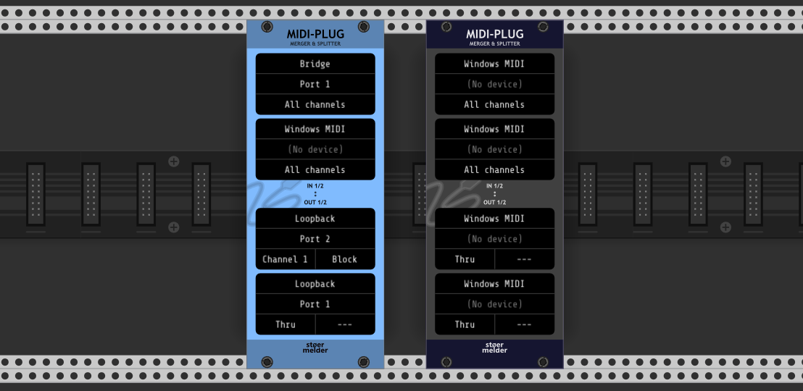

# stoermelder MIDI-PLUG

MIDI-PLUG is a utility module for MIDI routing that enables:
- Merging messages from different MIDI ports
- Filtering MIDI messages by channel
- Duplicating messages to two separate output ports

Each of the two output ports (located in the lower section) can be configured in different operating modes:

- **Thru** sends every MIDI message unmodified to the MIDI device.

- When a specific MIDI channel is selected, three sub-modes become available:

  - **Replace** replaces the MIDI channel of all messages with the selected channel.
  - **Filter** filters to the selected MIDI channel, all other MIDI channels are ignored.
  - **Block** blocks the selected MIDI channel, all other MIDI channels pass through unaffected.

Additionally, the input ports (upper section) also support MIDI channel filtering before routing to the output ports.

Note: System messages always pass through unaffected in all modes.

## Changelog

- v1.9.0
    - Initial release: MIDI-PLUG (virtual MIDI merger and splitter)
- v2.0.0
    - Removed MIDI "Loopback" driver as a dedicated loopback driver is available in Rack 2.2.0