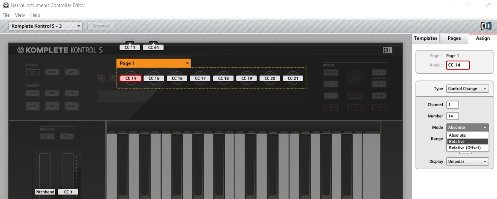
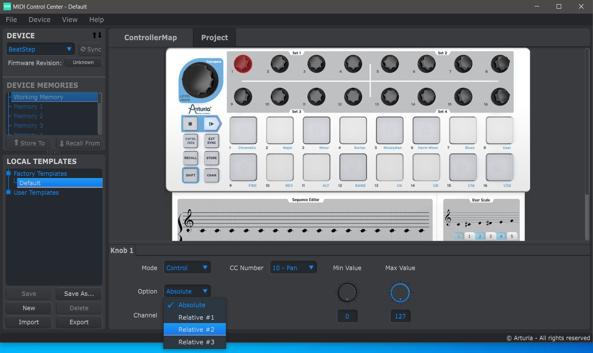
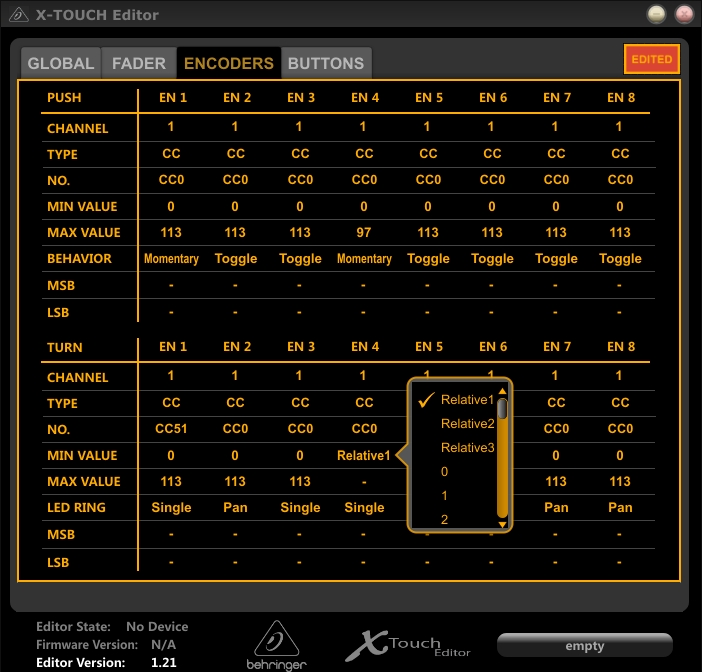
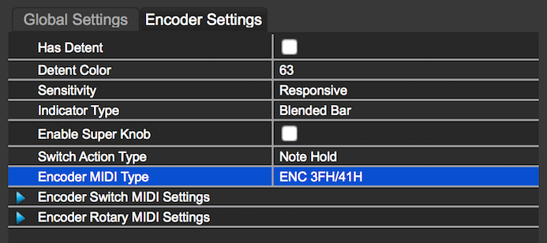

# stoermelder MIDI-STEP

MIDI-STEP is a module intended for relative MIDI protocols of endless rotary knobs found on some hardware MIDI controllers. The module outputs triggers on INC or DEC for every knob-twisting.

### Tested devices

I don't own all of following devices so I can provide only limited supported for setup and correct function. They have been tested successfully by users though. Feel free to contact me if you have a MIDI controller with endless rotary knobs which does not work with one of the existing relative modes.

- **Native Instruments controllers.** You have to change the assigned "Control Change" mode to "Relative" using the "Controller Editor" software.

- **Arturia Beatstep and Beatstep Pro.** These controllers support three different relative modes which can be configured in the "MIDI control center" software. Currently only "Relative #1" and "Relative #2" are supported. #1 should you give more precision when rotating the knobs at different speeds.

- **Behringer X-TOUCH Mini.** The controller supports three different relative modes which can be configured with the "X-TOUCH Editor" software. Currently only "Relative1" is supported.

- **DJ Tech Tools Midi Fighter Twister.** Set the "Encoder Type" to "ENC 3FH/41H" in the MidiFighter Utility.

MIDI-STEP was added in v1.5.0 of PackOne.