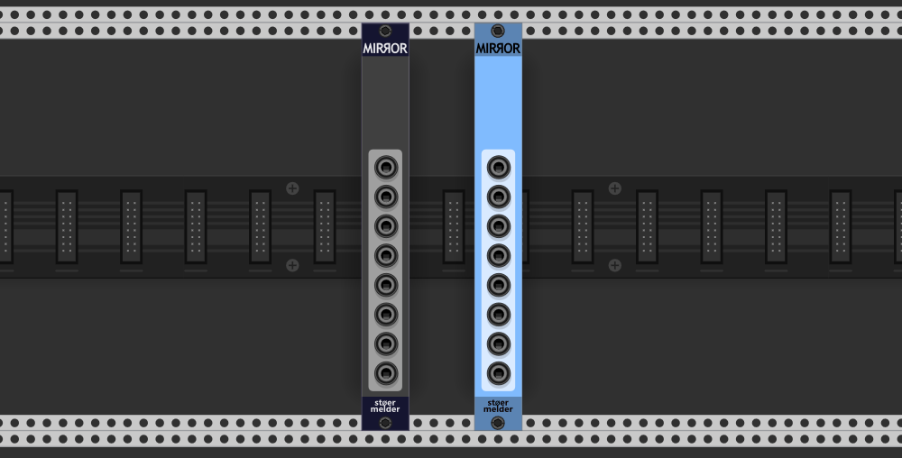
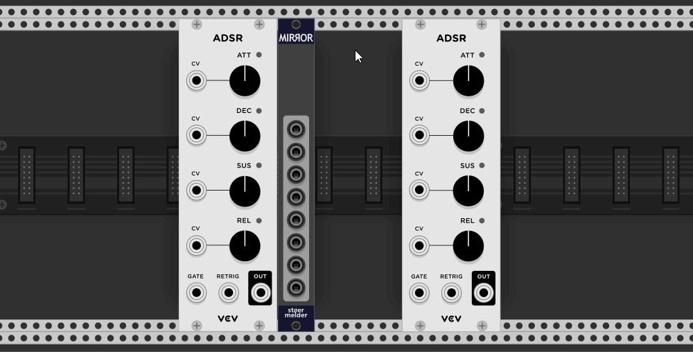
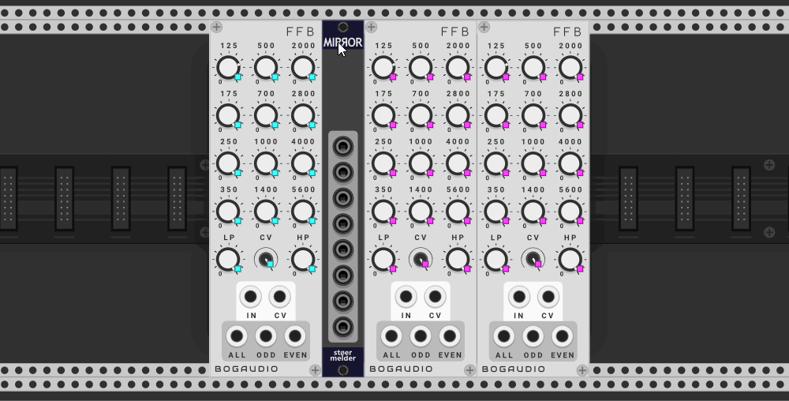
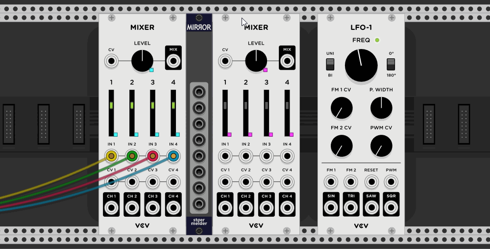
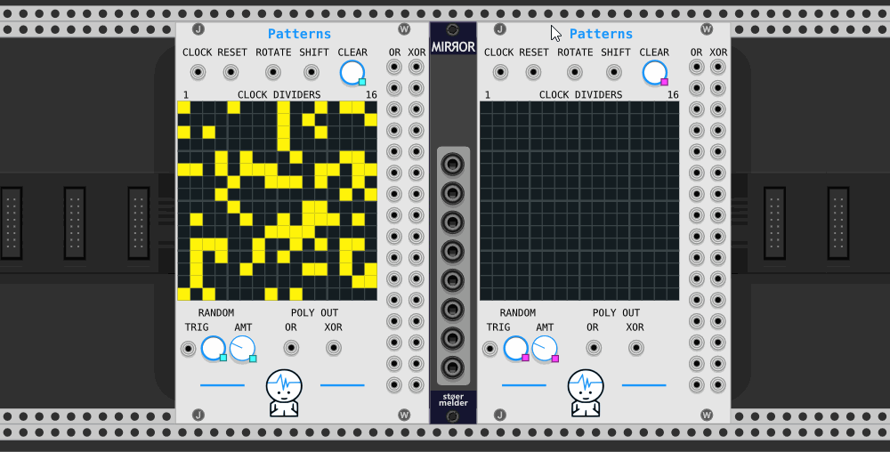

# stoermelder MIRROR

MIRROR is a utility module designed to synchronize parameters across multiple instances of the same module. It is particularly useful for ensuring that monophonic modules within a polyphonic patch share the same parameter values or changes simultaneously.

### How to use

- Place MIRROR between two instances of the same module.
- Select the _Bind source module (left)_ option to map all parameters of the module on the left side of MIRROR.
- Place another instance of the same module to the right of MIRROR and select _Map module (right)_ from the context menu to link all parameters.
- Alternatively, use _Add and map new module_ to automatically add and map a new instance.

Once bound, mapped modules can be placed anywhere in your Rack patch. They do not need to remain directly connected to MIRROR.

### Unmapping Parameters

- You can selectively **unmap** parameters if synchronization is not required for specific parameters.
  - If a parameter is unmapped on the **source module**, all synchronized instances will also lose the mapping.
  - If a parameter is unmapped on a **synchronized module**, only that specific instance will no longer mirror the parameter.

### CV-Ports

MIRROR includes eight input ports (0–10V range) that can be dynamically assigned to any parameter of the mapped modules. These ports allow you to control parameters via external CV signals.

### Presets

Many modules have internal states that are not reflected in their panel parameters. While MIRROR cannot automatically sync these internal states, you can manually trigger a sync to ensure all mirrored modules start in the same initial state.

### Additional Features

- **CPU Optimization** - Mapping many parameters can increase CPU usage. If audio-rate automation is required, enable _Audio rate processing_ in the context menu. By default, parameters are updated only every **32nd audio sample**, reducing CPU usage to roughly **1/32** of the original load.

- **Disable mapping indicators** - If the mapping indicators are distracting, you can disable them via the context menu.

- **Syncing modules without parameters** - Added in v1.8.0: The _Sync module presets_ option works even if the mirrored module lacks parameters, such as with [VCV Host](https://library.vcvrack.com/VCV-Host/Host).

- **Parameter change reporting in VCV Rack plugins** - By default, parameter changes are not reported back to the plugin host when using MIRROR in a plugin version of VCV Rack. In v2.2.0, an option was added to enable this behavior, though it may increase plugin CPU usage.

## Changelog

- v1.6.0
    - Initial release
- v1.7.0
    - Added syncing of module presets even if bound module has no parameters
    - Added hotkey for syncing module presets
    - Implemented support for parameter-mappings within STRIP
- v1.8.0
    - Added _Sync module presets_ option to work even if the mirrored module lacks parameters
- v2.2.0
    - Added option to report parameter changes back to plugin-host (plugin-version option)