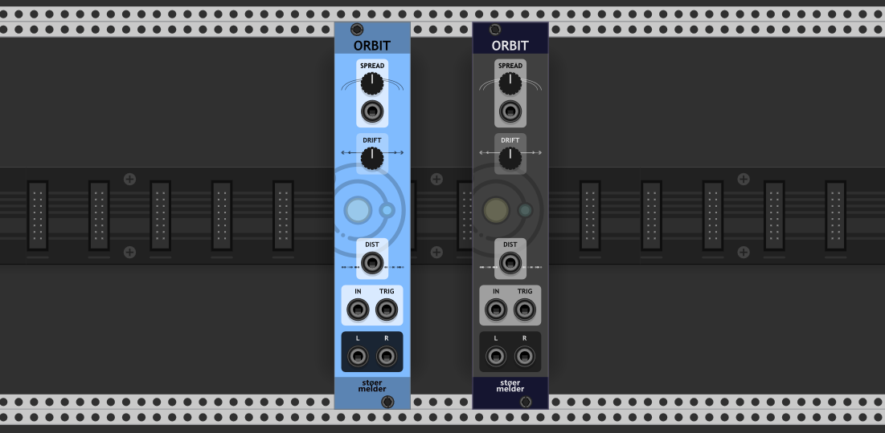

# stoermelder ORBIT

ORBIT is module designed for use in polyphonic scenarios: It adjusts the panning of each channel of a polyphonic cable in the stereo image. 

- _INPUT_ is the input signal, should be polyphonic.

- _TRIG_ triggers a new random position. If the trigger signal is monophonic all input channels get a new random position, if the trigger signal is polyphonic the corresponding input channel gets a new position, all other input channels stay unchanged.

- _Spread_ adjusts the maximum amount of panning from 0% to 100%.  

- _Drift_ controls, if the position in the stereo image is statically assigned or moving: Values from -1 to 0 drift the positions to the left or right, depending on the randomly assigned side of the input channel, values 1 to 0 drift to the center.

ORBIT provides different options for generating the random positions of the input channels, controlled by _Distribution_ setting in the context menu:

- **Normal**: The positions are generated according to a [normal distribution](https://en.wikipedia.org/wiki/Normal_distribution), the center is more likely than the extreme positions.

- **Normal (mirrored)**: The positions are generated according to a [normal distribution](https://en.wikipedia.org/wiki/Normal_distribution) but in a kind of "mirrored" sense, the extreme positions are more likely than the center positions.

- **Uniform**: The positions are generated [uniformly distributed](https://en.wikipedia.org/wiki/Continuous_uniform_distribution), every position in the stereo field has the same probability.

- **External**: The position are generated from an external input connected to the _DIST_-port, it is used like a "Sample & Hold" or "Sample & Glide" if _Drift_ is set unequal to 0. The input can be monophonic or polyphonic and an input voltage 0-10V is expected.

The output can be configured as polyphonic (the same number as input channels) or summed to single channels.

ORBIT was added in v1.9.0 of PackOne.