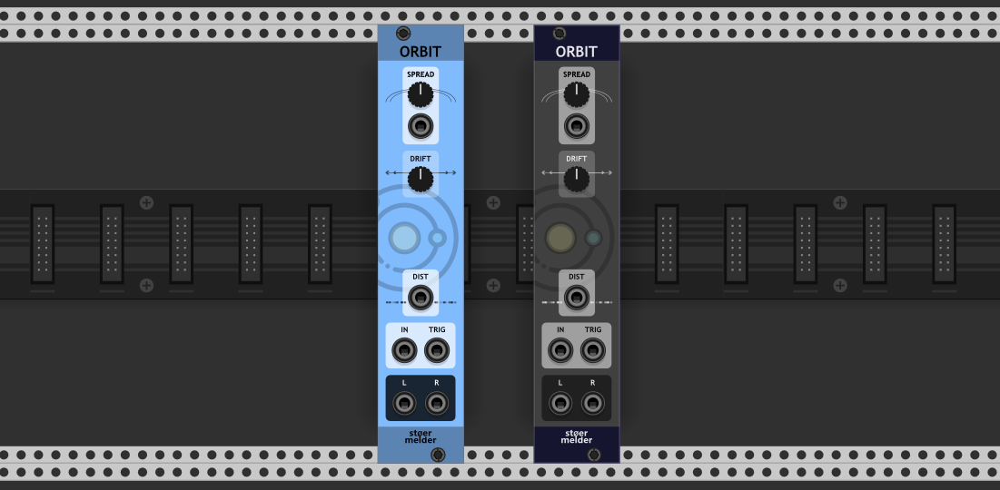

# stoermelder ORBIT

ORBIT is a module designed for use in polyphonic scenarios, allowing precise control over the panning of each channel/voice within a stereo image.

### Inputs and Controls

- **_INPUT_** - The polyphonic input signal to be processed.

- **_TRIG_** - Triggers a new random panning position for one or more channels.
  - If the trigger signal is **monophonic**, all input channels receive a new random panning position.
  - If the trigger signal is **polyphonic**, only the corresponding input channel(s) receive a new panning position, while others remain unchanged.

- **_Spread_** - Adjusts the maximum panning range from **0%** (center) to **100%** (full stereo width).

- **_Drift_** - Controls the dynamic behavior of panning positions.
  - Values from **-1 to 0** gradually shift positions to the **left** or **right**, based on the randomly assigned side of the input channel.
  - Values from **1 to 0** gradually shift positions toward the **center**.

### Random Position Generation

ORBIT offers various methods for generating random panning positions, controlled via the _Distribution_ setting in the context menu:

- **Normal** - Positions follow a [normal distribution](https://en.wikipedia.org/wiki/Normal_distribution), where center positions are more probable than extreme positions.

- **Normal (Mirrored)** - Positions follow a mirrored [normal distribution](https://en.wikipedia.org/wiki/Normal_distribution), where extreme positions are more probable than center positions.

- **Uniform** - Positions are [uniformly distributed](https://en.wikipedia.org/wiki/Continuous_uniform_distribution) across the stereo field, with every position having equal probability.

- **External** - Panning positions are derived from an external input connected to the **_DIST_** port.
  - Acts like a "Sample & Hold" or "Sample & Glide" if **_Drift_** is set to a non-zero value.
  - Supports both **monophonic** and **polyphonic** inputs, expecting a voltage range of **0–10V**.

### Output

The output can be configured as polyphonic (with the same number of channels as _IN_) or summed to single channels for left and right.

## Changelog

- v1.9.0
  - Initial release
- v2.0.0
  - Added output level control (#286)