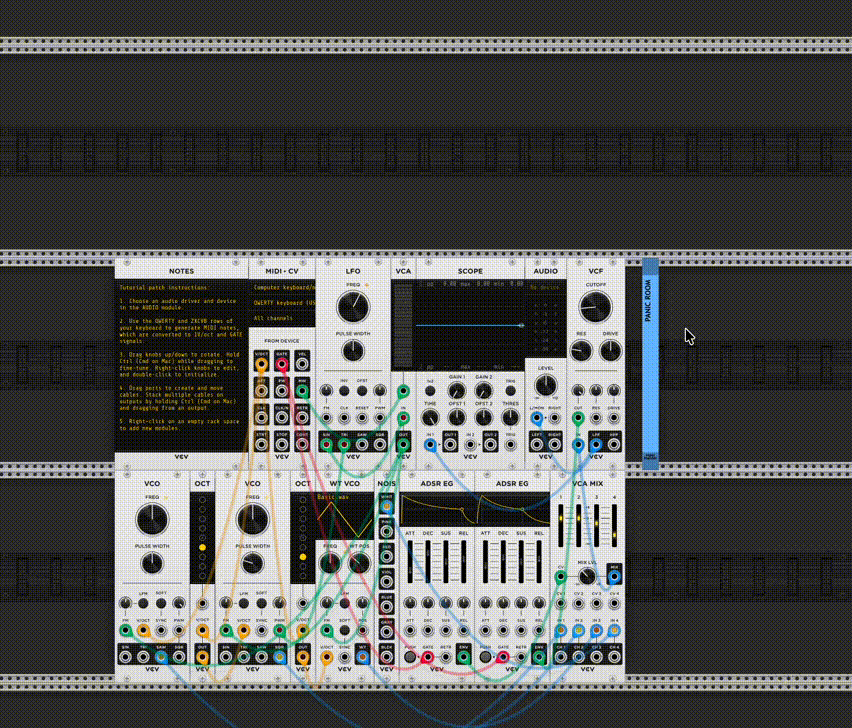

# stoermelder PANIC ROOM

PANIC ROOM is an untility module, it restricts your modular space within Rack, making it impossible to patch outside of a defined area.

### How to use

After adding PANIC ROOM to your patch, choose Learn from the context menu and drag to select the usable area. Any modules placed outside that area will be automatically disabled.

## Changelog

- v2.2.0
    - Inital release