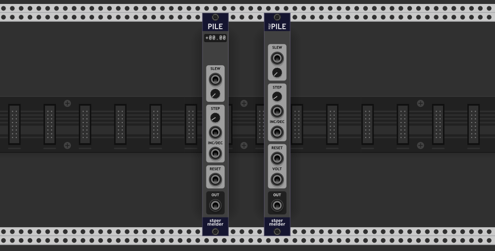
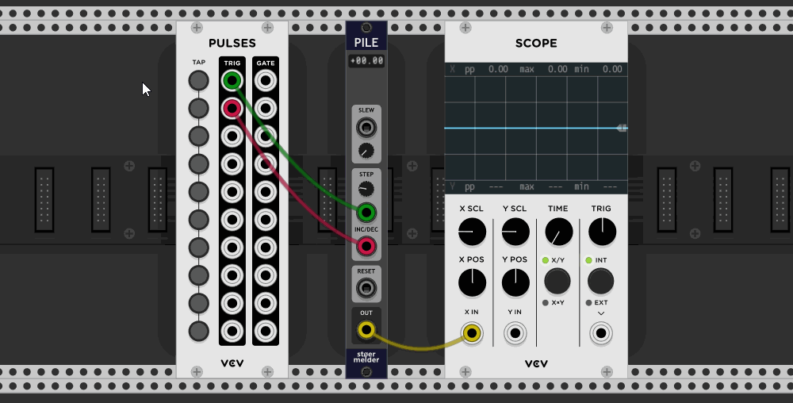
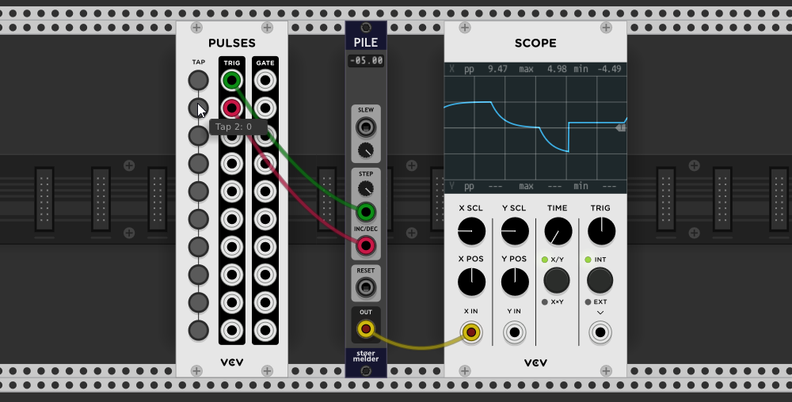

# stoermelder PILE and POLY-PILE

PILE and POLY-PILE are utility modules for conversion of triggers for "increment" and "decrement" into an absolute voltage. PILE is monophonic while POLY-PILE works for polyphonic cables up to 16 channels.

Applying triggers on the ports _INC_ and _DEC_ will increase and decrease, respectively, the output voltage within the selected voltage range with a voltage-jump set on the _SIZE_-trimpot. Multiple range options for unipolar 0..5V or 0..10V and bipolar -5..5V or -10..10V can be found on the context menu.

## SLEW

By default the output voltage jumps immediately to the target volume. By using the parameter labeled SLEW or its dedicated input-port (range 0..5V) the output slope will be limited with an exponential slew up to 5 seconds.

## RESET

PILE features a single _RESET_-port which can be used to set the output voltage induced by every input voltage change on _RESET_.

POLY-PILE features a _RESET_-port for triggering a reset to 0V if no cable is connected to VOLT. In case of a cable patched to VOLT the output voltage is set to its incoming voltage. While the _RESET_-port is monophonic the VOLT-port is polyphonic and normalized to the first channel.

## Tips

PILE and POLY-PILE come quite handy together with the module MIDI-STEP which outputs increment and decrement triggers for endless rotary knobs on your MIDI-controller.

PILE was added in v1.5 of PackOne.  
POLY-PILE was added in v1.6 of PackOne.