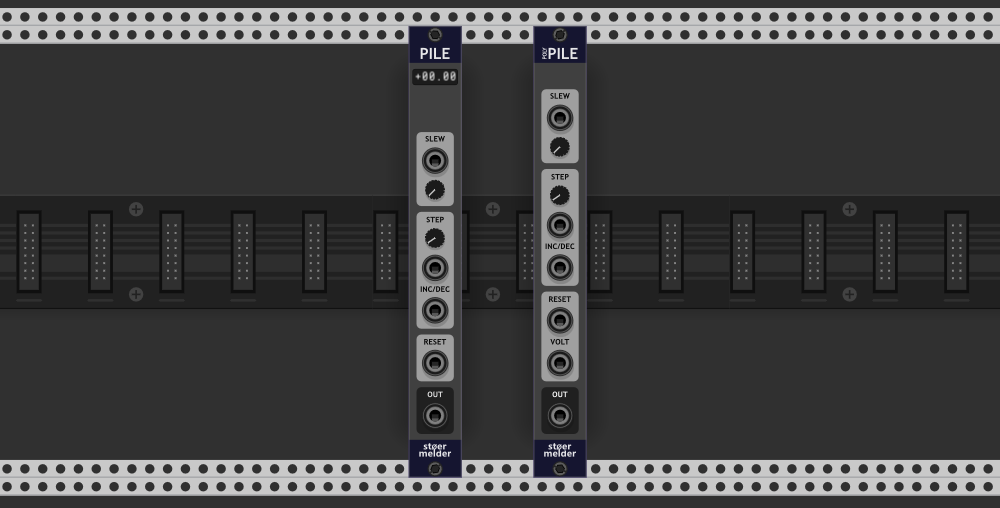
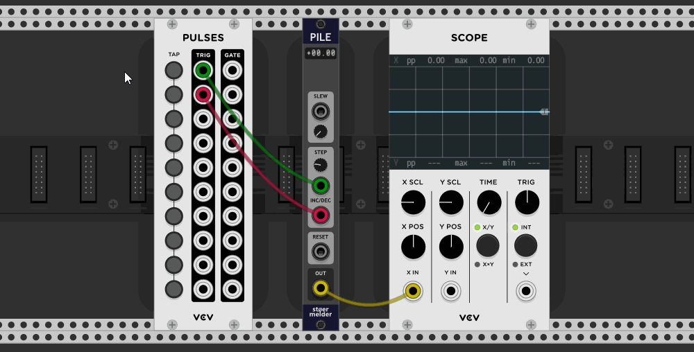
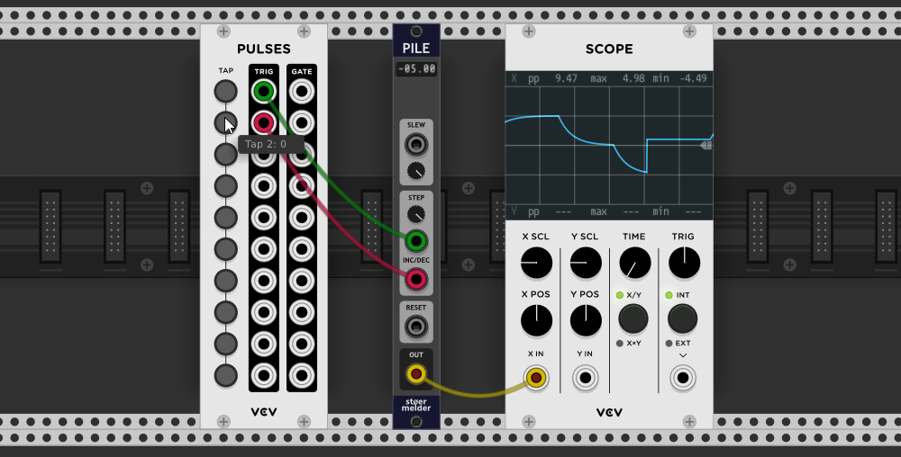

# stoermelder PILE and POLY-PILE Modules

PILE and POLY-PILE are utility modules that convert increment and decrement triggers into absolute voltage. PILE is monophonic; POLY-PILE supports up to 16 polyphonic channels.

Triggering the _INC_ and _DEC_ ports increases or decreases the output voltage within the selected range, with the voltage jump set by the _SIZE_ trimpot. The context menu offers multiple range options: unipolar 0–5V or 0–10V, and bipolar –5–5V or –10–10V.

### SLEW

By default, the output voltage jumps instantly to the target level. Using the SLEW parameter or its dedicated input port (range 0–5 V) limits the output slope with an exponential slew up to 5 seconds.

### RESET

PILE has a single _RESET_ port that sets the output voltage in response to any input voltage change on _RESET_.

POLY-PILE has a _RESET_ port that triggers a reset to 0V when no cable is connected to VOLT. If a cable is patched to VOLT, the output voltage follows the incoming voltage. The _RESET_ port is monophonic, while the _VOLT_ port is polyphonic and normalized to the first channel.

### Tips

PILE and POLY-PILE pair well with the MIDI-STEP module, which outputs increment and decrement triggers for endless rotary knobs on your MIDI controller.

## Changelog

PILE was introduced in v1.5 of PackOne.  
POLY-PILE was introduced in v1.6 of PackOne.