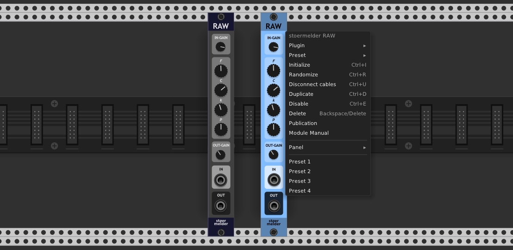

# stoermelder RAW

RAW is a digital effect based on the dynamics of bistable systems, according to the work of:

> Alexander Ramirez, Vikas Tokala, Antonin Novak, Frederic Ablitzer and Manuel Melon, “Bistable Digital Audio Effect,” in Proceedings of the 23rd International Conference on Digital Audio Effects (eDAFx-2020, DAFx2020 in 21), Vol.1, Vienna, Austria, 2020-21, pp. 109-116
>
> IMDEA (International Master's Degree in Electro-Acoustics), Le Mans University, France
>
> https://dafx2020.mdw.ac.at/proceedings/papers/DAFx2020_paper_6.pdf  
> https://ant-novak.com/posts/projects/2020-02-26_Bistable_Effect

Some contributions to the original implementation have been made by [Jatin Chowdhury](https://github.com/jatinchowdhury18) which improve stability of the algorithm and add an parameter for nonlinearity asymmetry.

RAW was added in v1.8.0 of PackOne.