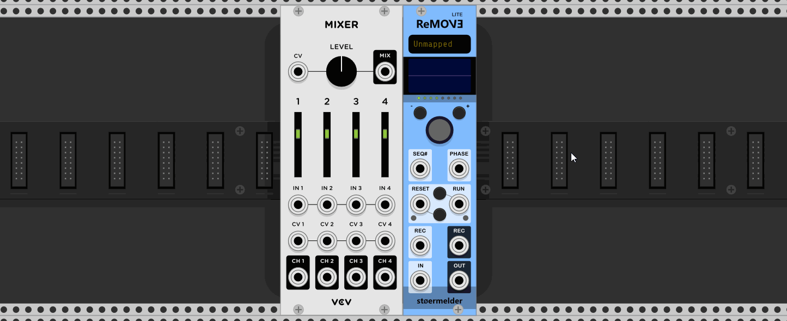
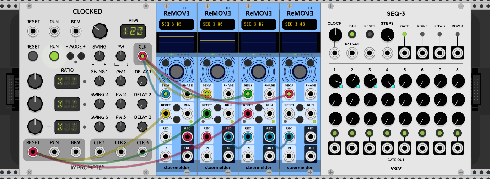
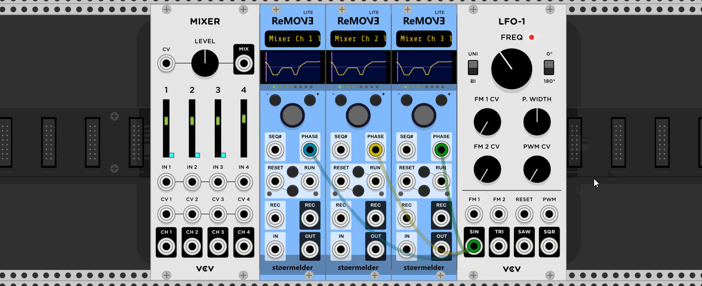
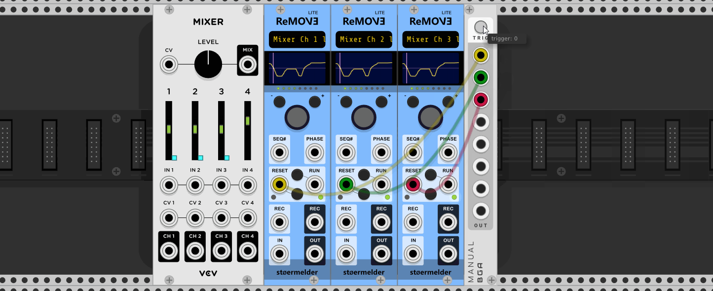
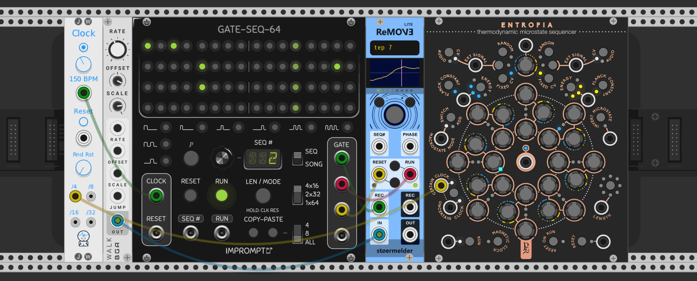
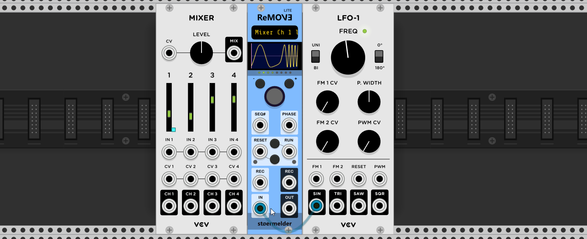

# stoermelder ReMOVE Lite

ReMOVE Lite is a utility module for recording and replaying movements of any parameter on any module in Rack. It supports up to 8 recorded sequences, various sampling rates, different recording modes, a phase input for directly controlling the playback and more settings. Though it is not its main purpose, ReMOVE can also be used as a CV recorder. All ports of ReMOVE Lite are monophonic.

A really epic [tutorial video](https://www.youtube.com/watch?v=Dd0EESJhPZA) from [Omri Cohen](https://omricohencomposer.bandcamp.com/) showcasing ReMOVE Lite.

Another fabulous [tutorial video](https://www.youtube.com/watch?v=P9bFPuCLuMs) from [Artem Leonov](https://artemleonov.bandcamp.com/) using 8 instances of ReMOVE Lite with MIDI mapping.

### Mapping of parameters

Parameter mapping is done by activating the mapping mode by clicking the display at the top. While 'Mapping...' is displayed, click any parameter of any module in Rack to bind it. You can unbind the parameter using the context menu of the display. Also, you can locate the module and mapped parameter if you get lost inside your rack.

### Sample rate and number of sequences

The module has a built‑in storage of 64k samples. At the full audio sample rate of 48 kHz, this storage corresponds to 1.3 seconds of recording. Such high precision is not needed for parameter automation, so ReMOVE Lite allows a sample rate of up to 2 kHz. The lowest setting is 15 Hz, giving 15 samples per second, which can still be acceptable for slowly changing parameters or low timing accuracy.

Be careful when using higher sample rates: Recorded sequences are stored inside the patch file, and these can become quite large if several modules are used (to be precise: 64 k samples, each 4 bytes, plus overhead for storing in JSON format, resulting in 2–3 MB).

ReMOVE Lite can be configured to record 1, 2, 4 or 8 different sequences. The maximum length for each sequence is evenly divided, so you get 1/8 of the available recording time when using 8 sequences. The available recording time is shown in the context menu option and in the display as soon as a recording starts. Be careful: Changing the number of sequences resets all recorded automation data.

Both settings for samplerate and number of sequences can be found in the context menu.

### Recording Modes

There are four different recording modes available, changed by context menu option:

- **Touch-Mode** (Default) - Triggering the red _REC_ button by mouse or through the _REC_-port arms recording.
Actual recording of automation data starts on the first mouse click ('touch') on the mapped parameter and continues as long as the button is pressed.

- **Move-Mode** - Similar to **Touch-Mode**, recording is armed when clicking on _REC_. Recording starts on the first change of the mapped parameter, which happens not necessarily on the mouse down event. Releasing the mouse button ends the recording, and the stored automation data will be trimmed at the end to the last change of value. This way the sequence starts on first change and ends on the last change.

- **Manual-Mode** - This mode starts the recording as soon as the red _REC_ button is pressed. **Manual-Mode** is especially useful when triggering using the _REC_-input.

- **Sample & Hold-Mode** (added in v1.0.4) - This mode records exactly one sample of the value of the mapped parameter. This can be useful for sequencing a parameter value in combination with the play mode 'Loop Sequences'.

Recording is only possible when a parameter is mapped, even when using the IN-port.

### Play Modes

Some modes for playback have been implemented:

- **Loop** (Default) - playback loops through the selected sequence.

- **Oneshot** - the sequence is played once and must be retriggered by _RESET_.

- **Ping Pong** - the sequence loops, first played forward and then backward.

- **Sequence Loop** (added in v1.0.4) - playback loops through all sequences.

- **Sequence Random** (added in v1.1.0) - playback walks randomly through all sequences.

You can use the _PHASE_-input if you want a different playback speed or a completely different playback pattern.
Added in v1.3.0: Additionally, you can change the _SMTH_ parameter for smoothing the recorded curve and for value jumps at sequence end or sequence change.

### _SEQ#_-input

The _SEQ#_-input allows you to select sequences by CV.

There are three different modes available:

- **0..10V** (Default) - The range is split evenly into 8 segments. 0..1.25V selects sequence 1, 1.25..2.5 V selects sequence 2, and so on.

- **C4–G4** - Keyboard mode, where C4 triggers sequence 1 and G4 triggers sequence 8.

- **Trigger** - When a trigger is received the module advances to the next sequence.

### _PHASE_-input

The input labeled _PHASE_ accepts 0–10V and allows controlling the playhead directly: voltages from 0 to 10V are mapped to the length of the sequence. Using an LFO's unipolar saw output or a clock with phase output, such as [ZZC's Clock module](https://zzc-cv.github.io/en/clock-manipulation/clock), the playback can be synced to sequencers, giving Loop-mode behavior. An LFO with triangle output gives you ping‑pong playback. Obviously multiple instances of the module can also be synchronized this way.

The ports _RUN_ and _RESET_ and their buttons are disabled and can't be used as long as a cable is connected to _PHASE_. From v1.0.4 on this is signaled by red LEDs next to the ports.

### _RESET_- and _RUN_-ports

Same behavior as most sequencers: _RUN_ can be configured for playback as 'high' or 'trigger'; a trigger on _RESET_ restarts the currently selected playback mode from the beginning. Inputs are disabled when currently recording or if the _PHASE_ input is connected.

Using ReMOVE in a sequencer scenario that records a random source and plays it back multiple times.

### _REC_-input

The _REC_-input is used for starting and stopping recordings via CV trigger. Be aware that a trigger with record modes _Touch_ and _Move_ only arms the recording.

### _REC_-output

The _REC_-output can be configured as 'gate' or 'trigger' every time a recording starts or stops.

### _IN_-input

The port labeled _IN_ accepts 0..10V or –5..5V (configuration option found in the context menu) and can be used to record parameter automation data from any external CV source. All parameter movements are ignored during a recording when a cable is connected to this port.

### _OUT_-output

The _OUT_-port outputs a voltage for the recorded sequence. It can be configured for ranges 0..10V or –5..5V.
Since v1.0.4, it also outputs CV while recording for monitoring purposes.
Since v1.3.0, there is a third option, EOC, on the context menu for outputting a trigger on the _OUT_-port every time the playback reaches the end of a sequence.

### Tips

- When duplicating an instance of the module all recorded sequences are also duplicated.

- The module can be remapped to another parameter after a sequence has been recorded.

- Changing the sampling rate of the module will affect all recorded data, and the playback speed will be higher or slower.

- The 'Randomization' feature of the module generates random automation curves (added in v1.0.5).

- A simple compression is implemented to reduce the size of the patchfile.

- Parameter changes are not reported back to the plugin host by default if ReMOVE Lite is used in a plugin version of VCV Rack. In v2.2.0, a context menu option was added to enable this behavior, which might cause higher CPU usage of the plugin.

## Changelog

ReMOVE Lite was introduced in v1.0.2 of PackOne.