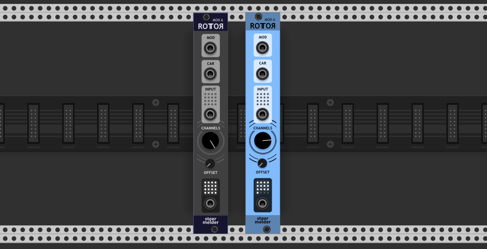
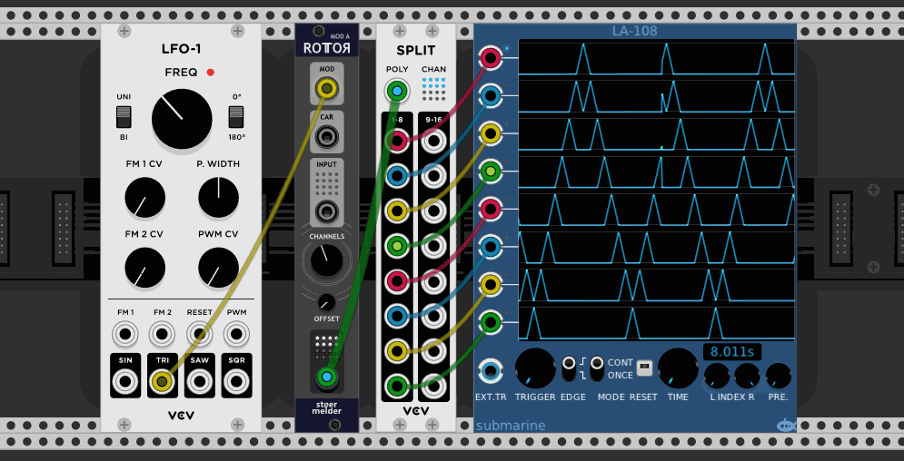
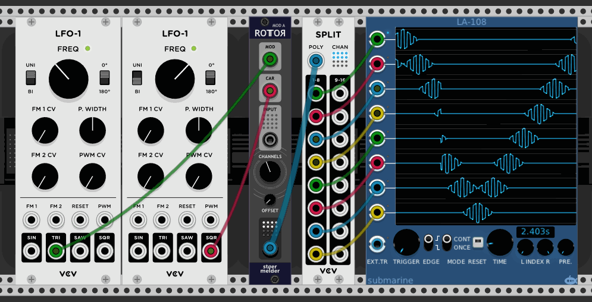
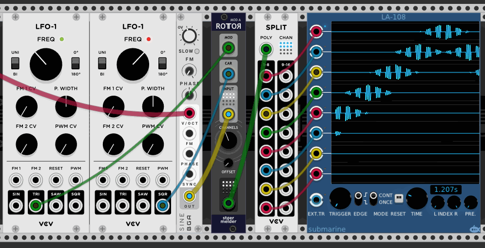

# stoermelder ROTOR model A

ROTOR model A is modulator spreading a carrier signal on up to 16 output channels.

## Modulator

The MOD-input (modulator) is mandatory and defines how the carrier signal is modulated across the output channels. It has to be unipolar (0V..10V) and monophonic. When the channel knob is set to 4, an input voltage in the range 0V..2.5V (=10V / 4 channels) outputs the carrier on channel 1 with linear attenuation proportionally to the voltage between 0V and 2.5V. So, 0V outputs 100% of the carrier, 1.25V outputs 50% of the carrier and 2.5V (and above) 0%. Also, an input voltage of 1.25V outputs 50% of the carrier on channel 2.

## Carrier

The CAR-input (carrier) is optional and monophonic. When no cable is connected a constant voltage of 10V is assumed. The carrier signal is spread accross the channels according to the voltage of the modulator.

## Input

The INPUT-port is optional and should be polyphonic. An input signal on channel *x* will be sent to the output on channel *x* attenuverted using the carrier signal on channel *x*. An unconnected channel will be ignored.

## OUTPUT-port

The "Channels" knob controls how many output channels are used.

ROTOR model A was added in v1.0 of PackOne.