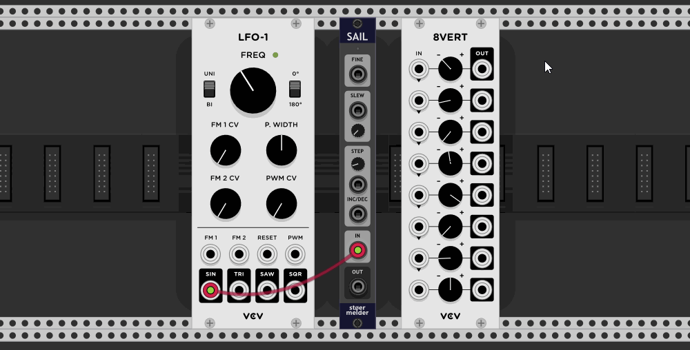
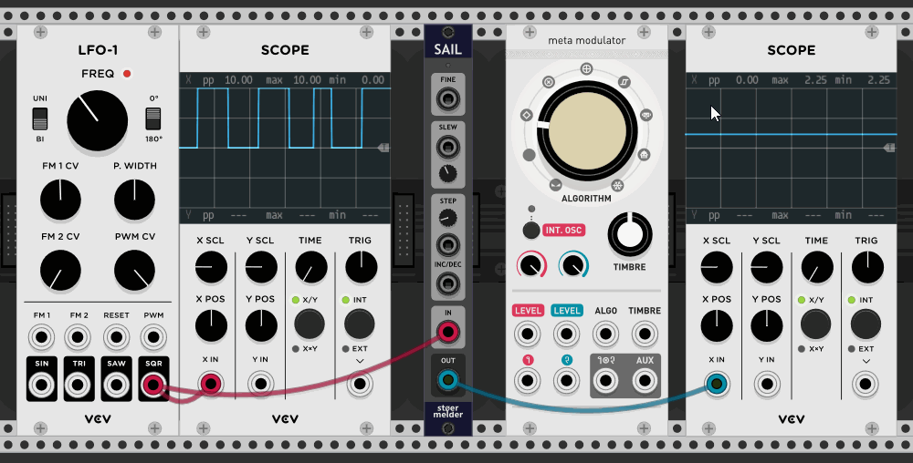
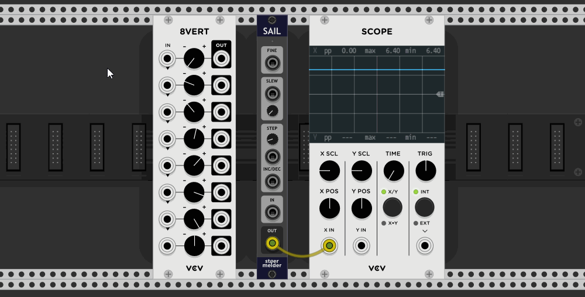
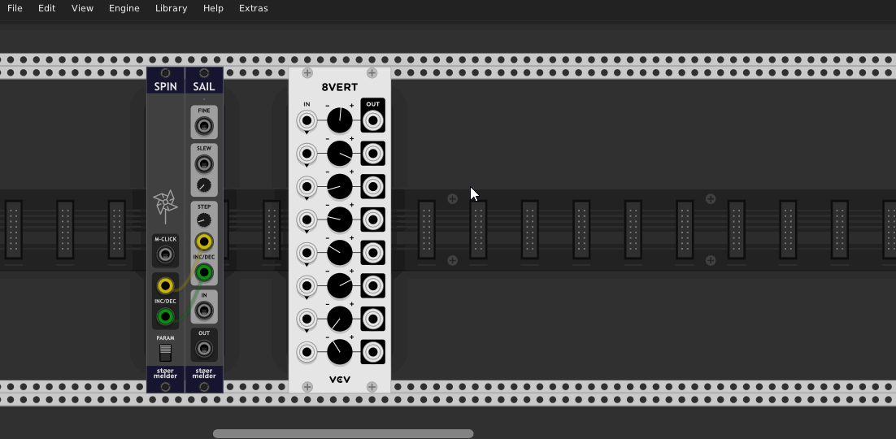

# stoermelder SAIL

SAIL is an utility module. It allows you to control any module parameter which is currently hovered by the mouse pointer with CV.

This module is especially helpful if used together with VCV MIDI-CC: You can map a specific MIDI CC and change any parameter currently hovered with the same control on your MIDI device. The indicator-LED on top of the module signals whenever a parameter is currently hovered.

### IN-port

There are two modes available on the context menu for the _IN_-port:  
In "Differential" mode the delta changes in voltage are determined and applied on the current value of the hovered parameter. If the SHIFT-key is held or the _MOD_-port is high (>= 1V) the parameter control precision is increased by factor 10.  
In "Absolute" mode the input voltage (range 0..10V) is directly mapped onto the parameter's range. 

### INC/DEC-ports

SAIL supports triggers for incrementing and decrementing the current value of the hovered parameter, _STEP_ sets the change on every trigger in percent of the full range. If _INC/DEC_ is connected the _IN_-port will be ignored. These ports are useful when connected to [MIDI-STEP](./MidiStep.md) which outputs triggers for endless rotary knobs on MIDI controllers.

### SLEW

The _SLEW_-parameter and input-port can be used to smoothen changes applied to the hovered parameter and make changes less "steppy".

### OUT-port

Additionally the module can convert the current value of the hovered parameter to voltage on the _OUT_-port. In "Reduced" mode only parameter changes made by SAIL itself will update the output voltage, in "Full" mode all changes (by mouse or MIDI-mapping) will update the output voltage.

## Tips

* You can use multiple instances of SAIL with different _STEP_-sizes for the _INC/DEC_-ports.

* You can use multiple instances of SAIL, one with _FINE_ permanently set to a high voltage and patched to a different CC of VCV MIDI-CC. This way one MIDI controller knob can be used for coarse control and one knob for fine control.

* SAIL uses an overlay window displaying parameter changes on the bottom of the screen (since v1.9.0). This overlay is enabled by default and can be disabled in the context menu. Some adjustments for the appearance of the overlay can be made with the [stoermelder ME](./Me.md) module.

SAIL was added in v1.5.0 of PackOne.