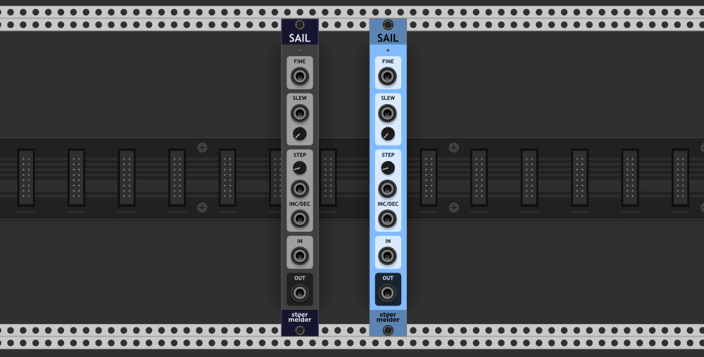
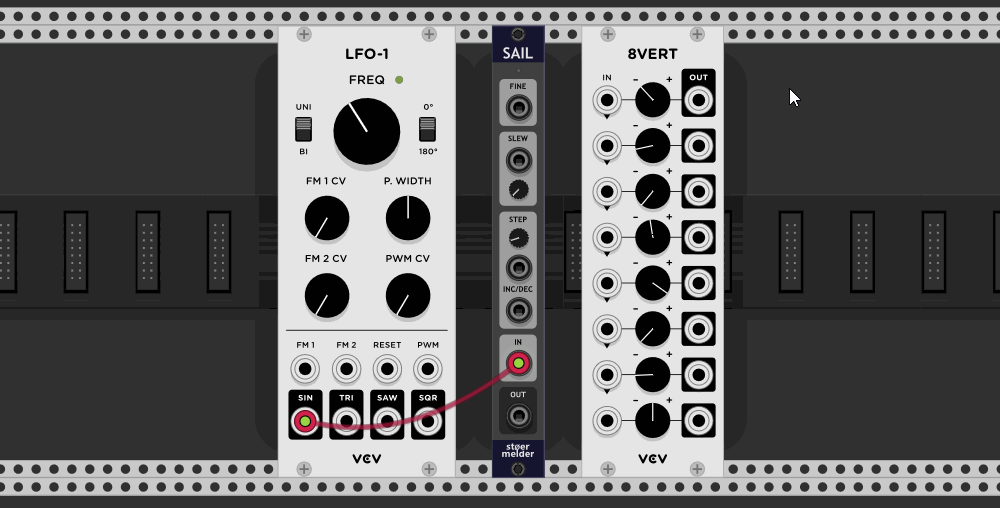
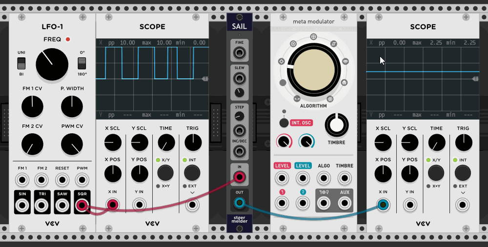
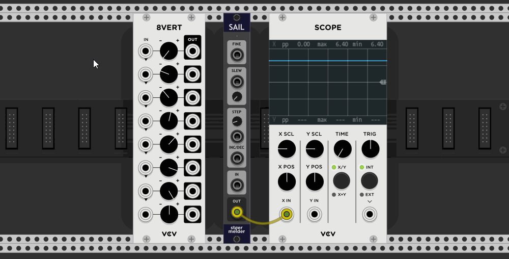
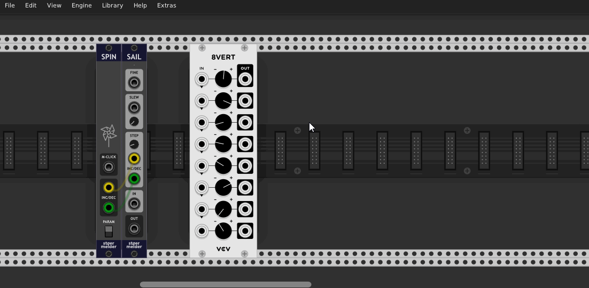

# stoermelder SAIL

SAIL is a utility module. It allows you to control any module parameter which is currently hovered by the mouse pointer with CV.

This module is especially helpful when used with VCV MIDI‑CC: you can map a specific MIDI CC and change any parameter currently hovered with the same control on your MIDI device. The indicator LED on top of the module signals when a parameter is hovered.

### _IN_-port

There are two modes available on the context menu for the _IN_-port:  
In "Differential" mode, the voltage delta is applied to the current value of the hovered parameter. If the Shift key is held or the _MOD_ port is high (≥ 1V), the precision is increased tenfold. In "Absolute" mode, the input voltage (0..10V) is directly mapped onto the parameter’s range.

### _INC_/_DEC_-ports

SAIL supports triggers to increment or decrement the hovered parameter; the _STEP_ value sets the change per trigger as a percentage of the full range. If _INC_ or _DEC_ is connected, the _IN_ port is ignored. These ports are useful when connected to [MIDI‑STEP](./MidiStep.md), which outputs triggers for endless rotary knobs on MIDI controllers.

### SLEW

The _SLEW_ parameter and input port smooth changes applied to the hovered parameter, reducing “steppiness”.

### _OUT_-port

Additionally, the module can convert the current value of the hovered parameter to voltage on the _OUT_ port. In Reduced mode, only changes made by SAIL update the output voltage; in Full mode, all changes (mouse or MIDI mapping) update the output voltage.

### Tips

- You can use multiple instances of SAIL with different _STEP_ sizes for the _INC_/_DEC_ ports. 

- You can also use multiple instances of SAIL, one with _FINE_ permanently set to a high voltage and patched to a different CC of VCV MIDI‑CC. This allows one MIDI controller knob to provide coarse control and another knob to provide fine control.

- SAIL uses an overlay window that displays parameter changes at the bottom of the screen (since v1.9.0). The overlay is enabled by default and can be disabled via the context menu. Appearance adjustments can be made with the [stoermelder ME](./Me.md) module.

SAIL was introduced in v1.5 of PackOne.