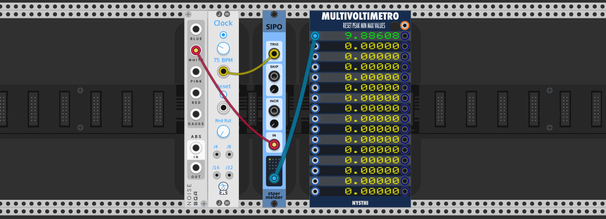

# stoermelder SIPO

SIPO is a serial-in parallel-out shift register. It features a polyphonic output, the ability to skip sampled values and to increment the stepsize between sampled values for even more variation.

