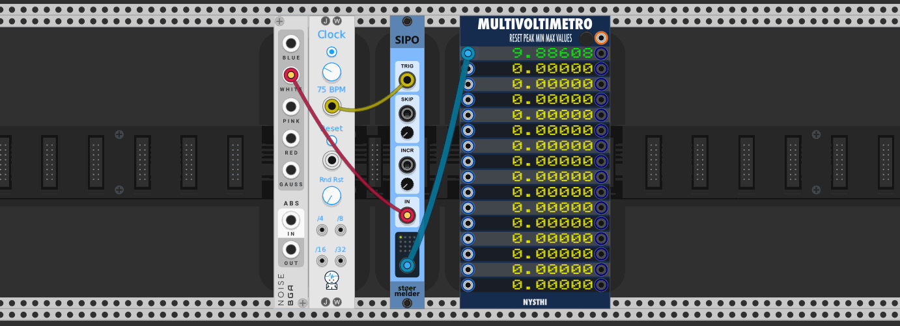

# stoermelder SIPO

SIPO is a **serial-in, parallel-out (SIPO)** shift register module designed for polyphonic applications. It provides:

- **Polyphonic output** capabilities
- The ability to **skip sampled values** during operation
- **Adjustable step size increment** between sampled values for enhanced variation

## Changelog

- v1.2.0
    - Initial release