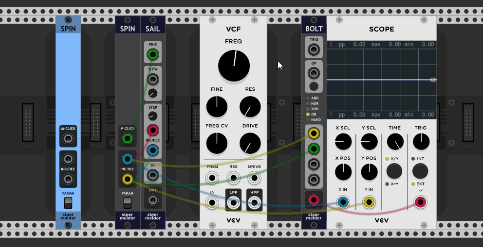
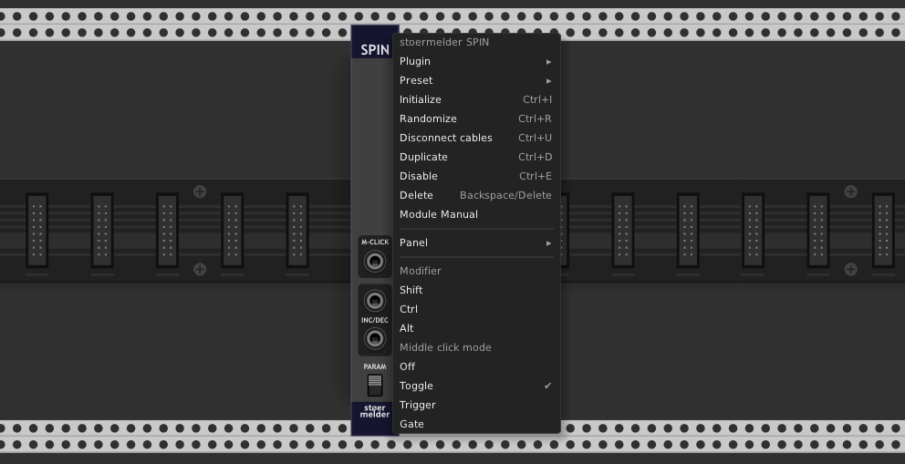

# stoermelder SPIN

SPIN is an utility module which converts mouse-wheel events or middle mouse-button into triggers. The module is especially useful with [SAIL](./Sail.md): this combination gives you mouse-wheel control of hovered parameters and fine-control using the middle mouse-button.

All ports of the module output a voltage of 10V. **INC** and **DEC** are used for positive or negative mouse-wheel changes, respectively, **M-CLICK** outputs 10V for middle mouse-button events.

The **PARAM** switch controls if events are handled only while hovering a parameter of any module. If **PARAM** is switched to the lower position the events are handled constantly (according to the used modifiers, see the following passage).

There are some options found in the context menu:

- As the mouse wheel is primarly used in Rack for srolling the current view the module provides modifiers: When enabled, the mouse-wheel events are only caught if the keyboard keys are held while scrolling. Modifiers can be combined or disabled at all.
- The middle click can be used to generate triggers, to generate gates (as long as the button is held) or the output value can be toggled. Additionaly the middle-click handling can be disabled. Please note that modifiers also apply on the middle-click.

Please note that you cannot use multiple instances of this module with the same settings: Only the first instance will receive and handle events. However, you can use multiple instances with different modifiers.

SPIN was added in v1.7 of PackOne.